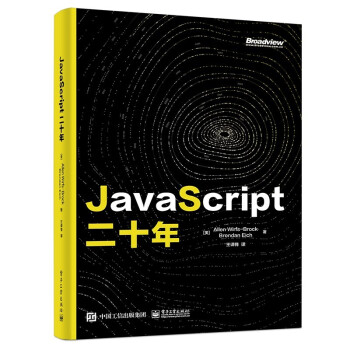

# JavaScript 二十年

  

  

本项目已与博文视点合作推出纸质版，其版税收入将有 10% 捐献给 Mozilla，[点击购买](https://item.jd.com/13211336.html)。

## 原文简介
本书由 JavaScript 之父 Brendan Eich 与 ES6 规范首席作者 Allen Wirfs-Brock 联合编写，详细记载和解读了自 1995 年语言诞生到 2015 年 ES6 规范制定为止，共计 20 年的 JavaScript 语言演化历程。全书不仅讲解了大量语言技术细节层面的演进，更复盘了更高层面上规范制定与标准博弈中的历史成败，是一部讲述人类如何在商业与技术上的竞争合作中促进产业发展的故事。

这个故事相当漫长而复杂。全文分为四个部分，每部分都对应 JavaScript 演化历程中的一个主要阶段。各部分之间还有一段简短的插曲，介绍彼时的开发者们是如何看待与使用 JavaScript 的。

这四个部分依次如下：

1. **[语言诞生](./part-1.md)**（The Origins of JavaScript），介绍了 JavaScript 的创建与早期发展，包括语言的诞生背景、命名方式、初始特性及其设计理念等。这一节还追溯了它在 Netscape 与其他公司最初的演化，例如微软的 JScript。
2. **[创立标准](./part-2.md)**（Creating a Standard），介绍了从 JavaScript 到 ECMAScript 标准的历程。这主要涵盖 JavaScript 标准化工作的启动、规范的创建、相关贡献者以及决策方式等。
3. **[改革失败](./part-3.md)**（Failed Reformations），介绍了在 Eich 离开后，缺乏「仁慈独裁者」的 ECMAScript 委员会修改语言的失败尝试。这主要涉及委员会的分裂、对 ES4 的两轮投入，以及 Flash 与 ActionScript 在其中的渊源等。
4. **[继往开来](./part-4.md)**（Modernizing JavaScript），介绍了 2009 年 ES5 与 2015 年 ES6 这两个成功标准背后的故事，主要包括对 ES5 与 ES6 的目标、重大基础性更改与重要新特性的介绍与回顾。

## 目录
* [语言诞生](./part-1.md)
  * [史前时代](./part-1.md#史前时代)
  * [Brendan Eich 加入网景](./part-1.md#brendan-eich-加入网景)
  * [Mocha 的故事](./part-1.md#mocha-的故事)
  * [JavaScript 1.0 与 1.1](./part-1.md#javascript-10-与-11)
    * [JavaScript 语法](./part-1.md#javascript-语法)
    * [数据类型与表达式](./part-1.md#数据类型与表达式)
    * [对象](./part-1.md#对象)
    * [函数对象](./part-1.md#函数对象)
    * [内置库](./part-1.md#内置库)
    * [执行模型](./part-1.md#执行模型)
    * [迷惑行为与 Bug](./part-1.md#迷惑行为与-bug)
      * [冗余声明](./part-1.md#冗余声明)
      * [隐式类型转换与 `==` 运算符](./part-1.md#隐式类型转换与--运算符)
      * [32 位算术](./part-1.md#32-位算术)
      * [`this` 关键字](./part-1.md#this-关键字)
      * [Arguments 对象](./part-1.md#arguments-对象)
      * [对数值属性键的特殊处理](./part-1.md#对数值属性键的特殊处理)
      * [原始值的属性](./part-1.md#原始值的属性)
      * [JavaScript 中的 HTML 注释](./part-1.md#javascript-中的-html-注释)
  * [微软 JScript](./part-1.md#微软-jscript22)
  * [从 Mocha 到 SpiderMonkey](./part-1.md#从-mocha-到-spidermonkey)
* [插曲：风评被害](./part-1.md#插曲风评被害)
* [创立标准](./part-2.md)
  * [寻找场地](./part-2.md#寻找场地)
  * [首次 TC39 会议](./part-2.md#首次-tc39-会议)
  * [编写规范](./part-2.md#编写规范)
  * [命名标准](./part-2.md#命名标准)
  * [ISO 快速通道](./part-2.md#iso-快速通道)
  * [定义 ECMAScript 3](./part-2.md#定义-ecmascript-3)
* [插曲：JavaScript 不需要 Java](./part-2.md#插曲javascript-不需要-java)
  * [布道师](./part-2.md#布道师)
  * [富互联网应用与 AJAX](./part-2.md#富互联网应用与-ajax)
  * [浏览器博弈论](./part-2.md#浏览器博弈论)
* [改革失败](./part-3.md)
  * [不满于成功](./part-3.md#不满于成功)
  * [对 ES4 的第一轮尝试](./part-3.md#对-es4-的第一轮尝试)
  * [另一条死路](./part-3.md#另一条死路)
  * [Flash 与 ActionScript](./part-3.md#flash-与-actionscript)
  * [对 ES4 的第二轮尝试](./part-3.md#对-es4-的第二轮尝试)
    * [重置 TC39-TG1](./part-3.md#重置-tc39-tg1)
    * [重新设计 ES4](./part-3.md#重新设计-es4)
    * [阻力](./part-3.md#阻力)
    * [寻求和谐](./part-3.md#寻求和谐)
* [插曲：认真对待 JavaScript](./part-3.md#插曲认真对待-javascript)
  * [JavaScript 性能革命](./part-3.md#javascript-性能革命)
  * [CommonJS 和 Node.js](./part-3.md#commonjs-和-nodejs)
  * [成为浏览器通用运行时的 JavaScript](./part-3.md#成为浏览器通用运行时的-javascript)
* [继往开来](./part-4.md)
  * [开发 ES3.1/ES5](./part-4.md#开发-es31es5)
    * [ES5 技术设计](./part-4.md#es5-技术设计)
      * [严格模式](./part-4.md#严格模式)
      * [Getter，Setter 和对象元操作](./part-4.md#gettersetter-和对象元操作)
      * [对象的完整性与安全性特性](./part-4.md#对象的完整性与安全性特性)
      * [活动对象（Activation Object）的移除](./part-4.md#活动对象activation-object的移除)
      * [其他 ES5 特性](./part-4.md#其他-es5-特性)
    * [实现与测试](./part-4.md#实现与测试86)
  * [从 Harmony 到 ECMAScript 2015](./part-4.md#从-harmony-到-ecmascript-2015)
    * [开始投入 Harmony](./part-4.md#开始投入-harmony)
      * [稻草人（Strawman）与目标](./part-4.md#稻草人strawman与目标)
      * [倡导者模型](./part-4.md#倡导者模型)
      * [选择特性集](./part-4.md#选择特性集)
      * [开始编写规范](./part-4.md#开始编写规范)
      * [One JavaScript](./part-4.md#one-javascript)
      * [Brendan 的梦想](./part-4.md#brendan-的梦想)
    * [重新打造规范](./part-4.md#重新打造规范)
      * [重组规范结构](./part-4.md#重组规范结构)
      * [新的术语](./part-4.md#新的术语)
      * [新的语义种类](./part-4.md#新的语义种类)
    * [ES2015 语言特性](./part-4.md#es2015-语言特性)
      * [Realms、Jobs、Proxies 和元对象编程（MOP）](./part-4.md#realmsjobsproxies-和元对象编程mop)
      * [块级声明作用域](./part-4.md#块级声明作用域)
      * [类](./part-4.md#类)
      * [模块](./part-4.md#模块)
      * [箭头函数](./part-4.md#箭头函数)
      * [其他特性](./part-4.md#其他特性)
      * [延期和被放弃的特性](./part-4.md#延期和被放弃的特性)
    * [Harmony 转译器](./part-4.md#harmony-转译器)
    * [完成 ECMAScript 2015](./part-4.md#完成-ecmascript-2015)
* [总结](./part-4.md#总结)
* [致谢](./part-4.md#致谢)
* [附录](./appendices.md)
  * [登场人物](./appendices.md#登场人物)
  * [登场组织](./appendices.md#登场组织)
  * [术语表](./appendices.md#术语表)
  * [缩略语和首字母缩写词](./appendices.md#缩略语和首字母缩写词)
  * [时间线](./appendices.md#时间线)
    * [第一部分：语言诞生](./appendices.md#第一部分语言诞生)
    * [第二部分：创立标准](./appendices.md#第二部分创立标准)
    * [第三部分：改革失败](./appendices.md#第三部分改革失败)
    * [第四部分：继往开来](./appendices.md#第四部分继往开来)
  * [1995 年 12 月 4 日的 JavaScript 发布公告](./appendices.md#1995-年-12-月-4-日的-javascript-发布公告)
* [备注](./notes.md)
* [参考文献](./references.md)

## 许可
本文基于 [CC-BY-NC 4.0](https://creativecommons.org/licenses/by-nc/4.0/) 许可，不限制非商用转载。

Allen Wirfs-Brock and Brendan Eich. 2020. JavaScript: the first 20 years. Proc. ACM Program. Lang. 4, HOPL, Article 77 (June 2020), 189 pages. DOI:https://doi.org/10.1145/3386327
