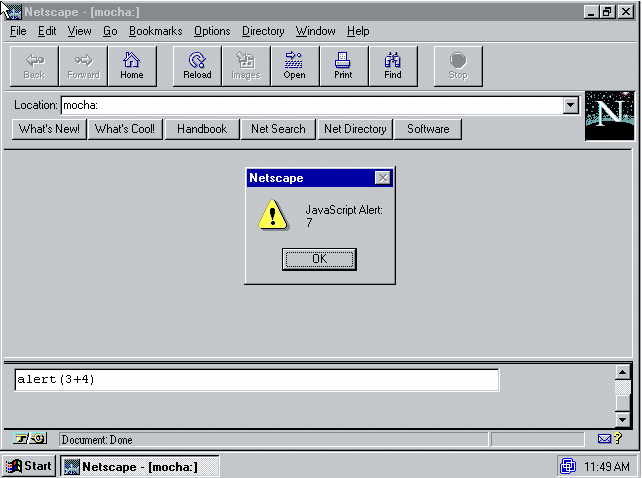

# 语言诞生

## 史前时代
万维网的概念与基础技术，是 1989-1991 年间由 CERN 的 Tim Berners-Lee [[2003](./references.md#tbl:history)] 创造的。Web 技术在高能物理圈内流通了几年，但并未在物理社区外引起强烈反响。它真正引发关注的契机，还是 1992-1993 年开发的 *Mosaic*<sup>[g](./appendices.md#Mosaic)</sup>。这款由本科生 Marc Andreessen 和伊利诺伊大学香槟分校超算中心（NCSA）的 Eric Bina 研发的应用，本质上定义了「Web 浏览器」这一全新软件类别。

NCSA Mosaic 是不仅易装易用，而且带有图形界面的 Web 客户端。它在物理学界之外普及了万维网的概念，传播相当广泛。到 1994 年初，商业资本开始通过获得 Mosaic 代码许可或从头研发仿 Mosaic 式浏览器的方式，争相加入这波浏览器浪潮。SGI（硅谷图形公司）的创始人 Jim Clark 拉到了风险投资，并招来了 Marc Andreessen 和 Eric Bina 两人。在 1994 年 4 月，他们共同创立了一家公司。这家公司最终定名为 Netscape（网景通讯），目标是推出世界上最流行的浏览器来替代 Mosaic。为此，Netscape 从零开始研发了下一代 Mosaic 式浏览器 *Netscape Navigator*<sup>[g](./appendices.md#Netscape-Navigator)</sup>，它于 1994 年 10 月起开始发行。到 1995 年初，Netscape Navigator 达到了初始目标，正在迅速地取代 Mosaic。

Tim Berners-Lee 的 Web 技术的核心，是使用*声明式的*<sup>[g](./appendices.md#declarative)</sup> HTML 标记语言来描述文档，将它们呈现为网页。但业界对于能方便最终用户编排应用操作的*脚本语言*<sup>[g](./appendices.md#scripting-language)</sup> [[Ousterhout 1997](./references.md#ousterhout)]，也展示出了相当大的兴趣。这些语言诸如微软 Office 中的 Visual Basic 和苹果 AppleScript [[Cook 2007](./references.md#applescript)] 之类，其设计目标并非用于实现应用核心的复杂数据结构和算法组件。相反地，它们为用户提供了将此类应用组件「粘合」在一起的新方式。在 Netscape 扩大万维网受众范围的途中，一个重要的问题就是脚本语言「是否应该」与「如何」集成到网页中。

### Brendan Eich 加入网景
Brendan Eich<sup>[4](./notes.md#4)</sup> 于 1985 年在伊利诺伊大学香槟分校硕士毕业，然后立即入职了 SGI 公司，主要从事 Unix 内核和网络层的工作。1992 年，他在离开 SGI 后加盟了 MicroUnity。这是一家资金雄厚的新兴公司，致力于开发视频媒体处理器。在这两家公司，他都实现了用于支持内核与网络编程任务的小型专用语言。在 MicroUnity，他还在 GCC *编译器*<sup>[g](./appendices.md#compiler)</sup>上做了些工作。

1995 年初，Brendan Eich 被 Netscape 以「在浏览器里写 Scheme」<sup>[5](./notes.md#5)</sup>为诱饵打动而跳槽了。但当 Eich 于 1995 年 4 月 3 日加入 Netscape 时，他发现公司在产品营销与编程语言上的现状都很复杂。Netscape 在 1994 年底拒绝了微软的低价收购要约。此后 Netscape 管理层预计自己将直面微软「拥抱，扩展，灭绝」战略 [[Wikipedia 2019](./references.md#wikip:EEE)] 的攻击。在盖茨的直接领导下，微软已经迅速意识到它们即将推出的封闭生态信息应用 Blackbird 项目 [[Anderson 2007](./references.md#msft:blackbird)]，在跨平台 Web 的兴起之下将无足轻重。因此，盖茨的「互联网浪潮」备忘录 [[Gates 1995](./references.md#gates:tidalwave)] 将微软的战略从 Blackbird 重新引导到了 *Internet Explorer*<sup>[g](./appendices.md#Internet-Explorer)</sup> 与一整套服务器产品上，以应对 Netscape 的攻城略地。

网页脚本语言的备选项，包括 Scheme 这样的研究型语言，Perl / Python / Tcl 这样基于 Unix 的实用型语言，以及微软 Visual Basic 这样的专有语言。Brendan Eich 希望的是在浏览器中实现 Scheme。但在 1995 年初，Sun（太阳微系统公司）开始为当时尚未发布的<sup>[6](./notes.md#6)</sup> Java 发起了游击营销活动 [[Byous 1998](./references.md#javahist)]。Sun 和 Netscape 迅速达成协议，决定将 Java 集成到 Netscape 2 中。Eich 回忆说，Marc Andreessen 在 Netscape 会议上的口号是「Netscape 加 Java 干掉 Windows」。在 1995 年 5 月 23 日 Sun 的 Java 发布会上，Netscape 宣布了他们授权 Sun 的 Java 技术 [[Netscape 1995a](./references.md#netscape:press:java)] 在浏览器中使用的意向。

Netscape 内部的这项快速决策，使得对 Scheme / Perl / Python / Tcl / Visual Basic 等脚本语言的选型都受到了严重的阻碍，它们在商业利益和（或）上市时间的角度上看都是不可行的。对 Netscape 和 Sun 的高层，尤其是 Marc Andreessen 和 Sun 的 Bill Joy 来说，他们认为唯一可行的方法是设计实现一门「小语言」<sup>[7](./notes.md#7)</sup>来补充 Java。

对这一决策的怀疑者在 Sun 占支配地位，在 Netscape 也占多数。他们质疑是否需要这样一门更简单的脚本语言：Java 是否不适合脚本编写？如何解释为什么两种语言比一种更好？Netscape 是否具备创建新语言的专业能力？

第一个反对意见很容易反驳。1995 年春季的 Java 并不适合初学者使用，人们必须将 Java 主程序的代码体放在包内部*类*<sup>[g](./appendices.md#class)</sup>声明下名为 `main` 的静态*方法*<sup>[g](./appendices.md#method)</sup>中，还必须为所有参数、返回值和变量声明静态*类型*<sup>[g](./appendices.md#type)</sup>。从 Visual Basic 与 Visual C++ 互补，以及许多 Unix 语言与原生代码组件互补的经验来看，Java 明显对于「胶水」脚本编写者来说还不够简单。

克服第二个反对意见的依据，则是对微软产品的参考。对于专业的 Windows 应用程序员，微软向他们出售 Visual C++。而对于业余爱好者、兼职程序员、设计师、会计师和其他人员，微软提供了 Visual Basic 作为脚本语言。这样那些经验不足的兼职程序员就可以「胶合」定制使用由 Visual C++ 构建的组件了。名为「Visual Basic for Applications」（VBA）的 Visual Basic 版本已经集成到了微软 Office 中，以支持这些应用的用户扩展和脚本需求。

克服了前两个反对意见后，Marc Andreessen 提出了浏览器脚本语言的代号「Mocha」。据 Eich 说，这一提议还希望在适当时候将该语言重命名为「JavaScript」。这种 Java 的辅助语言必须「看起来像 Java」，保持易用性并「基于对象」，而不是像 Java 这样基于类。

只剩下最后一个反对意见了：Netscape 是否具备创建有效脚本语言的专业知识，并应用到 1995 年 9 月的 Netscape 2 beta 上？Brendan Eich 的任务就是通过创建 Mocha 来证明这一点。

### Mocha 的故事
随着 Java 发布的临近，Brendan Eich 认为时间至关重要。双鸟在林不如一鸟在手，因此他在 1995 年 5 月<sup>[8](./notes.md#8)</sup>花了连续十天进行第一个 *Mocha*<sup>[g](./appendices.md#Mocha)</sup> 实现的原型设计。这项工作赶在了可行性论证的最后期限之前完成。这个 Demo 包括语言的最小实现，并最小化地集成到了 Netscape 2 浏览器的 pre-alpha 版本中。

Eich 的原型是在 SGI Indy Unix 工作站 [[Netfreak 2019](./references.md#sgiIndy)] 上开发的，使用了一个手写的词法分析器和递归下降解析器。这个解析器发出的是字节码指令，而不是语法分析树（parse tree）。字节码*解释器*<sup>[g](./appendices.md#interpreter)</sup>简单而缓慢<sup>[9](./notes.md#9)</sup>。

字节码特性源于 Netscape LiveWire 服务器<sup>[10](./notes.md#10)</sup>的需求，其开发人员甚至在将 Mocha 原型化之前就希望将其嵌入。这支团队的前 Borland 管理和工程人员都坚信动态脚本语言的未来，但他们希望使用字节码而非源码解析的方式，加快服务器应用的加载速度。

Marc Andreessen 强调，Mocha 应该非常易于使用，任何人都可以直接在 HTML 文档中编写几行。Sun 和 Netscape 的高层管理人员则重申了 Mocha 应该「看起来像 Java」的要求，明确排除了 BASIC 式的东西。但这种 Java 式的外表也带来了对 Java 式行为的期望，这种期望影响了语言*对象*<sup>[g](./appendices.md#object)</sup>模型的设计，以及原始类型（如 `boolean` / `int` / `double` / `string` 等）的语义。

在外表接近 Java 的要求之外，Brendan Eich 可以自由选择大多数语言设计细节。加入 Netscape 后，他探索了一些「易于使用」与「教育用途」的语言，包括 HyperTalk 语言 [[Apple Computer 1988](./references.md#apple1988hypercard)]，Logo 语言 [[Papert 1980](./references.md#logo)] 和 Self 语言 [[Ungar and Smith 1987](./references.md#self)]。所有人都认可 Mocha 将会「基于对象」但没有类。因为支持类将花费很长时间，并有与 Java 竞争的风险。出于对 Self 的认可，Eich 选择使用带有单个原型链接的*委托*<sup>[g](./appendices.md#delegation)</sup>机制，来创建动态的对象模型。他认为这样可以节省实现成本，但最后还是没有足够时间在 Mocha 原型中暴露该机制。

对象是通过为*构造函数*<sup>[g](./appendices.md#constructor-function)</sup>应用 `new` 运算符的方式创建的。名为 `Object` 的默认对象构造函数，与其他内建对象一起内置在环境中。每个对象由零个或多个属性组成。每个*属性*<sup>[g](./appendices.md#property)</sup>都有一个名称（也叫*属性键*<sup>[g](./appendices.md#property-key)</sup>）和一个值，该值可以是*函数*<sup>[g](./appendices.md#function)</sup>、对象或其他几种内建数据类型之一。可以通过为未使用的属性键赋值的方式，来创建出新属性。属性没有可见性或赋值限制，构造函数还可以提供一组初始属性。创建对象后，也可以将其他属性添加上去。LiveWire 团队特别喜欢这种非常动态的手法。

尽管 Scheme 的诱惑已经不再，Brendan Eich 仍然发现 Lisp 式的函数*一等公民*<sup>[g](./appendices.md#first-class)</sup>概念很有吸引力。函数一等公民对应的这套工具深受 Scheme 习惯用法的启发，方法不必被包含在类中。这包括支持顶层的子程序、将函数作为参数传递、对象上的方法，以及事件处理器（event handler）。由于时间限制，函数表达式（也叫 *lambda 表达式*<sup>[g](./appendices.md#lambda-expression)</sup>，或简称 lambda）被延期，但在语法中得以保留。事件处理器和对象方法通过向 Java（在 C++ 之后）借鉴的 `this` 关键字得以统一。在所有函数中，它都用于表示该函数在作为方法被调用时的上下文对象。

在与 Marc Andreessen 以及一些早期的 Netscape 工程师<sup>[11](./notes.md#11)</sup>做非正式讨论的激励之下，这个原型支持了 `eval` 函数。它可以解析执行包含程序的字符串。直觉上，这种动态的「字符串到程序」编程对 Web 浏览器和服务器上的某些应用很重要<sup>[12](./notes.md#12)</sup>。不过，支持 `eval` 的决策立刻带来了相应的后果。一些场景需要函数通过类似 Java 的 `toString` 方法，将其源码反编译为字符串。为此 Eich 选择在十天冲刺<sup>[13](./notes.md#13)</sup>内实现字节码反编译器，因为不论将源码放在主存储器（RAM 或 ROM）还是从辅助存储器（硬盘等）中恢复，对某些需支持的目标体系结构而言，代价都可能过于昂贵。对于受 Intel 8086 16 位分段内存模型约束的 Windows 3.1 计算机而言，情况尤其如此。因为对于内存中无边界或大型的结构体，需要覆盖并手动管理内存中的多个段。

十天结束时，原型在一次全体 Netscape 工程人员的会议上进行了演示（图 2）。演示获得了成功，这使人们对于交付更加完整且集成度更高的 Netscape 2 感到过分乐观。Netscape 2 的首个 beta 版本计划于当年 9 月发布。Brendan Eich 在那个夏天的主要工作，则是将 Mocha 更全面地集成到浏览器中。这需要设计实现使 Mocha 程序能与网页交互的 API。同时，他还需要将语言的原型实现转变为可交付的软件，并响应早期内部用户的错误报告、更改建议与特性需求。

这个十天创建 Mocha 故事的更多细节，可以参见 Brendan Eich 的复述 [[Eich 2008c](./references.md#BrendanHistory08), [2011d](./references.md#BrendanHistory11); [JavaScript Jabber 2014](./references.md#js-jabber:brendan); [Walker 2018](./references.md#jollyswagman:brendan)]。通过互联网档案馆，还可以获得 Mocha 生产版本的源码 [[Netscape 1997b](./references.md#netscape3.0.2)]。Jamie Zawinski [[1999](./references.md#nscpdorm)] 的「Netscape 宿舍」也描述了在此期间作为 Netscape 软件开发者的工作经历。

## JavaScript 1.0 与 1.1
Netscape 和 Sun 于 1995 年 12 月 4 日在联合新闻稿 [[Netscape and Sun 1995](./references.md#netscape:press:javascript); Appendix F] 中发布了 JavaScript。通稿中 JavaScript 被描述为「一种对象脚本语言」，可用于编写脚本来动态地「修改 Java 对象的属性和行为」。它将作为「Java 的补充，方便进行在线应用开发」。尽管它们的技术设计只有表面上的相似，两家公司还是试图在 Java 和 JavaScript 语言间建立牢固的品牌联系。这种名称上的相似性及其带来的两种语言具备密切联系的暗示，长期以来都是导致混乱的根源之一。



图 2. Mocha 控制台。Brendan Eich 的 Mocha 初始 Demo，其所演示的功能是在 SGI Unix 工作站的 Netscape 2 pre-alpha 中运行的「Mocha 控制台」。这个 Mocha 控制台除了名称改变之外，基本按原样发布在了 Netscape 2 正式版中。这是在 Windows 95 上运行的 Netscape 2.02 的屏幕截图。可以通过在浏览器地址栏中键入 `mocha:` 来激活这个 Mocha 控制台——正式版 Netscape 2 已将其更改为 `javascript:`，但 `mocha:` 仍然有效。激活控制台后，浏览器会打开两个页面框架。在下部文本框中键入的 Mocha 表达式，其求值运行后的效果会体现在上方页面中。这一示例展示了调用内置 `alert` 函数来获得表达式计算值的弹出窗口。原始演示版本的弹出窗口显示的是「Mocha Alert」，而不是 「JavaScript Alert」。

以「LiveScript」名称发布的 JavaScript，最初于 1995 年 9 月在 Netscape Navigator 2.0 的第一个 beta 版本 [[Netscape 1995b](./references.md#netscape:nav:2.0b1:releasenotes)] 中公开。该版本后还有四个 beta 版本，然后才是 1996 年 3 月发布的 Navigator 2.0 正式版。这个正式版支持了 JavaScript 1.0。而 Netscape Enterprise Server 2.0 也在 3 月发布 [[Netscape 1996f](./references.md#netscape:press:server2.0)]，将 JavaScript 1.0 集成到了其 LiveWire 服务端的脚本组件中。

JavaScript 只是 Netscape Navigator 中一个相对较小的功能，因此其开发受到了 Navigator 2.0 整体规划的约束。该计划要求在 1995 年 8 月冻结特性。JavaScript 1.0 的特性集，实际上是划出了当年 8 月 Mocha 实现里正在开发或即将开发的特性。尽管 Eich 在整个 Navigator 2.0 发布历程中都在继续修复最初 Mocha 实现中的 bug，但相对于设想中的语言设计而言，这一特性集并不完整，仍然存在各种疑难 bug 和边界条件下的特殊行为。Brendan Eich 在 1.0 发行前不久接受了采访 [[Shah 1996](./references.md#brendan96)]，他回应了 JavaScript 作为 Java 附属品的官方定位，以及初始发布版本的仓促性：

> BE（Brendan Eich）：我希望它（JavaScript）可以由其他厂商基于我和 Bill Joy 正在起草的规范来实现。我希望看到它保持小巧，但能在 Web 上随处可见，成为把对 HTML 元素的操作与 Java applet 等其他组件粘合在一起时的首选方式。
>
> BE：……据我所知，最常见的用途是使页面更智能，更生动。比如可以根据一天中的时间，在单击链接时加载不同的 *URL*<sup>[g](./appendices.md#URL)</sup>。
>
> ……
>
> BE：隧道的尽头是光明的。现在 JavaScript 的单人秀成分还太重，2.0（Netscape Navigator 版本，译者注）会包含许多烦人的小 bug。我希望所有重大错误都有解决方法，我也已经花了很多时间与开发者一起寻找 bug 及其解法。
>
> 我将继续通过修正错误、添加新特性，并尝试使 JavaScript 在所有平台上保持一致的方式，来完成 2.1 版本。我不知道 2.1 版本具体何时交付，但可以保证它会在明年秋天前发布——我们这里前进得很快。

JavaScript 1.0 [[Netscape 1996d](./references.md#netscape:js1.0:handbook)] 是一种简单的*动态类型*<sup>[g](./appendices.md#dynamically-typed)</sup>语言，它支持数字、字符串与布尔值、一等公民函数，以及对象数据类型。从语法上看，JavaScript 与 Java 一样属于 C 家族，其控制流语句借鉴了 C，其表达式语法也包括了大多数 C 的数字运算符。JavaScript 1.0 有一个小的内置函数库，其源码通常直接嵌入 HTML 文件中，但其内置库包含一个 `eval` 函数，可以解析并求值编码到字符串中的 JavaScript 源码。整个 JavaScript 1.0 是一门非常精简的语言。图 3 总结了一些缺失的特性。对于现代 JavaScript 程序员而言，这些特性的遗漏可能令人惊讶。

<table>
  <tr><td>独立的 <code>Array</code> 对象类型</td><td><code>Array</code> 字面量</td></tr>
  <tr><td>正则表达式</td><td>对象字面量</td></tr>
  <tr><td>对 <code>undefined</code> 的全局绑定</td><td><code>===</code> 运算符</td></tr>
  <tr><td><code>typeof</code>, <code>void</code>, <code>delete</code> 运算符</td><td><code>in</code>, <code>instanceof</code> 运算符</td></tr>
  <tr><td><code>do-while</code> 语句</td><td><code>switch</code> 语句</td></tr>
  <tr><td><code>try-catch-finally</code> 语句</td><td><code>break</code>/<code>continue</code> 到标签</td></tr>
  <tr><td>嵌套函数声明</td><td>函数表达式</td></tr>
  <tr><td>函数的 <code>call</code> 和 <code>apply</code> 方法</td><td>函数的 <code>prototype</code> 属性</td></tr>
  <tr><td>基于原型的继承</td><td>对内置原型对象的访问</td></tr>
  <tr><td>循环垃圾回收<sup><a href="./appendices.md#cyclic-garbage-collection">g</a></sup></td><td>HTML <code>&lt;script&gt;</code> 标签的 <code>src</code> 属性</td></tr>
</table>

图 3. JavaScript 1.0 中未涉及的 JavaScript 常用特性（约 2010 年时）。

1996 年初，代号「Atlas」的 Netscape Navigator 3.0 开发工作启动 [[Netscape 1996g](./references.md#netscape:nav:3.0b3:releasenotes)]，并于 1996 年 8 月发布。Brendan Eich 在此期间得以继续开发那些当 1995 年 8 月的 2.0 版本特性冻结时，还不够完整或缺失的特性。直到 Navigator 3.0 中发布 JavaScript 1.1 [[Netscape 1996a](./references.md#netscape:js1.1:newfeatures), [e](./references.md#netscape:js1.1:handbook)] 时，JavaScript 的初始定义和开发才算完成。以下各节概述了 JavaScript 1.0/1.1 语言的设计。

### JavaScript 语法
JavaScript 1.0 的语法直接以 C 语言 [[ANSI X3 1989](./references.md#c89)] 为基础，有一些地方受到了 *AWK*<sup>[g](./appendices.md#AWK)</sup> 语言 [[Aho et al. 1988](./references.md#aho1988awk)] 的启发。一个脚本（script）就是一系列的语句（statement）和声明（declaration）。与 C 不同的是，JavaScript 的语句并不限于在函数体内出现。在 JavaScript 1.0 中，脚本源码嵌入在由 `<script></script>` 标签包围的 HTML 文档中。

JavaScript 1.0 中受 C 启发的语句包括：表达式语句；`if` 条件语句；`for` 和 `while` 循环语句；非顺序控制流的 `break`、`continue` 和 `return` 语句；以及语句块（支持使用由 `{}` 分隔的语句序列，就像使用单条语句一样）。`if`，`for` 和 `while` 语句都是复合语句<sup>[14](./notes.md#14)</sup>。JavaScript 1.0 并未包含 C 的 `do-while` 语句，`switch` 语句，语句标签与 `goto` 语句。

在基本的 C 语句全家桶基础上，JavaScript 1.0 添加了两个复合语句，用于访问其对象数据类型的属性。受 AWK 启发的 `for-in` 语句可以遍历对象的*属性键*<sup>[g](./appendices.md#property-key)</sup>。而在 `with` 语句<sup>[15](./notes.md#15)</sup>的语句体内，可以把某个对象的属性名称当作变量来访问。由于属性可能被动态添加（在更高版本的语言中还可以被删除），因此可见变量的*绑定*<sup>[g](./appendices.md#binding)</sup>可能会随 `with` 语句体中的执行过程而发生变化。

JavaScript 中的声明（declaration）并未遵循 C 或 Java 的风格。JavaScript 是动态类型的，没有语言层面的类型名称作为识别声明的语法前缀。相反地，JavaScript 的声明使用关键字作为前缀。JavaScript 1.0 有两种形式的声明，即 `function` 声明和 `var` 声明。`function` 声明<sup>[16](./notes.md#16)</sup>的语法是直接从 AWK 借鉴的，定义了单个可调用函数的名称、形参和语句主体。`var` 声明可以引入一个或多个变量绑定，并能选择性地为变量赋值。所有的 `var` 声明都被视为语句，并可在任何语句上下文中出现，包括语句块中。在 JavaScript 1.0/1.1 中，函数声明则只能在脚本的顶层出现，并且不支持嵌套。`var` 声明也可以出现在函数体内。由这类声明定义的变量，属于函数的局部变量。

与 C 不同的是，JavaScript 1.0 的语句块并未引入声明作用域的概念。在函数体内的语句块中，`var` 声明对这整个函数体均局部可见。位于函数外部块中的 `var` 声明则具备全局*作用域*<sup>[g](./appendices.md#scope)</sup>。如果向作用域内不存在 `function` 或 `var` 声明的变量名赋值，则会隐式创建具有该名称的全局变量。事实证明这种行为是导致错误的重要原因，因为如果拼写错了已声明的变量，也会静默地创建名称错误的新变量。

JavaScript 与传统 C 语法还有一个重要区别，那就是它对语句末尾分号的处理。C 将分号视为强制性的语句终止符，而 JavaScript 则允许在分号是行中最后一个有效字符时，省略这个用于终止语句的分号。这种行为的确切规则并未包含在 JavaScript 1.0 文档中。《Netscape 2.0 手册》在描述各种 JavaScript 语句形式时也并未展示分号，它只说明「一条语句可能跨越多行。如果每条语句之间用分号分隔，则可能在一行上出现多条语句 [[Netscape 1996d](./references.md#netscape:js1.0:handbook)]」。手册的 JavaScript 代码示例使用了无分号的编码风格，如下所示：

``` js
var a, x, y
var r = 10
with (Math) {
  a = PI * r * r
  x = r * cos(PI)
  y = r * sin(PI / 2)
}
```

这种不使用分号就可以编写 JavaScript 代码的特性，称为自动分号插入（ASI）。ASI 在 JavaScript 程序员间仍然存在争议。相当一部分程序员仍然更喜欢以无分号风格编码，而其他人则从不使用 ASI。

### 数据类型与表达式
JavaScript 1.0/1.1 是一种动态类型语言，具有五种基本数据类型：数字、字符串、布尔值、对象和函数。这里的「动态类型」意味着运行时类型信息与每条数据相关联，而不是与诸如变量之类的「值的容器」相关联。运行时类型检查可确保操作仅应用于各操作所支持的数据值上。

布尔值、字符串和数字是不可变（immutable）的值。布尔类型具有两个值，分别为 `true` 和 `false`。字符串值由 8 位字符编码的不可变序列组成，没有 Unicode 支持。数字类型由所有可能的 IEEE 754 [[IEEE 2008](./references.md#ieee754)] 双精度二进制 64 位浮点值组成，不同之处在于仅暴露了一个规范（canonical）的 `NaN` 值。某些运算会特殊处理与「无符号 32 位整数」和「有符号 32 位二进制补码整数」相对应的数字值。Mocha 内部使用了此类整数值的替代表示形式，但只有一个正式的数字数据类型。

JavaScript 1.0 有两个特殊值，用于表示「缺少有用的数据值」。未初始化的变量会被设置为特殊值 *undefined*<sup>[17](./notes.md#17)</sup>。这也是程序在尝试访问对象中尚不存在的属性时所返回的值。在 JavaScript 1.0 中，可以通过声明和访问未初始化变量的方式，获取到 *undefined* 这个值。而值 `null` 则旨在表示某个预期存在对象值的上下文里「没有对象」。它是根据 Java 的 `null` 值建模的，有助于将 JavaScript 与 Java 实现的对象进行集成。在整个历史上，同时存在这样两个相似但又有显著不同的值导致了 JavaScript 程序员的困惑，很多人不确定应在何时使用哪个。

JavaScript 1.0 的表达式语法基本上复制自 C，使用了一组相同的运算符（operator）与优先级规则。这里主要省略的部分是 C 的指针和与类型相关的运算符，以及一元的 `+` 运算符。二元的 `+` 运算符被重载，以执行数字加法与字符串连接。移位和按位逻辑运算符可以对有符号的 32 位二进制补码整数进行位级的操作。如有必要，操作数将被截断为整数，并取模减少到 32 位的值。`>>` 运算符可以对 32 位整数值执行符号扩展的算术右移。JavaScript 还添加了从 Java 借鉴的 `>>>` 运算符，用于执行无符号的右移运算。

JavaScript 1.1 添加了 `delete`，`typeof` 和 `void` 运算符。在 JavaScript 1.1 中，`delete` 运算符仅会将其对应的变量或对象属性操作数设为 `null` 值。`typeof` 运算符会返回一个字符串，该字符串标识其操作数的原始类型。可能的字符串值包括 `"undefined"`、`"object"`、`"function"`、`"boolean"`、`"string"`、`"number"`，或一个由实现环境决定的字符串值，以此来标示宿主对象的种类。令人困惑的是，`typeof null` 会返回字符串值 `"object"` 而不是 `"null"`。其实也可以说这与 Java 保持了一致，因为 Java 的所有值都是对象，而 `null` 本质上是表达「没有对象」的对象。但是，Java 缺少与 `typeof` 运算符等效的特性，并使用 `null` 作为未初始化变量的默认值。根据 Brendan Eich 的回忆，`typeof null` 的值是原始 Mocha 实现中*抽象泄漏*<sup>[g](./appendices.md#leaky-abstraction)</sup>的结果。`null` 的运行时值使用了与对象值相同的内部标记值进行编码，因此 `typeof` 运算符的实现就直接返回了 `"object"`，而无需任何额外的特殊处理。实践表明，这种选择对 JavaScript 程序员带来了很大的麻烦。他们通常想在尝试访问某个值的属性之前，先测试这个值是否确实是一个对象。但光是测试值的类型是否为 `"object"` 并不足以保护属性访问，因为尝试访问 `null` 的属性也会产生运行时错误。

`void` 运算符仅求值其操作数，然后返回 *undefined*。访问 *undefined* 的一种常见手法是 `void 0`。引入 `void` 运算符是为了作为辅助，以便定义那些会在单击时执行 JavaScript 代码的 HTML 超链接。例如：

``` html
<a href="javascript:void usefulFunction()">
  Click to do something useful
</a>
```

这里 `href` *属性*<sup>[g](./appendices.md#attribute)</sup>的值应为一个 URL，而 `javascript:` 是浏览器可识别的特殊 URL 协议。这意味着要对后面的 JavaScript 代码求值，并使用将其转换为字符串的结果，就像使用由常规  `href` URL 获取的响应文档那样。除非获得 *undefined*，否则 `<a>` 元素将尝试继续处理该响应文档。通常 Web 开发者想要的只是在单击链接时对 JavaScript 表达式求值而已。给表达式加上前缀 `void` 即可允许以这种方式使用该表达式，避免 `<a>` 元素的进一步处理。

C 和 JavaScript 表达式之间的最大区别，是 JavaScript 运算符会自动将其操作数隐式转换为运算符领域内的数据类型。JavaScript 1.1 添加了一种可配置的机制，用于将任意对象转换为数字或字符串值。图 4 总结了 JavaScript 1.1 的隐式类型转换（coercion）规则。

<table>
  <thead>
    <tr><th>From - To</th><th>function</th><th>object</th><th>number</th><th>boolean</th><th>string</th></tr>
  </thead>
  <tbody>
    <tr><td><b>undefined</b></td><td>error</td><td>null</td><td>error</td><td>false</td><td><code>"undefined"</code></td></tr>
    <tr><td><b>function</b></td><td>N/C</td><td>Function object</td><td>valueOf/error</td><td>valueOf/true</td><td>decompile</td></tr>
    <tr><td><b>object (not null)</b></td><td>Function object</td><td>N/C</td><td>valueOf/error</td><td>valueOf/true</td><td>toString/valueOf<sup>1</sup></td></tr>
    <tr><td><b>object (null)</b></td><td>error</td><td>N/C</td><td>0</td><td>false</td><td><code>"null"</code></td></tr>
    <tr><td><b>number (zero)</b></td><td>error</td><td>null</td><td>N/C</td><td>false</td><td><code>"0"</code></td></tr>
    <tr><td><b>number (nonzero)</b></td><td>error</td><td>Number</td><td>N/C</td><td>true</td><td>default</td></tr>
    <tr><td><b>number (NaN)</b></td><td>error</td><td>Number</td><td>N/C</td><td>false<sup>2</sup></td><td><code>"NaN"</code></td></tr>
    <tr><td><b>number (+Infinity)</b></td><td>error</td><td>Number</td><td>N/C</td><td>true</td><td><code>"+Infinity"</code></td></tr>
    <tr><td><b>number (-Infinity)</b></td><td>error</td><td>Number</td><td>N/C</td><td>true</td><td><code>"-Infinity"</code></td></tr>
    <tr><td><b>boolean (false)</b></td><td>error</td><td>Boolean</td><td>0</td><td>N/C</td><td><code>"false"</code></td></tr>
    <tr><td><b>boolean (true)</b></td><td>error</td><td>Boolean</td><td>1</td><td>N/C</td><td><code>"true"</code></td></tr>
    <tr><td><b>string (empty)</b></td><td>error</td><td>String</td><td>error<sup>3</sup></td><td>false</td><td>N/C</td></tr>
    <tr><td><b>string (non-empty)</b></td><td>error</td><td>String</td><td>number/error</td><td>true</td><td>N/C</td></tr>
  </tbody>
</table>

* 若结果以斜杠分隔，表示 JavaScript 会先尝试前者，若未成功则使用后者。
* **N/C** 表示不需转换（No Conversion Necessary）。
* **decompile** 表示一份包含函数独有源码的字符串。
* **toString** 表示调用 toString 方法的结果。
* **valueOf** 表示在 valueOf 方法能为目标类型返回值时，对其进行调用的结果。
* **number** 表示在字符串为有效整数或浮点数字面量时，其相应的数值。
* <sup>1</sup> 如果 valueOf 没有返回字符串，则进行默认的对象到字符串转换。
* <sup>2</sup> 在 Navigator 3.0 所用的 JavaScript 1.1 中，会将 NaN 转换为 true。
* <sup>3</sup> 在 Navigator 3.0 所用的 JavaScript 1.1 中，会将空字符串转换为 0。

图 4. Eich 和 McKinney 在 JavaScript 1.1 初始规范中提出的隐式类型转换规则 [[1996](./references.md#TC39:1996:002), page 23]，最终标准化的规则与此略有不同。这是对原始表格的复制，存在一些排版上的细微差别。脚注 3 并未出现在原文中。

### 对象
JavaScript 1.0 的对象是关联数组，其元素称为属性。每个属性都有一个字符串键和一个值，该值可以是任何 JavaScript 数据类型。属性可以被动态添加。JavaScript 1.0/1.1 不支持从对象中删除属性。

只要某个属性的键字符串符合标识符的语法规则，就可以用形如 `obj.prop0` 的点符号（dot notation）来访问它。所有属性都可以使用方括号表示法（bracket notation）来访问，包括那些键不符合标识符规则的属性。其中用方括号括起来的表达式将被求值，并转换为用作属性键的字符串。例如当 `n` 的值为 `0` 时，`obj["prop" + n]` 等效于 `obj.prop0`。赋值给不存在的属性会创建一个新属性，访问不存在的属性通常会返回 *undefined*。但是在 JavaScript 1.0/1.1 中，如果使用方括号表示法访问不存在的属性值，并且属性键是非负整数的字符串表示形式，则会返回 `null` 值。

属性既可以用作数据存储，也可以将行为与对象关联。那些值为函数的属性，可以作为对象的方法被调用。而作为对象方法被调用的函数，则可以通过关键字 `this` 的动态绑定来访问该对象。

要想创建对象，可以将 `new` 运算符应用于内置函数或用户自定义的函数。那些意图以这种方式被使用的函数，则称为构造函数（constructor）。构造函数通常会将属性添加到新对象。这些属性既可以是数据，也可以是方法。内置的构造函数 `Object` 可以用于创建最初没有属性的新对象。图 5 展示了如何使用 `Object` 构造函数或用户定义的构造函数，来创建新对象。

``` js
// 使用 Object 构造函数
var p1 = new Object;
p1.x = 0;
p1.y = 0;

// 使用自定义的构造函数
function Point(x, y) {
  this.x = x;
  this.y = y;
}
var p2 = new Point(0, 0);
```

图 5. JavaScript 1.0 中创建对象的可选方式。属性既可以在对象被 `Object` 创建之后添加，也可以通过自定义构造函数在创建对象时添加。

JavaScript 1.0 还有一个内置的 `Array` 构造函数，但使用 `Object` 与 `Array` 构造函数所创建的对象只有一个可见的区别，那就是为该对象显示的调试字符串（形如 `"[object Object]"` 之类，译者注）。在 JavaScript 1.0 中，`Array` 构造函数创建的对象没有 `length` 属性。

通过将整数值作为键来创建属性的方式，可以对任何对象实现类似数组的索引行为。这样的对象还可以带有非整数键对应的属性：

``` js
var a = new Object; // 或者 new Array
a[0] = "zero";
a[1] = "one";
a[2] = "two";
a.length = 3;
```

JavaScript 1.0 中没有对象*继承*<sup>[g](./appendices.md#inheritance)</sup>的概念。程序必须分别将所有属性添加到每个新对象上，这通常是通过为程序所使用的每个「类对象」（class object）定义一个构造函数的方式来实现的。图 6 展示了基于 JavaScript 1.0 定义的简单 Point 抽象。

``` js
// 定义出作为方法被使用的函数
function ptSum(pt2) {
  return new Point(this.x + pt2.x, this.y + pt2.y);
}
function ptDistance(pt2) {
  return Math.sqrt(Math.pow(pt2.x - this.x, 2) + Math.pow(pt2.y - this.y, 2));
}

// 定义 Point 构造函数
function Point(x, y) {
  // 创建并初始化新对象的数据属性
  this.x = x;
  this.y = y;

  // 为每个对象实例添加方法
  this.sum = ptSum;
  this.distance = ptDistance;
}
var origin = new Point(0, 0); // 创建 Point 对象
```

图 6. 使用 JavaScript 1.0 定义的 Point 抽象，每个实例对象具备自己的方法属性。

在这个示例中值得注意的重要之处如下：

* 每个方法都必须定义为全局可见的函数。这类函数的名称是必需的，而且其名称不应与用于定义其他「类抽象」（class-like abstraction）方法函数的名称冲突（`ptSum`，`ptDistance`）。
* 构造对象时，必须为每个方法创建一个对象属性，并将其值初始化为相应的全局函数。
* 方法是通过属性名称（`origin.distance`）而非声明的全局名称（`ptDistance`）被调用的。

JavaScript 1.1 不再需要直接在每个新实例上创建方法属性。它通过函数对象名为 `prototype` 的属性，将*原型*<sup>[g](./appendices.md#prototype)</sup>对象与构造函数关联起来。《JavaScript 1.1 指南》[[Netscape 1996e](./references.md#netscape:js1.1:handbook)] 将 `prototype` 描述为「由所有该类型对象共享的属性」。这是个模糊的描述，更好的表述可能是这样的：原型是一种特殊的对象，其自身属性与所有「由构造函数创建的对象」所共享。

对这种共享机制没有更进一步的说明，但可以发现原型对象具备如下特征：

* 访问对象属性时，如果这个属性的名称在「与对象构造函数相关联的原型」上已被定义，那么将返回原型对象的属性值。
* 对原型对象属性的添加或修改，对于通过「与原型相关联的构造函数」创建的现有对象，是立即可见的。
* 为对象属性赋值时，会*遮盖*<sup>[g](./appendices.md#shadow)</sup><sup>[18](./notes.md#18)</sup>在「与对象构造函数相关联的原型」上定义的同名属性值。

对于语言内置的 `Object.prototype` 对象，其所有属性都可以通过对任何对象的属性访问来获取到，除非该属性已被对象或其原型遮盖。

图 7 展示了 JavaScript 1.1 中对图 6 简单 Point 抽象的定义。

``` js
// 定义出作为方法被使用的函数
function ptSum(pt2) {
  return new Point(this.x + pt2.x, this.y + pt2.y);
}
function ptDistance(pt2) {
  return Math.sqrt(Math.pow(pt2.x - this.x, 2) + Math.pow(pt2.y - this.y, 2));
}

// 定义 Point 构造函数
function Point(x, y) {
  // 创建并初始化新对象的数据属性
  this.x = x;
  this.y = y;
}

// 添加方法到共享的原型对象
Point.prototype.sum = ptSum;
Point.prototype.distance = ptDistance;

var origin = new Point(0, 0); // 创建 Point 对象
```

图 7. 使用 JavaScript 1.1 定义的 Point 抽象。实例对象从 `Point.prototype` 对象上继承方法，而不是在每个实例上定义方法属性。

这里的不同之处在于，方法仅在原型对象上挂载了一次，而不是在构造每个实例对象时重复挂载。由原型对象提供给某个对象的属性称为*继承属性*<sup>[g](./appendices.md#inherited-property)</sup>，而直接在对象上定义的属性则称为*自有属性*<sup>[g](./appendices.md#own-property)</sup>。自有属性会遮盖同名的继承属性。

原型对象的属性通常是方法。在这种情况下，构造函数提供的原型发挥的是与 C++ 中的虚函数表（vtable）或 Smalltalk 中的 MethodDictionary 相同的作用，也就是将通用的行为与一组对象相关联。构造函数实际上充当的是类对象（class object）的角色，其原型相当于与类实例共享方法的容器。这是一种对 JavaScript 1.1 对象模型的合理解释，当然也不是唯一的解释。

对构造函数原型属性的命名，清楚地表明 Brendan Eich 考虑了另一种对象模型。该模型的灵感来自于 Self 编程语言 [[Ungar and Smith 1987](./references.md#self)]。在 Self 中，新对象是通过「部分克隆某些种类的原型对象」的方式来创建的。每个克隆体都有一个指回其原型的 `parent` 链接，这样原型就可以提供能在其所有克隆体之间共享的功能了。JavaScript 1.1 的对象模型可以看作是 Self 模型的一种变体。在原型中，原型对象可以通过构造函数被间接访问到，而 `new` 运算符将从原型中克隆出新实例。这些克隆出的实例，会*继承*<sup>[g](./appendices.md#inherit)</sup>那些在原型对象属性上通用共享的功能。一些 JavaScript 程序员将此机制称为「原型继承<sup>[g](./appendices.md#prototypal-inheritance)</sup>」。这是一种委托机制的形式。一些 JavaScript 程序员还使用带引号的「类式继承<sup>[g](./appendices.md#classical-inheritance)</sup>」概念，来指代 Java 和许多其他面向对象语言中使用的继承风格。

JavaScript 1.1 的文档 [[Netscape 1996e](./references.md#netscape:js1.1:handbook)] 并未完全描述这两个对象模型。它维护的是一个与 1995 年 12 月 Netscape / Sun 新闻稿一致的营销故事。JavaScript 被定位为一种用于「脚本式编写对象交互」的语言，而对象抽象的实际定义（类定义）将用 Java 编写。此时原生 JavaScript 的对象抽象能力尚且限于次要特性。这些次要特性仅引起了微小的关注，有很多并未被文档化。

### 函数对象
在 JavaScript 1.0/1.1 中，函数定义（function definition）会创建并命名一个可调用的函数。JavaScript 函数是一等（first-class）的对象值。在 `function` 声明中提供的名称会被定义为全局变量，类似于顶层代码中的 `var` 声明。而它的值则是函数对象，可以赋值给变量、设置为属性值、在函数调用中作为参数传递，以及作为函数的返回值。因为函数也是对象，所以在它们上面同样可以定义属性。以下示例展示了如何将属性添加到函数对象上：

``` js
function countedHello() {
  alert("Hello , World!");
  countedHello.callCount++; // 增加该函数的 callCount 属性
}
countedHello.callCount = 0; // 将计数器与函数相关联
for (var i = 0; i < 5; i++) countedHello();
alert(countedHello.callCount); // 显示 5
```

函数需要用形式参数列表（formal parameter list）来声明。但参数列表的大小，并不会限制调用函数时可传递的参数数量。如果调用函数时传递的实参（实际参数，argument）数量少于其声明的形参（形式参数，parameter）数量，那么多余的形参将被设置为 *undefined*。而如果传递的实参数量超过形参数量，则会对额外的实参求值，但无法通过形参名称获得这些值。不过在执行函数体期间，还可以使用类似数组的实参对象（arguments object）作为函数对象 `arguments` 属性的值。调用函数时传递的所有实参，都可以用作 `arguments` 对象的整数键（integer-keyed）属性。这样一来，就可以支持可变长度参数列表的函数了。

### 内置库
JavaScript 1.0 附带了具备内置函数、对象和构造函数的库（library）。在这个库定义的通用对象<sup>[19](./notes.md#19)</sup>和函数之中，有少量属于通用，而有大量则是宿主特定（host-specific）的。在 Netscape Navigator 中，*宿主对象*<sup>[g](./appendices.md#host-object)</sup>提供的模型表达了当前 HTML 文档的一部分。这些 API 最终被称为级别 0 的文档对象模型（DOM）[[Koch 2003](./references.md#dom0); [Netscape 1996b](./references.md#navdom0)]。而对于 Netscape Enterprise Server，宿主对象支持客户端与服务端之间的通信，管理客户端与服务端之间的会话（session）状态，以及对文件与数据库的访问。这种服务端宿主对象的设计，并没有在 Netscape 服务器产品以外的地方被采用。

JavaScript 的早期设计，很大程度上受到了浏览器平台需求的驱动。在早期 JavaScript 版本对应的 Netscape 文档中，并没有明确区分库中的元素是意图「独立于宿主环境」还是「依赖宿主」。不过，DOM 和其他浏览器平台 API 的设计、演变和标准化，已经足够构成它们自己的重要故事了。本文仅在与 JavaScript 的总体设计相关时，才会提及与浏览器相关的问题。

JavaScript 1.0 仅具有两个通用的对象类，即 `String` 和 `Date`。此外还有一个单例全局对象 `Math`，其属性是常用的数学常量和函数。

在 JavaScript 1.0 程序中，对于某些不活跃或实现得不完整的类，也可以看到它们的构造函数，前提是程序知道该如何访问它们。

JavaScript 1.1 完成了这些特性的实现，并文档化记录了它们的存在。图 8 总结了 JavaScript 1.0 和 1.1 中定义的那些与宿主无关的类。

<table>
  <thead>
    <tr><th colspan="2">基础对象</th><th colspan="2">属性</th></tr>
    <tr><th>1.0</th><th>1.1</th><th>1.0</th><th>1.1 新增</th></tr>
  </thead>
  <tbody>
    <tr><td colspan="2">(global functions)</td><td>eval, isNaN<sup>1</sup>, parseFloat<sup>2</sup>, parseInt<sup>2</sup></td><td></td></tr>
    <tr><td><del>Array</del><sup>3</sup></td><td>Array</td><td></td><td>join, reverse, sort, toString</td></tr>
    <tr><td><del>Boolean</del><sup>3</sup></td><td>Boolean</td><td></td><td>toString</td></tr>
    <tr><td>Date</td><td></td><td>getDate, getDay, getHours, getMinutes, getMonth, getSeconds, getTime, getTimezoneOffset, getYear, setDate, setHours, setMinutes, setMonth, setSeconds, setTime, setYear, toGMTString, toLocaleString, Date.parse, Date.UTC</td><td>toString</td></tr>
    <tr><td colspan="2">(function objects)</td><td>arguments, length, caller</td><td></td></tr>
    <tr><td><del>Function</del><sup>3</sup></td><td>Function</td><td></td><td>prototype, toString</td></tr>
    <tr><td>Math</td><td></td><td>E, LN2, LN10, LOG2E, LOG10E, PI, SQRT1_2, SQRT2, abs, acos, asin, atan, ceil, cos, exp, floor, log, max, min, pow, random<sup>1</sup>, round, sin, sqrt, tan</td><td></td></tr>
    <tr><td>Object</td><td></td><td></td><td>constructor, eval, toString, valueOf</td></tr>
    <tr><td><del>Number</del><sup>3</sup></td><td>Number</td><td></td><td>toString, Number.NaN, Number.MAX_VALUE, Number.MIN_VALUE, Number.NEGATIVE_INFINITY, Number.POSITIVE_INFINITY</td></tr>
    <tr><td colspan="2">(string values)</td><td>length</td><td></td></tr>
    <tr><td></td><td>String</td><td>charAt<sup>4</sup>, indexOf, lastIndexOf, <del>split</del><sup>3</sup>, substring, toLowerCase, toUpperCase, (plus 13 HTML wrapper methods)</td><td>split, toString, valueOf</td></tr>
  </tbody>
</table>

* <sup>1</sup> 在 1.0 中仅于 Unix 平台可用。
* <sup>2</sup> 在 1.0 中的行为，视宿主操作系统不同而不同。
* <sup>3</sup> 在 1.0 中存在，但缺乏实用性或 bug 较多。
* <sup>4</sup> 在 1.0 中这些方法是字符串值的属性。在 1.1 中它们是 String.prototype 的属性。

图 8. JavaScript 1.0/1.1 中宿主独立的内置库。

`String` 类提供了 `length` 属性和 6 个对不可变字符串值进行操作的通用方法，它们会在适当的时候返回新的字符串值。JavaScript 1.0 的 `String` 类还包括 13 种方法，用于使用各种 HTML 标签来包装字符串值。这个例子说明了 JavaScript 1.0/1.1 中「与宿主相关的特性」和「通用特性」之间的模糊界限。JavaScript 1.0 没有提供全局 `String` 构造函数，所有字符串值都是使用字符串字面量、运算符或内置函数创建的。JavaScript 1.1 添加了全局 `String` 构造函数和 `split` 方法。

`Date` 类用于表示日历日期和时间。JavaScript 1.0 的 `Date` 是直接按照 Java 1.0 [[Gosling et al. 1996](./references.md#jls)] 中的 `java.util.Date` 类而实现的，连 bug 都保持了一致。这里包括了一些编码细节，如使用以 GMT 时间 1970 年 1 月 1 日 00:00:00 为中心的毫秒级分辨率时间值，在外部以 0-11 编号的月份，以及 Java 设计中存在的 2000 年歧义。这个设计决策的理由，是与 Java 互操作性方面的需求。唯一被排除的 Java 方法是 `equal`，`before` 和 `after`。这里并没有使用它们的必要，因为 JavaScript 具备隐式类型转换（automatic coercion）转换能力，可以将数字关系运算符直接与 Date 对象一起使用。

除了 `Object` 之外，`Date` 是 JavaScript 1.0 中唯一可用的内置构造函数。另外除了类的实例方法之外，`Date` 也是唯一在构造函数对象上暴露方法的类。那些浏览器特定（browser-specific）的类则都没有暴露出构造函数。

对内置库和宿主提供的对象而言，它们的属性具有一些特殊的性质。这些性质是那些由 JavaScript 程序员自定义的属性所不具备的。比如，有的方法属性不会被 `for-in` 语句枚举，而某些属性会被 `delete` 运算符忽略，或具有只读的值。访问或修改某些这样的属性时，会产生具有可见副作用的特殊行为。

JavaScript 1.1 加入了可用的 `Array` 类。由 `Array` 构造函数创建的对象，可以用于表示由整数索引且起点为零的多个异类（heterogeneous）向量。数组元素作为对象属性表示，它们的键是其整数下标的字符串表示形式。数组对象还具有 `length` 属性，这一属性的值由构造函数初始化设置。每当访问大于或等于当前 `length` 值的元素索引时，就会更新 `length` 属性的值。因此，数组对象的元素数量可以动态增长。

### 执行模型
在 Netscape 2 和后续的浏览器中，HTML 网页都可能包含多个 `<script>` 元素。加载页面后，浏览器将为 HTML 文档创建一个新的 JavaScript 执行环境和全局上下文。全局上下文包括了全局对象，这个对象的属性键涵盖了（由 JavaScript 内置库与宿主环境所提供的）内置函数与变量的名称，以及脚本中定义的全局变量和函数。

在 Netscape 2 中，每个 `<script>` 元素里的 JavaScript 代码都会按照它们在页面 HTML 文件中的出现顺序，逐个解析和求值。在后来的浏览器中，还可以标记 `<script>` 元素以支持延迟求值（deferred evaluation）。这使得浏览器可以在等待从网络上请求 JavaScript 代码的同时，继续处理 HTML。但不论在哪种情况下，浏览器一次都只会求值一个脚本。脚本之间通常共享同一个全局对象。由脚本创建的全局变量和函数，对所有后续脚本均可见。每个脚本都会运行到完成（run to completion），而不会被抢占（preëmption）或中断（interruption）。早期浏览器的这一特性已成为 JavaScript 的一条基本原理。脚本是执行的基本单位。每个脚本的执行一旦开始，就会持续到它完成为止。在脚本内部，不必担心其他脚本的并发执行，因为这种情况不会发生。

Netscape 2 还引入了网页框架（Web page frame）的概念<sup>[20](./notes.md#20)</sup>。页框（frame）是网页的一个区域，可以在其中载入单独的 HTML 文档。页面上的所有页框都会共享相同的 JavaScript 执行环境，每个页框在这一环境中都具有单独的全局上下文。在不同页框中加载的脚本对应不同的全局对象、不同的内置对象，以及不同的全局变量与函数。不过，全局上下文并没有独立的地址空间。JavaScript 执行环境对应单个用于存储对象的地址空间（address space），这一空间会在环境内的所有页框之间共享。由于所有对象都在同一个地址空间中，对象的引用可能经由不同页框内的 JavaScript 代码互相传递，从而混杂来自不同全局上下文的对象。这可能会导致让人意想不到的行为。图 9 中的 JavaScript 1.1 示例说明了这一点。

``` js
// 只要在其他页框内求值 new Object()
// 就会让 alien 变量引用到在那里创建的对象
var alien = createNewObjectInADifferentFrame();
var native = new Object(); // 在当前页框创建对象
Object.prototype.sharedProperty = "each frame has distinct built-ins";
alert(native.sharedProperty); // each frame has distinct built-ins
alert(alien.sharedProperty); // undefined
```

图 9. JavaScript 1.1 示例，表明即便不同 HTML 页框的内置对象不同，对象也可以互通。

每个页框都有独立的 `Object` 构造函数和 `Object.prototype`。它们所提供的属性，由该构造函数创建的所有对象所继承。向某个页框的 `Object.prototype` 添加属性，不会使该属性对其他页框内由 `Object` 构造函数创建的对象可见。

交互式的 JavaScript 网页是事件驱动的应用。其中的事件循环（event loop）由浏览器实现。HyperCard [[Apple Computer 1988](./references.md#apple1988hypercard)] 启发了 Brendan Eich 在最初的 Netscape 2 DOM [[Netscape 1996c](./references.md#navscripting)] 设计中使用事件的概念。最初，事件主要是由用户交互触发的。但在现代浏览器中事件有很多种，其中只有一些是源自用户的。

执行完网页定义的所有脚本后，页面的 JavaScript 环境将保持活跃状态，等待事件发生。事件处理器可以与浏览器提供的对象相关联，这包括了许多 DOM 对象。一个事件处理器也就是一个 JavaScript 函数，能响应事件的发生而被调用。将函数赋值给浏览器对象的某些特定属性，就能使该函数成为与这一属性相关联的事件处理器。例如与可点击的指点设备（鼠标）相对应的对象，就具备可设置的 `onclick` 属性。也可以使用一段 JavaScript 代码，直接在 HTML 元素中定义 JavaScript 事件处理器。例如：

``` html
<button onclick="doSomethingWhenClicked()">
  Click me
</button>
```

处理完 HTML 元素后，浏览器将创建一个 JavaScript 函数，并将其赋为按钮对象 `onclick` 属性的值。`onclick` 的代码片段会被用作函数体。当被 JavaScript 事件处理器监听的事件发生时，它将被放入未决（pending）事件池中。一旦没有正在执行的 JavaScript 代码，浏览器就会从事件池中获取一个未决事件，并调用与其关联的函数。和脚本一样，事件处理器函数也是运行到完成为止的。

### 迷惑行为与 Bug
JavaScript 有一些令人感到奇特或意外的特性。它们之中有些是故意为之，有些则是在最初的 Mocha 10 天冲刺期间做出的快速设计决策的产物。JavaScript 1.0 也有 bug 和未完成的半成品特性。

#### 冗余声明
JavaScript 允许作用域内存在多个具有相同名称的声明。函数内部声明的所有同名变量名称，都会对应到同一个变量绑定。这个绑定在整个函数体中都是可见的。例如以下就是个有效的函数定义：

``` js
function f(x, x) { // x 对应第二个形参，忽略第一个 x
  var x; // 和第二个形参相同的绑定
  for (var x in obj) { // 和第二个形参相同的绑定
    var x = 1, x = 2; // 和第二个形参相同的绑定
  }
  var x = 3; // 和第二个形参相同的绑定
}
```

函数 `f` 中所有的 `var` 声明都会指向相同的变量绑定，也就是函数第二个形参的绑定。在函数的形参列表中，同一名称可以多次出现。在执行函数体之前，由 `var` 声明定义的变量都会初始化为 *undefined*，但名称与形参名相同的 `var` 变量则不在此列。在这种情况下，变量初始值会与「为同名形参传递的实参」相同。`var` 声明的初始化过程（包括冗余声明在内）与「为初始化后的变量赋值」的语义相同。它们在函数体内按正常执行顺序，依次在（初始化阶段）到达时执行。

脚本中可能有多个具有相同名称的 `function` 声明。在发生这种情况时，具有该名称的最后一个函数声明将被提升（hoist）到脚本顶部，并用这个名称初始化全局变量。所有其他同名的 `function` 声明都将被忽略。如果同时存在相同名称的全局 `function` 声明和全局 `var` 声明，它们都会指向相同的变量。在执行流程中遇到初始化器（即字面量）时，所有带初始化器的 `var` 声明都会覆盖函数值。

#### 隐式类型转换与 `==` 运算符
隐式类型转换旨在降低最初采用 JavaScript 作为简单脚本语言的入门障碍。但随着 JavaScript 逐渐演变为通用语言，事实证明它是导致混淆和编码错误的重要来源，对 `==` 运算符来说尤其如此。在最初的 10 天冲刺之后，添加到 Mocha 中的一些有问题的转换规则，原本是为了响应 alpha 用户的请求，以简化 JavaScript 同 HTTP / HTML 的集成。例如，Netscape 的内部用户要求使用 `==` 来比较包含字符串值 `"404"` 的 HTTP 状态码与数字 404。他们还要求在数字上下文中将空字符串自动转换为 `0`，从而为 HTML 表单的空字段提供默认值。这些类型转换规则带来了一些意外，例如 `1 == '1'` 且 `1 == '1.0'`，但 `'1' != '1.0'`。

JavaScript 1.0 还会在 `if` 语句的断言内，将 `=` 运算符视为 `==`。例如：

``` js
// JavaScript 1.0-1.2
if (a = 0) alert("true"); // 这两条语句是等价的
if (a == 0) alert("true");
```

#### 32 位算术
JavaScript 的按位逻辑运算符，会对编码为 IEEE double 浮点数的 32 位值进行运算。按位运算符首先将整数截断，然后在执行按位运算前为其操作数做模转换，获得 32 位二进制补码值。因此，可以通过表达式 `x|0`，将数字值 `x` 强制转换为 32 位值，其中 `|` 是按位逻辑或运算符。基于这种手法，我们就能按以下步骤执行 32 位的带符号加法：

``` js
function int32bitAdd(x, y) {
  return ((x | 0) + (y | 0)) | 0; // 将结果 32 位截断的加法
}
```

可以使用类似的模式来执行无符号 32 位算术运算，但这时应使用无符号右移运算符 `>>>0` 来代替 `|0`。

#### `this` 关键字
每个函数都有一个隐式的 `this` 形参。将函数作为方法调用时，这个参数会被设置为用于访问该方法的对象。这和大多数面向对象语言中的 `this`（或 `self`）含义相同。但是 JavaScript 在「关联到对象的方法」与「独立函数」这两者之间，使用了单一的定义形式。这使 `this` 导致了许多程序员的困惑和 bug。

当直接调用函数而未为其限定（qualify）对象时，`this` 将被隐式设置为全局对象。而全局对象的属性包括了程序的所有全局变量。因此在直接调用函数时，`this` 所限定的属性引用，等价于对全局变量的引用。因为对 `this` 的处理取决于函数的调用方式，所以相同的 `this` 引用在不同的调用场景下，可能具有不同的含义。例如：

``` js
function setX(value) {
  this.x = value;
}
var obj = new Object;
obj.setX = setX; // 将 setX 作为 obj 的方法

obj.setX(42); // 将 setX 作为方法调用
alert(obj.x); // 显示 42

setX(84); // 直接调用 setX
alert(x); // 获取全局变量 x，显示 84
alert(obj.x); // 显示 42
```

由于某些 HTML 会将 JavaScript 代码段隐式转换成作为方法调用的函数，因此 `this` 引起了进一步的混乱。例如：

``` html
<button name="B" onclick="alert(this.name + ' clicked')">
  Click me
</button>
```

当执行事件处理器时，它将触发按钮的 `onclick` 方法。这时 `this` 指向按钮对象，然后 `this.name` 会检索其 `name` 属性的值。

#### Arguments 对象
函数的 `arguments` 对象与它的形参联系在一起——在 `arguments` 对象的数字索引属性与函数的形参之间，存在着动态的映射。对 `arguments` 对象属性的更改，也会更改相应形参的值。并且可以发现对形参的更改，也会对相应的 `arguments` 对象属性生效：

``` js
// JavaScript 1.0-1.1
f(1, 2);
function f(argA, argB) {
  alert(argA); // 显示 1
  alert(f.arguments[0]); // 显示 1
  f.arguments[0] = "one";
  alert(argA); // 显示 one
  argB = "two";
  alert(f.arguments[1]); // 显示 two
  alert(f.arguments.argB); // 显示 two
}
```

如以上示例的最后一行所示，还可以将形参名称作为 `arguments` 对象的属性键，以此来访问形参。

从概念上说，在调用函数时，应该为这次触发的函数创建一个新的 `arguments` 对象，并将该函数对象 `arguments` 属性的值设置为这个新 `arguments` 对象。但在 JavaScript 1.0/1.1 中，函数对象和 `arguments` 对象是相同的对象：

``` js
// JavaScript 1.0-1.1
function f(a, b) {
  if (f == f.arguments) alert("f and f.arguments are the same object");
}
if (f.arguments == null) alert("but only while a call to f is active");
```

理想情况下，函数的 `arguments` 对象只能在其函数体内访问。这是通过在函数调用返回时，自动将函数的 `arguments` 属性设置为 `null` 来部分实现的。但假设有两个函数 `f1` 和 `f2`，如果 `f1` 调用 `f2`，那么 `f2` 就可以通过对 `f1.arguments` 求值的方式，访问到 `f1` 的实参。

`arguments` 对象还有一个名为 `caller` 的属性。这个 `caller` 属性的值是「触发当前函数调用」的函数对象。但如果是最外层的函数调用，这个值则为 `null`。通过使用 `caller` 和 `arguments`，任何函数都可以检查当前调用栈上的函数及其实参，甚至还可以修改调用栈上函数的形参值。还有一个具备相同含义的 `caller` 属性可以通过函数对象直接访问，而无需通过 `arguments` 对象。

#### 对数值属性键的特殊处理
在 JavaScript 1.0 中，方括号在与整数键一起使用时具有不寻常的语义。在某些情况下，带方括号的整数键会按照属性的创建顺序，来依次访问对象的属性。如果对象上尚不存在具有该键的属性，并且该整数值 n 小于对象属性的总数，那么就会使用属性顺序来访问对象。在这种情况下，将会访问在该对象上创建的第 n 个属性（起点为零），例如：

``` js
// JavaScript 1.0
var a = new Object; // 或者 new Array
a[0] = "zero";
a[1] = "one";
a.p1 = "two";

alert(a[2]); // 显示 two
a[2] = "2";
alert(a.p1); // 显示 2
```

JavaScript 1.1 删除了对方括号的这种特殊处理。

#### 原始值的属性
在 JavaScript 1.0 中，数字和布尔值没有属性。并且在尝试访问它们或为其分配属性时，会产生错误消息。字符串值的行为则类似于具有属性的对象，但它们除了只读的 `length` 属性之外，都共享一组相同的属性和值。例如：

``` js
// JavaScript 1.0
"xyz".prop = 42; // 设置所有字符串的 prop 属性为 42
alert("xyz".prop); // 显示 42
alert("abc".prop); // 显示 42
```

在 JavaScript 1.1 中，对数字、布尔值或字符串值做属性访问或赋值时，会使用内置的 Number / Boolean / String 构造函数隐式创建「包装器对象」（wrapper object）。属性访问是在包装器（wrapper）上执行的，并且通常会从其内置原型来访问继承的属性。通过自动调用 `valueOf` 和 `toString` 方法执行的类型转换，使得在大多数情况下，包装器可以被视为原始值来使用。还可以通过赋值的方式，在包装器对象上创建新属性。但隐式创建的包装器，通常会在赋值后立即不可访问。例如：

``` js
// JavaScript 1.1
"xyz".prop = 42; // 设置字符串包装器的 prop 属性为 42
alert("xyz".prop); // 隐式创建另一个包装器，显示 undefined
var abc = new String("abc"); // 显式创建一个包装器对象

alert(abc + "xyz"); // 隐式将包装器转为字符串，显示 abcxyz
abc.prop = 42; // 在包装器对象上创建属性
alert(abc.prop); // 显示 42
```

#### JavaScript 中的 HTML 注释
Netscape 1 和 Mosaic 浏览器在遇到 HTML `<script>` 元素时所做的操作，引起了 Netscape 2 中潜在的 JavaScript 互操作性问题。那些较旧但仍被广泛使用的浏览器，在显示网页时会以文本形式显示 `<script>` 正文，亦即实际的 JavaScript 源码。在这些浏览器中，可以用 HTML 注释<sup>[21](./notes.md#21)</sup>将脚本主体括起，从而避免出现这种情况。例如：

``` html
<!-- Mosaic and Netscape 1 -->
<script>
  <!-- 这是包住脚本体的 HTML 注释
    alert("this is a message from JavaScript"); // 对旧浏览器不可见
    // 下一行结束 HTML 注释
  -->
</script>
```

基于这种编码模式，Netscape 1 和 Mosaic 中的 HTML 解析器会将整个脚本主体识别为 HTML 注释，而不去显示它。但按照最初的 Mocha 实现方式，这会使得浏览器无法将脚本解析为 JavaScript，因为 HTML 注释的分隔符（delimiter）在 JavaScript 代码中属于无效语法。为避免该问题，Brendan Eich 使 JavaScript 1.0 支持用 `<!--` 作为单行注释的开始，和 `//` 等效。他没有让 `-->` 成为可识别的 JavaScript 注释分隔符，因为在它前面加上 `//` 即可。这样一来就可以实现脚本的向后兼容支持了，如下所示：

``` html
<!-- Mosaic, Netscape 1, and Netscape 2 with JavaScript 1.0 -->
<script>
  <!-- 这既是旧浏览器中的 HTML 注释，也是一条 JS 单行注释
  alert("this is a message from JavaScript"); // 对旧浏览器不可见
  // 下一行既结束了 HTML 注释，也是一条 JS 单行注释
  //-->
</script>
```

尽管 `<!--` 注释并未记录为正式的 JavaScript 语法，但 Web 开发者已使用了它们，并且其他浏览器的 JavaScript 实现也支持它。结果 `<!--` 成为了事实上的 *Web Reality*<sup>[g](./appendices.md#Web-Reality)</sup>。二十年后的 2015 年，它终于被添加到了 ECMAScript 标准中——笑到最后的总是 Web Reality。

## 微软 JScript<sup>[22](./notes.md#22)</sup>
在 Netscape 和 Sun 公开发布 JavaScript 的同一周，微软宣布它准备令 Visual Basic 成为「用 Visual Basic Script 来创建万维网应用的标准」[[Wingfield 1995](./references.md#infoworld:1995:12:11)]。微软在 1996 年 5 月 29 日的 Internet Explorer 3.0 Beta 新闻稿 [[Microsoft 1996](./references.md#microsoft:pressIE3beta)] 中，正式宣布了对 JavaScript 的支持：

> **ActiveX 脚本**。凭借对 Visual Basic® Script 和 JavaScript 的原生支持，Microsoft Internet Explorer 3.0 提供了最为全面且语言无关（language-independent）的脚本能力。Microsoft Internet Explorer 可以扩展出对其他脚本语言的支持，例如 REXX、CGI 和 PERL。网页设计师可以将任何脚本语言插入 HTML 代码中，创建出将 ActiveX 控件、Java Applet 以及其他软件组件连接在一起的交互式页面。

自 1995 年 10 月 Robert Welland 加入微软 Internet Explorer（IE）团队开始，JScript 的开发工作就启动了。Welland 之前曾为苹果的 Newton 掌上电脑和 NewtonScript 编程语言 [[Smith 1995](./references.md#Smith:1995:UPL:217838.217844)] 工作。NewtonScript 是基于原型的面向对象语言，其设计受 Self 语言的影响。Welland 与 NewtonScript 的首席设计师 Walter Smith 以及该项目的顾问 David Ungar 密切合作，因此 Welland 非常熟悉 Self 和 Ungar 关于基于原型的语言的想法。在离开苹果后，Welland 一直在考虑该如何将脚本添加到浏览器，这也使得他最后被招来实现 Internet Explorer 的脚本能力。

当 Robert Welland 来到微软时，他被告知的是应该将 Visual Basic 放入 IE 中，但当他与微软 DevDiv 开发者工具部门<sup>[g](./appendices.md#DevDiv)</sup>的 Visual Basic 团队讨论时，对方表示这需要花费两年时间。因此他和 Sam McKelvie 快速尝试了使 VBA<sup>[23](./notes.md#23)</sup> 在 IE 2 中运行的工作，但发现它太过于复杂而无法与浏览器的对象模型集成。Welland 在 Netscape 2 公开测试版中研究了 LiveScript / JavaScript，并开始尝试实现一个针对 JavaScript 的简单字节码解释器，而后 McKelvie 对其进行了改进。Welland 发现，DevDiv 部门的 Peter Kukol 已经编写了一个 JavaScript 解析器<sup>[24](./notes.md#24)</sup>，可以用来生成字节码。于是 Welland 和 McKelvie 将他们的解释器、Kukol 的解析器和 Patrick Dussud 编写的垃圾收集器连接了起来，构成了 JScript 的基础。

微软的 DevDiv 部门负责微软所有编程语言和开发者工具的开发。因此，在 Windows 部门 IE 团队工作的 Robert Welland 和 Sam McKelvie 要想参与新语言实现的开发，在政治上是敏感的。而对于 IE 是否应该支持 JavaScript 的问题，也存在着内部争议。DevDiv 希望集中精力将 Visual Basic 用于脚本，并将 Java 用于应用程序。但 IE 团队的目标是使 IE 3 与 Netscape 3 兼容，这就涉及了对 JavaScript 的支持。微软对于不得不支持 JavaScript 并不满意，但为时已晚，已经无法忽略它了。最后的折衷方案是，IE 和微软整体上将同时支持 JavaScript 和 Visual Basic 用于脚本编写，而脚本语言部分的职责属于 DevDiv。IE 和 Windows 团队的职责，则是把脚本能力集成到浏览器和其他产品中。

1996 年 1 月，Sam McKelvie 转入 DevDiv，而 Robert Welland 留在了 IE 团队。同样在 1 月，Shon Katzenberger 从 Microsoft Word 团队调入 DevDiv，从事脚本研发工作。Katzenberger 接管了解释器的职责，并在 Visual Basic 团队的帮助下，获得了能在同一款解释器上运行的 Visual Basic 脚本化子集。这被称为 Visual Basic Script（VBS）。

Welland 和 McKelvie 将脚本系统打包在一起，覆盖了对 JScript 和 VBS 的支持。这是一个可嵌入的组件，后来被称为 Active Scripting。该组件于 1996 年作为 IE3 和微软 Web 服务器产品 IIS 的一部分而提供。在 IIS 中，它为 Active Server Pages（ASP）提供了服务器端脚本支持。Active Scripting 随后成为了 Microsoft Windows 的标准组件，到 2019 年仍可用于支持旧版应用程序。

IE 团队非常重视与 Netscape 的竞争。他们希望当时作为 Active Scripting 一部分的脚本调试器能够吸引到 JavaScript Web 开发者使用 IE，因为 Netscape 没有 JavaScript 调试器。但他们也了解到，与 Netscape 浏览器的网站互操作性对于推广 IE 至关重要。于是 Shon Katzenberger 和其他人针对数千个使用 JavaScript 的网站运行了 IE 3 的开发版本，并将结果同 Netscape 2 与 Netscape 3 做了比较。每当发现差异时，Katzenberger 都必须对 Netscape JavaScript 的行为做逆向工程，以了解其不同之处。其中有些行为让他们非常吃惊。当他们发现在 Netscape 的实现中 HTML 页框竟然共享一个公共的对象地址空间并可以自由交换对象时，更是尤其让他们震惊。IE 已将页框实现为隔离的环境，因此需要大量的重新设计才能使对象在其中传递。

在整个 JScript 的开发过程中，适当语言规范的缺乏一直是个问题。Welland 回忆说在整个开发历程里，领导 IE3 开发的 Thomas Reardon 会抓住一切机会，就 JavaScript 语言规范的缺失而斥责 Netscape 同行。

## 从 Mocha 到 SpiderMonkey
在 1995 年全年和 1996 年的大部分时间里，Brendan Eich 都是唯一全职从事 *JavaScript 引擎*<sup>[g](./appendices.md#JavaScript-engine)</sup><sup>[25](./notes.md#25)</sup>开发工作的 Netscape 开发者。在 1996 年 8 月发布的 Netscape 3.0 版本中，JavaScript 1.1 仍然主要包含 1995 年 5 月的 10 天原型代码。在发布这个版本后，Eich 认为是时候偿还*引擎*<sup>[g](./appendices.md#engine)</sup>的技术债<sup>[26](./notes.md#26)</sup>，并努力使 JavaScript「成为一门更干净的语言」了。但 Netscape 管理层则希望他研究语言规范。他们对微软针对 JavaScript 规范缺失的批评很敏感，并认为即将开始的语言标准化进程需要这样一份规范作为输入。Eich 拒绝了，他想把重新实现 Mocha 作为开始。要想编写规范，他需要的是仔细检查 Mocha 的实现。他认为在检查 Mocha 时重写 Mocha 是最有效率的方法，这也能让他在初始的设计错误被纳入规范前纠正它们。

由于对辩论感到沮丧，Brendan Eich 离开办公室，在家工作了两个星期。在此期间，他重新设计实现了 JavaScript 引擎的核心。此举的收获是一个更快、更可靠和更灵活的运行引擎。他舍弃了将 JavaScript 值表示为*差异联合体*<sup>[g](./appendices.md#discriminated-union)</sup>的实践，改为使用包含即时原始值的标记指针（tagged pointer）。他还实现了诸如嵌套函数、函数表达式和 `switch` 语句之类的特性，这些特性从未在原始引擎中实现过。基于引用计数的内存管理器也被替换成了基于标记 / 清除算法的垃圾收集器。

当 Eich 返回办公室时，新引擎已经取代了 Mocha。Chris Houck 这位早期的 Netscape 开发者也参与了进来，成为了 JavaScript 团队的第二位专职成员。Houck 根据电影《Beavis and Butt-Head Do America》[[Judge et al. 1996](./references.md#beavis)] 中的桥段，将新引擎命名为「*SpiderMonkey*<sup>[g](./appendices.md#SpiderMonkey)</sup>」<sup>[27](./notes.md#27)</sup>。Clayton Lewis 加入团队担任经理，并聘请来了 Norris Boyd。技术作家 Rand McKinny 被派来协助 Eich 编写规范。

Brendan Eich 继续将语言增强为 JavaScript 1.2，以使其成为 Netscape 4.0 的一部分。它于 1996 年 12 月发布了第一个 beta 版本，而正则表达式则添加到了 1997 年 4 月的 beta 版本中。各平台上的 Netscape 4 生产版本于 6 月起开始释出，并于 1997 年下半年进行了分发。

SpiderMonkey 所实现的 JavaScript 1.2 语言和内置库，相对于 JavaScript 1.0/1.1 有了显著的增强。图 10 列出了JavaScript 1.2 中主要的新特性 [[Netscape 1997c](./references.md#netscape:js1.2:guide)]。

```
* do 语句
* 语句标签，以及 break/continue 到标签
* switch 语句
* 嵌套函数声明（使用词法作用域）
* 函数表达式（lambda 表达式）
* 消除原本由 == 运算符所执行的隐式类型转换
* 可妥善删除属性的 delete 运算符
* 对象字面量
* 数组字面量
* 正则表达式字面量
* 可进行正则表达式匹配的 RegExp 对象
* 所有对象上的 __proto__ 伪属性
* 新数组方法 push, pop, shift, unshift, splice, concat, slice
* 新字符串方法 charCodeAt
* 基于 RegExp 的 fromCharCode (ISO latin-1), match, replace, search, substr, split
* 函数的 arity 属性
* 将函数及其 arguments 对象拆分为不同对象
* 函数的形参与局部声明，可作为 arguments 对象上的属性名
* arguments.callee
* watch/unwatch 函数
* import/export 语句与脚本签名
```

图 10. JavaScript 1.2 的新特性。

在 JavaScript 1.2 中，大多数新加入的库都来自于其他流行语言现有特性的启发。数组 `concat` 和 `slice` 方法的灵感来自 Python 的序列操作，而 `push` / `pop` / `shift` / `unshift` / `splice` 方法都直接根据同名的 Perl 数组函数建模。Python 还启发了字符串的 `concat` / `slice` / `search` 方法。字符串的 `match` / `replace` / `substr` 来自 Perl。Java 启发了 `charCodeAt` 方法。至于正则表达式的字符串匹配语法和语义，借鉴的则还是 Perl。

JavaScript 1.2 在语句层面所添加的内容，提供了以前熟悉 C 系列语言的程序员所期望的语句。`do` 语句直接复制了 C 语言 `do` 语句的语法和类似的语义，这在 JavaScript 1.0 中遗漏了。带标签的语句以及 `break` / `continue` 到某个标签名的功能，则是直接按照 Java 中的相同特性建模的。它们允许从多级嵌套的循环和 `switch` 语句中尽早脱离（early escape），也可以在非迭代的代码块里这么做。JavaScript 1.2 的 `switch` 语句包含了对 `case` 选择器表达式的编译期求值 [[Eich et al. 1998](./references.md#spidermonkey:js1.4-src), jsemit.c lines 757-776]，这同 C 与 Java 是一致的。

在 JavaScript 1.0/1.1 中，函数只能定义在脚本顶层的全局声明中。JavaScript 1.2 支持把函数通过局部声明的形式，定义在另一个封闭函数中。这样的内部函数定义可以嵌套到任意层级。内部函数具备词法作用域，它们的局部声明会遮盖外部作用域中具有相同名称的声明。在 JavaScript 1.0/1.1 中，可以对变量和函数做前向引用，因为语言在逻辑上将顶级的 `var` 和 `function` 声明「提升」到了脚本的开头，而函数局部的 `var` 声明也会被「提升」到函数体的开头。类似地在 JavaScript 1.2 中，嵌套的 `function` 声明也会被提升到封闭函数体的开头。如果有多个具有相同名称的 `function` 声明，那么就将封闭函数体源码中最后出现的那个声明与该名称绑定。

JavaScript 1.2 还提供了 lambda 表达式支持，这是通过允许函数定义作为表达式原语的方式来实现的。它们称为「函数表达式」，并在语法上与函数声明相同，只是函数名称变成了可选的。如果存在函数名称，语言则会出于绑定目的，将函数表达式视为提升后的 `function` 声明。不带函数名称的函数表达式则会定义一个匿名函数。不论在哪种情况下，函数表达式的每次运行时求值都会创建一个新的闭包（closure）。新的 `callee` 属性被添加到了 `arguments` 对象上，使得此类闭包可以递归引用自己。

数组字面量和对象字面量<sup>[28](./notes.md#28)</sup>都受到了 Python 中类似特性的启发。数组字面量为创建和初始化数组对象的元素提供了简洁的语法，让 JavaScript 程序员可以编写如下内容：

``` js
// JavaScript 1.2
var p2 = [1, 2, 4, 8, 16, 32, 64];
```

而不必这样：

``` js
// JavaScript 1.1
var p2 = new Array();
p2[0] = 1;
p2[1] = 2;
p2[2] = 4;
// etc.
```

类似地，对象字面量提供了用于创建对象并将属性与之关联的简洁语法。通过对象字面量，程序员可以编写如下内容：

``` js
// JavaScript 1.2
var origin = { x: 0, y: 0 };
```

而不必这样：

``` js
// JavaScript 1.0
var origin = new Object;
origin.x = 0;
origin.y = 0;
```

对象字面量和函数表达式的组合，简化了对包含方法的无类（classless）对象的定义。例如：

``` js
// JavaScript 1.2
function Point(x, y) {
  return {
    x: x,
    y: y,
    distance: function (another) {
      return Math.sqrt(Math.pow(this.x - another.x, 2)
        + Math.pow(this.y - another.y, 2)
      );
    }
  }
}
var origin = new Point(0, 0);
alert(origin.distance(new Point(5, 5)));
```

将对象字面量和函数表达式的组合，也提供了一种更方便的方法来定义原型对象。另外添加的地方还有 `__proto__` 伪属性（pseudo-property），这个伪属性使 JavaScript 程序能动态访问并修改每个对象（用来访问继承属性）的内部引用<sup>[29](./notes.md#29)</sup>。通过使用 `__proto__`，程序可以动态构造任意深度的属性继承层次结构，并动态指定对象该从何处继承属性。

最终，某些 JavaScript 1.2 的更改被证明是错误的。`import` 和 `export` 语句旨在与 Netscape 4 中兼容 Java 的脚本签名机制 [[Netscape 1997a](./references.md#jssec)] 一起使用。对于签名后的脚本，它们之中定义的全局变量对该脚本是私有的，但使用 `export` 语句可以显式导出其中的函数。非 Netscape 浏览器从未采用过此特性。

尽管用户需求促生了 JavaScript 1.0/1.1 中 `==` 运算符的隐式类型转换规则，但一些用户仍发现该行为令人惊讶和混乱。Brendan Eich 决定消除 JavaScript 的大多数隐式类型转换，以修复 `==` [[Netscape 1997a](./references.md#netscape:js1.2:guide:operators); [Rein 1997](./references.md#js1.2evol)]。如果两个操作数都不是相同的原始类型（数字，字符串，布尔值，对象），那么 `==` 将返回 `false`。

JavaScript 1.2 希望通过 `<script>` 标签的 `version` 属性，来应对 JavaScript 1.0 和 1.1 的语义更改。但是到 JavaScript 1.2 生产版本发布时，这种形式的版本管理对 Web 开发者来说已变得难以维护 [[Rein 1997](./references.md#js1.2evol)]，对于需要工作在非 Netscape 浏览器上的网页来说尤其是这样。这些浏览器都维护了自己的 JavaScript 实现。


# 插曲：风评被害
从诞生之初，JavaScript 一直受到舆论的激烈批评。一些批评针对的是这门语言基本的设计决策，例如动态类型或隐式类型转换等设计细节。其他批评者对于它与 HTML 的集成方式，或对于它暴露浏览器安全漏洞的风险 [[Fair 1998](./references.md#Fair98)]，也存在着巨大的反对意见。Robert Cailliau [[Wikinews 2007](./references.md#wikinews:cailliau)] 称 JavaScript 为「计算史上最可怕的糟粕」，并说：「我只知道一种比 C 更糟糕的编程语言，那就是 Javascript（原文如此）。」Bert Bos 在 W3C 研讨会上 [[2005](./references.md#bos05)] 将 JavaScript 描述为「有史以来最糟糕的发明」。

对许多新手程序员而言，浏览器中的 JavaScript 让他们首次接触到了常见的编程问题，例如浮点运算的挑战等。他们通常认为这些问题是 JavaScript 特有的。许多经验丰富的程序员将 JavaScript 与熟悉的编程语言（或由于名称混淆而与 Java）进行比较，并发现 JavaScript 的不足。介绍 JavaScript 怪癖的文章 [[Cardy 2011](./references.md#gotchas)] 以及相关网站（例如 `wtfjs.com` [[Leroux 2010](./references.md#wtfjs)]）一度在 Web 上十分流行。
