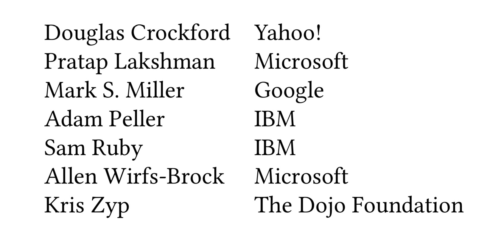
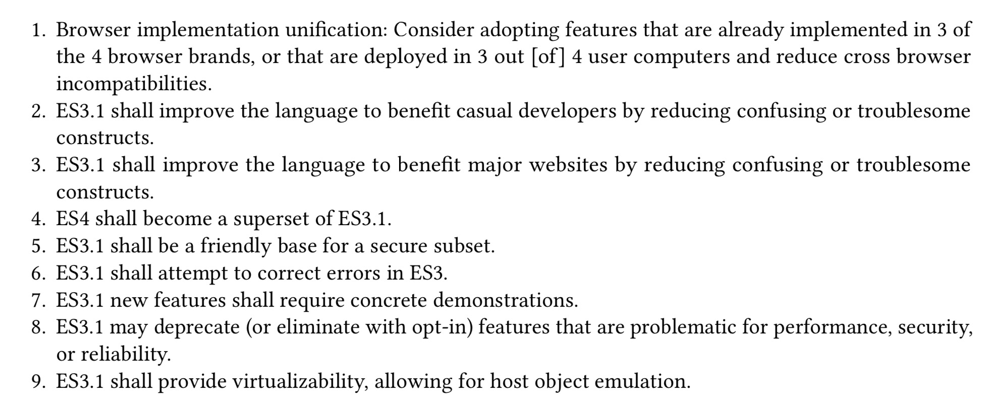

## 开发 ES3.1 / ES5
几乎整个 2007 年里，新版 ES4 工作组都认为 ES3.1 只是为了脱离新版 ES4 而做出的一个竞争性尝试，而且没有包含任何技术实质。但是，Douglas Crockford、Pratap Lakshman 和 Allen Wirfs-Brock 仍然致力于对 ES3 规范进行渐进式改以保证其与时俱进，并尝试修复互操作性问题的根源。在发布 ES3.1 的初始目标、设计原则以及功能级改动后，他们工作的第一步是要更全面地了解 Web 浏览器中 JavaScript 的现状以及 Web Reality 与 ES3 规范的不同之处。

ES3.1 工作组的一个担忧是，微软为 Internet Explorer 实现的 JScript 享有不符合 Web 标准的影响力。为了理解与 ECMAScript 有关的问题的有效性和范围，Allen Wirfs-Brock 请 Pratap Lakshman 对其进行分析以得到 IE JScript 偏离 ES3 规范的所有方式。分析的结果记载于一个长达 87 页的《JScript 与 ES3 的偏差》报告中，并于 2007 年 9 月完成。报告分为三个主要部分。第一个主要部分确定了当时 JScript 的实现偏离了 ES3 规范明确要求的每个位置。对于每个偏差，报告均提供了被违反的 ES3 规范语言、可用于观察偏差的测试用例以及在当时最新版本的 Internet Explorer、Mozilla Firefox、Opera 和苹果 Safari 上运行测试的结果。当时，这些浏览器被认为是「top four」的浏览器。图 29 展示了已识别的各种偏差的示例。有些偏差是 Internet Explorer 特有的，而有些偏差在所有测试的浏览器中相同，还有些偏差在 Internet Explorer 和其他一或两个浏览器中相同。


图 29. 一个记录在 JScript 偏差报告中的 ES3 偏差。

偏差报告的第二个主要部分确定了 ES3 规范中明确定义了「行为依赖于实现」或定义不充分的所有位置。该部分还提供了测试用例及其在四个主要浏览器上运行测试的结果。最后的主要部分描述了 Internet Explorer 实现的扩展 ES3 规范的功能。Wirfs-Brock 还准备了记载着 Firefox 对 ES3 扩展的列表。Douglas Crockford 和 Allen Wirfs-Brock 于 2007 年 8 月 16 日开会并审查了这些文件的草案。会议的结论是在 ES3.1 规范中进行了一系列的尝试性更改。

ES3.1 的开发在 2008 年 1 月的 TC39 会议上正式启动，会上审查了目标，另有几位 TC39 的参会者对开发工作表示有兴趣。2 月 11 日，Lakshman 向 TC39 私人电子邮件列表发送了一条 ES3.1 号召消息。该电子邮件提醒人们注意去年夏天准备的偏差与互操作性文档，并要求对这些文档提供更多反馈。2 月 21 日举行的电话会议上确定了每周两次电话会议的工作时间表。与以前的 ES3.1 讨论相比，参与这些电话会议的人数要多得多。图 30 列出了常规参会者。起初，人们直接使用电子邮件进行交换和讨论建议。也有一些讨论在 es4-discuss 电子邮件论坛进行。然而，由于与新版 ES4 主题相关的流量很大，导致很难挑选出 ES3.1 相关的主题，因此在 4 月成立了一个单独的 es3.1-discuss 电子邮件论坛，之后会议中的大多数 ES3.1 设计讨论都移至这个论坛。



图 30. 2008 ES3.1 WG 会议一般参会者。

第一批的讨论主题中有一个是回顾 ES3.1 的总体目标以及解决的问题和添加新功能应遵循的设计规则。微软 Live 团队的开发人员和其他一些 Web 框架开发人员所倡导的早期立场是，避免使用任何新的语法扩展，因为这些扩展会导致脚本无法在现行或较旧版本的浏览器上进行解析。但是「无新语法」的规则过于约束，忽视了各种浏览器已经具备某些语法扩展的事实。讨论中基于微软的 JScript 偏差文档中分析的四个最著名的浏览器（Internet Explorer、Firefox、Opera 和 Safari）得出了「四分之三」规则，当这些浏览器中有四分之三同意实现某个功能或具有相同行为时，ES3.1 规范就应采用该功能。这个规则引发了关于「ES3.1 应该如何处理浏览器互操作性问题」的广泛讨论。

大家一致认为，通过规定语言更改来改变 ES3.1 的首要原则是「不要破坏 Web」，因为这将改变已经在主要浏览器之间进行交互的现有 Web 页面的行为。但是，在数以亿计的现有网页中，这些改动实际上依赖于 ECMAScript 规范的哪些内容？哪些改动会是 Web breaking？浏览器开发者中的传闻报道认为，由于现有网页的庞大基数，某些可互操作的浏览器功能（无论用法有多晦涩或令人难以置信）都可能被某些已有页面使用。基于此观点，所有四种主要浏览器的通用功能不能更改，而四种浏览器中的三种浏览器的通用功能则很适合标准化。但是，对于只有四个浏览器中的两个或所有浏览器都不同的功能和行为呢？显然，此类功能和行为对于现有的可交互 Web 并不是必需的，并且可能会在标准化过程中进行修改。

工作组还发现，ECMAScript 规范中对实现可变性的限制通常不利于创建可互操作的网页。传统语言规范可能会允许「特定于实现」（implementation-specific）的变化以便为语言实现者提供灵活性或适应不同实现中的已知变化，但这会与通过多个独立创建的 Web 浏览器访问全球的可互操作 Web 的想法完全不兼容。ECMAScript 规范需要比传统语言规范更规范、更详细，并且还需要尽可能消除现有的实现偏差。经过二月份的初步讨论，Douglas Crockford 在 WIKI 上发布了修订后的 ES3.1 目标（图 31）。



图 31. 2008 年 2 月 ES3.1 修订后的目标。


图 32. 截至 2008 年 3 月 28 日的 ES3.1 工作组任务分配。

在 2008 年 3 月的面对面会议上，工作组一致认为应该立即开始编写实际的 ES3.1 规范文档。Patrap Lakshman 带着经过勘误表修正后的 ES3 规范的版本到达了会议，该勘误表由 Mozilla 维护。工作组同意将其用作 ES3.1 基础文档，并请 Lakshman 担任编辑。跟以前的版本一样，规范文档将使用微软Word 编写。基于第三版的更改跟踪（change tracking）将用来跟踪用于审查的规范演变情况，并确保在新版 ES4 的努力下改动能被重新集成。工作组的成员（图 32）被指派来开发特定新功能的规范文本。当工作完成后，Lakshman 会将它们合并到 master 草案中去。

2008 年 5 月 29 日，Pratap Lakshman 在 TC39 Wiki 上发布了 ES3.1 规范的初稿。更新后的草案通常每周发布一次，而「审查草案」则在每次 TC39 会议之前两到三周发布。2008 年 5 月 29 日到 2009 年 3 月 2 日期间共发布了 26 个中间草案。

长期以来，IBM 一直主张 JavaScript 需要支持小数运算。从 1998 年 11 月 19 日 TC39 工作组会议开始，Mike Cowlishaw 就主张将其包含在 ES3 和初版 ES4 中。当 IBM 重新通过 TC39 为新版 ES4 和 ES3.1 做出贡献时，他们再次强烈主张引入对小数的支持。IBM 的参与者确保 TC39 意识到「反对所有不支持小数运算的新语言标准」是 IBM 的政策。TC39 中的许多人都对实现这一目标的可行性表示怀疑，但是 Brendan Eich 支持 IBM，并指出 Firefox 最常报告的的错误来自于那些不了解二进制浮点运算语义的 JavaScript 开发人员。Eich 帮助 Sam Ruby 开始开发原型，他们使用 Mozilla 的 SpiderMonkey 引擎将 IEEE 754-2008 浮点小数实现为新的原始数据类型，使其可以在混合模式（mixed-mode）表达式中与 Number 类型结合使用。在 2008 年 9 月和 2008 年 11 月的 ES3.1 草案中纳入了关于小数功能的相当完整的规范。2008 年 11 月 19 日至 20 日的 TC39 会议的目的是就从 ES3.1 草案中保留或删除哪些新功能做出最终决定。会议的第一项议题便是小数运算支持。委员会的结论是，小数设计仍然太不成熟，并且存在剩余的设计问题，这些问题在不延迟 ES3.1 的情况下是不可能解决的。会议纪要中记录了这些担忧，并得出以下结论：

> 由于存在这些问题，因此决定将小数的支持推迟到 ECMAScript 的 Harmony 修订版之前。与会者承认，在 ECMA-Script 小数提案的开发方面已经取得了非常显著的进展，并要感谢 IBM 的 Sam Ruby 在开发方面所做出的努力。与会者鼓励 Sam 和其他 TC39 成员继续开发该提案，并对完全集成且通用的小数运算版本可以成为 Harmony 修订的组成部分感到乐观。

在 2009 年 1 月发布的下一个审核草案中没有关于小数运算的资料。

由于微软将 JavaScript 开发责任转移给了一个新的基于 Redmond 的小组，并且 Pratap Lakshman 拒绝了调迁的机会，因此他在 2009 年 3 月 25 日至 26 日的会议上宣布辞去 ECMA-262 编辑的职务。委员会任命 Allen Wirfs-Brock 接任他的编辑职位。

Wirfs-Brock 回忆说，在 TC39 会议期间的一个休息时间，他接近了 Brendan Eich 并建议将 ES3.1 重命名为带有整数的版本。关于新名称的说法是，E3.1 已成长为 ECMA-262 的完整版本，与之前的三个版本一样重要。由于停产的新版 ES4 作品已经广为宣传，因此将 ES3.1 指定为第 4 版会对 JavaScript 开发人员社区和 Web 搜索引擎造成混乱。相反，Wirfs-Brock 建议 Ecma 永久停用 ECMA-262 第 4 版，并发布 ES3.1 作为第 5 版。Eich 同意了，所以在会议恢复时，他们向接受该提议的整个委员会提出了这个想法。在会议上同意后，委员会还同意接受当时最新的草案作为最终草案。2009 年 4 月 7 日，「最终草案」以第 5 版的名称发布。最终草案定稿后，又发布了五个候选草案，其中包含一些较小的技术和编辑更改。在 2009 年 8 月，苹果公司发现，使 `arguments` 对象继承自 `Array.prototype` 的决定会与 `Prototype` 框架发生了意外的交互，从而破坏了多个苹果网站和 NASA 网站。这一改动已从最终规范中删除。

2009 年 9 月 23 日，TC39 投票接受了 ES5 的完成，并将其转发给 Ecma 大会批准。Ecma GA 审核并批准的最终草案于 2009 年 10 月 28 日发布。在第 3 版获得批准十年后，《ECMA-262 第 5 版》于 2009 年 12 月 3 日由大会批准。大会投票赞成 19 票，反对 2 票。IBM 投反对票，因为该标准不包括对小数运算的支持。Intel 表示，他们不投票只是因为他们没有足够的时间对规范进行完整的知识产权审查。

《ECMA-262 第 5 版》是 ISO/IEC ECMAScript 标准的快速通道修订版。它经历了 ISO 国家机构的审核过程，Allen Wirfs-Brock 根据审核过程中的反馈将许多编辑上的更正和澄清纳入了规范。该修订版于 2011 年 6 月作为《ECMA-262 第 5.1 版》和《ISO/IEC 16262 第 3 版》发布。

## ES5 技术设计
尽管 ES3.1 最初的目标非常保守，ES5 仍包含多项技术创新。

*严格模式*（Strict Mode）。ES5 严​​格模式是 Douglas Crockford 为 JavaScript 设计的「纠正错误和不便」的最终产物。其中一些不便在当时会造成语法错误，例如*保留字*（reserved words）既无法作为*对象字面量*（object literals）的属性键，也无法在点号后使用。而在 ES5 中可以在不影响现有代码的情况下被修正。但是，仍有许多 JavaScript 的错误功能并不能无条件修复，因为它们可能会更改现有代码的运行时行为，从而「破坏 Web」。严格模式的想法是使 JavaScript 开发人员有机会使用新的或更新后的代码来明确是否选择加入（opt-in）包含此类修复程序的语言方言。浏览器将必须同时支持严格模式和传统非严格模式的代码。在理想情况下，严格模式应该能够在各个函数级别上进行选择，以便现有脚本可以逐步转换为使用严格模式。人们希望随着时间的流逝，严格模式将成为编写新代码的主要方言。但是，最初的采用是一个问题。有人认为在所有主要浏览器上实现 ES5 严格模式之前可能会有相当大的延迟。浏览器博弈论预测，如果严格模式会使脚本在某些流行的浏览器上无法使用，那么开发人员将不会使用它。使严格模式符合 subtractive 可以避免该问题。严格模式并没有向 ECMAScript 添加新功能；相反，它删除了有问题的功能。在不支持严格模式的浏览器上运行时，无错误的严格模式代码应继续按开发人员的预期工作。

早期的一个问题是如何选择是否进入严格模式。严格模式的细粒度要求能通过一种可以轻松嵌入到脚本中的机制进行选择。它不能是外部的，例如 `<script>` 元素*属性*（attribute）。ES4 考虑使用 `use` 指令放置在 ECMAScript 代码中以选择各种模式。但是这样的指令将违反 ES3.1「无新语法」的设计规则。还有一种可能性是使用特殊形式的注释作为指令。但是，ES3.1 工作组不愿使用任何有意义的语义注释，因为 JavaScript 压缩工具（minimizers）会删除注释。Allen Wirfs-Brock 发现，ECMAScript `ExpressionStatement` 的语法可生成任何表达式，包括仅包含字符串字面量常量的表达式，只要它是显式的或隐式的（通过 ASI）后跟分号，那么它就可以转换成有效的语句。这意味着诸如 `"use-strict";` 的声明，在语法上是有效的 ES3 代码。因为它只是一个常量值，所以在 ES3 中执行它没有副作用。它是一个*无操作*（no-op）。使用这样的语句作为严格模式的选择似乎是非常安全的，因为任何现有的 JavaScript 代码似乎都不太可能已经使用了这样的语句形式，并且 ES3 的实现将忽略它在已加载的任何 ES5 代码中的存在。工作组采纳了这个想法，使用 `"use-strict";` 的声明作为脚本或函数主体的第一条语句，就表示整个脚本或函数应使用严格模式语义处理。

严格模式的主要目标之一是捕获容易出现但在运行时不明显的编码错误。严格模式下添加了以下新的运行时错误：

* 给未声明的标识符赋值。在旧版 JavaScript 中，对误打的变量名称进行赋值会导致在全局对象上创建属性。
* 给只读的自有或继承的属性赋值。在旧版 JavaScript 中，此操作无提示。
* 尝试在不可扩展的对象上创建属性。这样的对象在 ES5 之前就不存在，但是为了保持一致性，在 ES5 中的严格模式之外执行此操作将无提示地执行任何操作。
* 将删除运算符应用于不可删除的属性。在旧版 JavaScript 中，删除将返回 `false`。
* 将 `delete` 运算符应用于变量引用会产生语法错误。在旧版 JavaScript 中，对于明确声明的变量，`delete` 会返回 `false`。如果变量引用是通过对象的 `with` 语句支持的，或者是全局对象的属性，则它将在旧版 JavaScript 中删除。

严格模式还会删除或修改那些可能会使程序更混乱，更难优化或更不安全的功能：

* 禁止 `with` 语句。`with` 语句提供了一种变量引用的动态作用域形式，这种形式可能会造成困扰，并且难以实现优化。
* `eval` 函数不能动态添加新绑定到当前作用域。
* `eval` 和 `arguments` 不能用作变量或参数名称。
* 函数的 `arguments` 对象不与其*形参*（formal parameters）相关联。相反，严格模式 `arguments` 对象是一个类数组（array-like）的对象，其元素是传递给函数的参数值的快照。修改其元素不会修改相应形参的值，反之亦然。
* 严格模式下的函数的 `arguments` 对象没有 `callee` 属性。将这样的对象传递给其他代码时不再隐式转移调用其函数的能力。
* 严格模式下的函数禁止在 `arguments` 上实现 `caller` 属性功能的对象。 `caller` 属性是 ES3 的一个非标准但已广泛实现的扩展，该扩展使得可以遍历函数的调用堆栈并获取所有的调用函数。
* 严格模式下的函数如果没有提供 `this` 值，全局对象对其便不可用。

Douglas Crockford 的错误和不便清单上的还有许多关于严格模式的功能，但不包括在内。对于这些功能，要么是 TC39 无法就该功能不受欢迎达成一致，要么是发现该改动不会符合 subtractive。例如，尽管 Crockford 和其他许多人不喜欢 JavaScript 的自动分号插入，但许多开发人员更喜欢在没有显式分号的情况下进行编码。同样，将 `typeof null` 更改为返回非 `object` 的其他内容也不符合 subtractive。

*Getters，Setters，Object 元操作（Meta Operations）*。从第一个 JavaScript 实现开始，内置对象和宿主对象中的某些属性就已具有一些标记。对于通过 JavaScript 代码创建的对象，这些标记并不可用。例如，某些属性具有只读的值或无法使用 `delete` 运算符删除，内置对象和宿主对象的方法属性在被 `for-in` 语句进行枚举时将会被跳过。在 ES1 中这些特殊语义的确定，是通过将 ReadOnly，DontDelete 和 DontEnum 这些标记（attribute）与「规范中的对象模型」相关联的方式来实现的。这些标记会通过伪代码来测试，伪代码定义了它们所涉及的语言标记的语义。这些标记没有具现化（reified）- 在 JavaScript 中，并不存在能为「新创建或已有的属性」设置这些标记的语言标记。直到 ES3 时，添加了一个 `Object.prototype.propertyIsEnumerable` 用于测试 DontEnum 标记是否存在的方法，但是仍然没有对 ReadOnly 或 DontDelete 标记的非破坏性测试的相应方法。类似地，有许多由浏览器 DOM 提供宿主对象也暴露了一些属性，它们通常叫做「getter / setter 属性」。在 ES5 中这些属性被命名为*访问器属性*（accessor properties），会在存取属性值时执行计算。由于缺少对这些功能的标准化支持，JavaScript 程序员既无法定义「遵守与内置或宿主对象相同约定」的库，也无法实现 polyfill 来可靠地模拟这类对象。

这些问题的统一解决方案是新 ES5 功能中的最大集合。该功能集没有正式名称，被非正式地称为「静态对象函数」（Static Object Functions）或「对象反射函数」（Object Reflection Functions）。Allen Wirfs-Brock 为此功能集编写了设计原理文档。它包含了用例以及以下设计准则：

* 干净地将元（meta）和应用程序层分开。
* 尽量降低 API 的复杂度，例如方法的数量和方法参数的复杂度。
* 专注于命名和参数设计的可用性。
* 尝试复用设计中的基本元素。
* 尽可能使编程人员或实现能够充分使用 API。

第一条准则不鼓励在 `Object.prototype` 中添加其他方法，例如 `propertyIsEnumerable`，这将进一步模糊元和应用程序层的分离。相反，ES5 工作组决定通过把这些功能作为命名空间对象的属性，将这些功能与应用程序对象分离。他们考虑添加一个名为 `Reflect` 的新内置全局对象作为命名空间对象，但又担心这会与现有代码的名称冲突。最终，他们决定将新函数作为 `Object` 构造函数的属性，而不是 `Object.prototype` 的属性。将对象构造函数作为命名空间是一个不错的选择，因为它是一个已经存在的全局变量，并且在标准的实现和以前的版本中都没有定义任何属性。同时，它的名称也与重新考虑对象定义的想法契合。

下一个问题是确定 API 的形式。遵循第二条准则，ES5 设计人员希望避免给每个属性标记以及访问器属性分别设置单独的查询与赋值函数。设计人员考虑了许多方法来将该功能合并到少量函数中。一些可能性包括具有布尔标记的位编码的单个函数（例如「只读」）或具有大量*位置参数*（positional parameters）的单个函数。但是，这两种方法的可用性都不好。使用可选的*关键字参数*（keyword arguments）可能可以解决这些可用性问题，但是 ES5 缺少关键字参数。

Allen Wirfs-Brock 建议使用*描述符*（descriptor）对象，该对象的属性将与各种*属性标记*（property attributes）对应。这样的描述符可用于定义和检查属性。Wirfs-Brock 的第一份草案展示了一个可能的 API 示例，该示例用于向名为 obj 的对象添加属性：

``` javascript
Object.addProperty(obj, { name:"pi", value:3.14159, writable:false });
```

在示例中，描述符被编码为对象字面量，并且默认值被用作属性描述符上没有的与其他属性标记对应的所有属性。还有一个假设的 `defineProperty` 函数采用类似的描述符，可以用来更改已有属性的标记值。`defineProperty` 不会修改不存在于描述符属性上的标记。最后，可以通过调用`getProperty` 来获取对象的任何已存在的属性的完整描述符。


图 33. ES5 对象反射函数。

Mark Miller 提出了改进意见，建议定义一个 `defineProperty` 以支持「添加新属性」和「修改现有属性」用例。Miller 还建议从属性描述符中删除 name 属性，通过将描述符包装在一个对象中，该对象的属性名是目标对象中受影响的属性名。这样的「属性映射表」（property map）将允许通过单次调用定义多个属性。例如，以下操作定义了名为 `x` 和 `y` 的属性：

``` javascript
Object.defineProperties(obj, {
    x: { value: 0, writable: true },
    y: { value: 0, writable: true }
});
```

Miller 建议删除 `defineProperty` 并只保留 `defineProperties` 形式，因为它很容易用于单个属性。但是，这种表达方式很难定义具有计算名称的属性。ES3.1 没有语法方式将计算值放置在对象文字的属性名称位置。最终，ES3.1 既提供了用来定义通过单独的名称传递名称的单个属性的 `defineProperty`，又提供了可以使用属性映射定义多个属性的 `defineProperties`。ES5 定义的整套对象反射功能如图 33 所示。

访问器属性也能通过属性描述符来支持。使用具有 `get` 和 `set` 属性之一或两者的描述符来定义访问器属性，而不是 `value` 属性。例如，一个拦截数据属性操作的访问器属性可以定义为：

``` javascript
Object.defineProperties(obj, {
    x: {
        set: function(value) { this.privateX = value }, // 公有访问器属性
        get: function() { return this.privateX }
    },
    privateX: {
        value: 0,
        writable: true
    } // 「私有」数据属性
});
```

除了基于反射的接口之外，ES3.1 还添加了使用对象字面量定义访问器属性的语法支持。四分之三的浏览器都已经实现了这个语法，因此它符合添加新语法的标准。在对象字面量中通过函数来定义访问器属性，其中函数关键字 `function` 被 `get` 或 `set` 替换，例如：

``` javascript
var obj = {
    privateX: 0, // 一个普通的属性
    set x(value) { this.privateX = value }, // 访问器属性 x setter
    get x() { return this.privateX }, // 访问器属性 x  getter
    get negX() { return -this.privateX } // 只有 getter 的访问器
};
```

为了支持这些新功能，需要扩展内部对象模型，该对象模型首先在 ES1 规范中定义。并且还需要通过对象反射 API 暴露内部对象模型的一部分内容。这也为重新考虑对象模型的术语提供了契机。ES1 将属性描述为具有一个值和一组标记，这些标记包括 ReadOnly，DontEnum 和 DontDelete。ES1 的标记是无状态的，它们是附加到属性的标记，用来表明它们的存在与否。为了将标记作为属性描述对象的属性，ES3.1 设计人员通过更改内部模型将 ES1 标记建模为与每个对象属性相关联的布尔值状态变量，并且将属性值重新设定为另一个状态变量。内部标记的命名约定也更改为内部方法的双括号模式。为了支持访问器属性，内部对象模型需要添加 `[[Get]]` 和 `[[Set]]` 标记，这些标记的值分别是在值引用时调用的 getter 函数和在赋值时调用 setter 函数，或是表示默认函数的 `undefined`。属性根据是否具有 `[[Value]]` 标记、 `[[Get]]` 标记和 `[[Set]]` 标记来区分为数据属性或访问器属性。

为了支持访问器属性，需要更新 ES1 定义的 `[[Get]]` ，`[[Put]]` 和 `[[CanPut]]` 内部方法的规范。为了支持对象反射 API 使用的属性描述符，还需要添加  `[[DefineOwnProperty]]`，`[[GetOwnProperty]]` 和 `[[GetProperty]]` 内部方法。但是反射 API 仍然不够。在 ES3.1 中，`for-in` 语句对属性键的枚举、`Object.getOwnPropertyNames` 以及 `Object.keys` 函数仍使用非正式的散文来定义语义。

设计对象反射 API 的最后一步是为这些作为属性描述符对象中的属性标记的词汇，确定一致且可用的命名约定。尤其是 DontEnum 和 ReadOnly 之类的名称，它们缺乏内部一致性并引起可用性方面的问题，当它们被视为布尔值标志时更是如此。例如，将属性设为可枚举需要表达为双重否定（将 DontEnum 设置为 `false`）。在 2008 年初，Neil Mix 在与新版 ES4 有关的主题帖上建议，将 enumerable，writable 和 removable（对应 DontDelete）作为标记名更好。Mark Miller 对这些名称表示赞赏，并提出了一个设计指南：标记名应说明什么是允许的而不是什么是拒绝的。他还建议遵循安全最佳实践，即默认情况下拒绝。当定义属性时，必须显式地开启任何所需的标记。


图 34. ES5 中属性的标记状态图

对象反射 API 提供了 ECMAScript 早期版本中没有的新功能。它允许程序更改现有属性的标记，这些属性包括在数据属性和访问器属性。有一个考虑是是否需要额外的标记来禁用进行此类更改，可能作为标记名称的包括「dynamic」、「flexible」和「fixed」。人们担心添加一个额外的布尔属性标记可能会对现有实现产生影响。如果一个实现没有可用的额外位来表示该标记怎么办？最终，ES3.1 工作组意识到，更改属性的标记等效于原子查询该属性的当前标记，删除该属性，然后重新创建具有相同名称但标记值已修改的属性。鉴于这种等效性，可以使用单个标记来开启删除和修改。DontDelete、removable 标记被重命名为「configurable」，并赋予了该含义。Mark Miller 绘制了ES5属性标记的状态图，并发布在 ECMAScript Wiki 上。注意，当 configurable 标记为 `false` 时，仍然可以将属性的 writable 标记从 `true` 更改为 `false`。创建这个奇怪现象是为了安全沙盒可以更改某些内置属性，从不可配置但可写为不可配置的、不可写。

Douglas Crockford 作为在 JavaScript 应用程序中使用基于原型风格的面向对象编程的倡导者，他提倡使用名为 `beget` 的函数来创建具有明确的原型的对象。ES5 函数`Object.create` 本质上是将属性映射添加为可选第二参数的 `beget` 函​​数，例如：

``` javascript
var point1 = beget(protoPoint); // 创建一个 point , 使用 Crockford 风格
point1.x = 0;
point1.y = 0;
var point2 = Object.create(protoPoint, { // 使用 ES5 声明式的风格
    x: {value: 0},
    y: {value: 0}
});
```

ES3 中 Crockford 的 `beget` 函数与 ES5 的对比

Allen Wirfs-Brock 曾希望 JavaScript 程序员采用声明式风格，并且实现可以识别该模式并优化对象的创建。然而在实践中，可用性问题阻止了这个 ES5 模式的广泛应用。这个问题出在默认属性标记的选择上。JavaScript 1.0 中，通过隐式赋值创建的属性具有等效的属性标记 `{writable：true，enumerable：true，configurable：true}`。但是，在设计 ES5 属性描述符时使用的默认拒绝策略意味着所有这些标记的默认值均为 `false`。`Object.create` 声明式风格的例子如下所示：

``` javascript
// 使用 Crockford 风格，通过 Object.create 创建
var point1 = Object.create(protoPoint);
point1.x = 0;
point1.y = 0;
// point1.x attributes: writable: true, enumerable: true, configurable: true
// point1.y attributes: writable: true, enumerable: true, configurable: true

// using Object.create in a declarative
var point2 = Object.create(protoPoint, {
    x: {value: 0},
    y: {value: 0}
});
// point2.x attributes: writable: false, enumerable: false, configurable: false
// point2.y attributes: writable: false, enumerable: false, configurable: false
```

为了完全匹配 `beget` 示例的效果，使用 ES5 风格的 JavaScript 程序员必须编写：

``` javascript
// 创建一个 point 实例, 通过 ES5 支持以及传统的标记值
var point2 = Object.create(protoPoint, {
    x: {value: 0, writable: true, enumerable: true, configurable: true },
    y: {value: 0, writable: true, enumerable: true, configurable: true }
});
```

对于大多数希望使用 JavaScript 传统意义上更为宽松的默认值的程序员而言，这种表达方式过于繁琐。在实践中，通常使用 `Object.create` 的单参数形式来创建新对象，使用 `Object.defineProperties` 定义和操作已创建的对象的属性，很少使用 `Object.create` 的两个参数形式来定义新建对象的属性。

*对象的完整性与安全性功能*。Netscape 3 引入的 HTML `<script>` 元素 `src` 属性使网页可以从多个 Web 服务器加载 JavaScript 代码。按照最常见的说法，脚本被加载到一个JavaScript 执行环境中，在那里它们共享一个全局名称空间。跨站脚本可以直接进行交互，这使得人们可以创建 mashup 应用程序。跨站脚本的加载功能得到了广泛使用，并且使基于广告的 Web 业务模型成为了可能。但是，跨站脚本也可能相互篡改与干扰，并干扰页面主页站点中的脚本。Web 开发人员最终意识到，第三方脚本可能引发一些诸如窃取密码之类的用户机密数据或是修改页面行为以欺骗用户的风险。到 2007 年，网络广告经纪人在悄悄地分发恶意广告的行为开始被发现。浏览器厂商开发了各种 HTML 和 HTTP 级别的功能来解决该问题，例如内容安全策略（CSP），但是该级别的功能不能直接解决许多低级别的 JavaScript 漏洞。

当 Douglas Crockford 和 Mark Miller 参加 ES3.1 工作组时，正在积极开发用于提供 JavaScript 执行沙箱的技术，这些沙箱可用于安全地托管不受信任的第三方 JavaScript 代码的执行。尽管 ES3.1 强大的向后兼容性需求意味着无法消除许多已知的第三方脚本漏洞，但 Crockford 和 Miller 都力求消除可以被删除的漏洞并添加新功能以促进安全沙箱的创建。特别是 Mark Miller，他对基于对象能力构建沙箱所需的功能十分感兴趣。

最大的问题是 JavaScript 对象的可变性。默认情况下，每个 JavaScript 对象（包括标准库对象）都可以通过获取该对象引用的来任意修改。属性和方法可以被更改、赋值或删除。这适用于直接引用的对象以及从根对象开始可间接引用的所有对象。尽管 ES3 没有提供直接修改对象对其原型对象的引用的方法，但是除 Internet Explorer 之外的所有主流浏览器都已经实现了非标准属性 `__proto__`，通过该属性可以修改对象的原型继承链。唯一的例外是 ES3 中带有 ReadOnly 或 DontDelete 标记的少数内置属性。

Mark Miller 和 Douglas Crockford 希望增加在将对象传递给不受信任的代码之前锁定该对象属性的功能。他们将使用该功能来保护暴露给沙盒的内置库对象，并允许托管沙盒的代码保护将其传递给不受信任的代码所需的任何对象。通过将 DontDelete 标记重新用作 Configurable 标记与使用 `Object.defineProperty` 使属性变为不可配置的能力，提供了保护单个属性的基本能力。但这仍不足以防止不受信任的代码将新属性附加到传递给它的对象上。添加新属性的能力使不受信任的代码可以覆盖继承的行为，并有可能构建可用于泄漏私人数据的秘密通信渠道。在 ES5 中，通过将一个内部 `[[Extensible]]` 的新状态与每个对象相关联来解决这个问题。创建对象时，`[[Extensible]]` 默认设置为 `true`。但是，如果将它设置为 `false`，则新属性就无法添加到该对象上，任何用于修改对象的 `[[Prototype]]` 的扩展也被无法实现。最后，一旦 `[[Extensible]]` 设置为 `false`，就无法将其重置为 `true`。

`Object.isExtensible` 函数提供了一个用于查询对象的 `[[Extensible]]` 状态的 API。函数 `Object.preventExtensions` 强制将 `[[Extensible]]` 设置为 `false`。`Object.freeze` 函数能够很方便地将 `[[Extensible]]` 以及所有属性的 `[[Configurable]]` 和 `[[Writable]]` 标记设置为 `false`。这使得对象的直接状态完全不可变。`Object.seal` 函数类似 `Object.freeze`，只是它没有将 `[[Writable]]` 设置为 `false`。它固定了对象的原型和属性集，但仍允许修改数据属性的值。

另一个重点关注的问题是对全局对象的环境访问。ECMAScript 将全局对象定义为一个属性位于全局作用域上的对象。所有命名的标准库对象都作为全局对象的属性存在，并且大多数 JavaScript 宿主环境向全局对象添加了特定于环境的其他对象和 API 函数。例如在浏览器中，全局对象与 `window` 对象相同，并提供对当前网页的 DOM 对象和其他浏览器 API 的完全访问权限。通常，沙箱会限制对某些或所有全局对象属性的访问，或者提供某些全局对象属性的替代版本。理论上，可以通过在所有沙盒代码周围强行放置一个额外的词法作用域并设置该作用域来实现这个效果，这个做法可以为某些全局对象属性提供替代绑定，或者通过提供值为 `undefined` 的 shadow 绑定来隔离它们。但是自 JavaScript 1.0 以来，已经有一种方法可以访问无法被词法作用域掩藏的全局对象：

``` javascript
function getGlobalObject() {
    // 直接调用时，this 的值是 global 对象
    return this;
}
getGlobalObject().document.write("pwned");
```

直到 ES5 前，直接调用函数（而不是由对象限定的方法调用）的行为将传递 `null` 作为隐式 `this` 参数，并且所有函数在输入时都将替换 `this` 值为 `null` 的全局对象。为了向后兼容，不能对现有代码进行更改。但是，ES5 严格模式为新代码提供了主动加入新行为的机会。在 ES5 中，严格模式函数永远不会用全局对象替换实际的 `this` 参数。沙盒可以只允许在沙盒中运行严格模式的 JavaScript 代码，从而保护自己免受环境全局对象访问。

随着 ES5 的开发，Web 上开始出现如图 35 所示示例的实际的恶意漏洞。ES3 规定使用对象字面量创建的对象继承于 `Object.prototype`，并且该对象字面量使用 `[[Put]]` 内部方法安装新对象字面量中列出的属性。但是，当使用 `[[Put]]` 将值分配给对象的属性时，它会查找原型继承链，以查看它是否可以找到具有相同名称的属性。如果它找到具有该名称的 setter 属性，它将执行该 setter 函数。如果在 `Object.prototype` 上安装此类 setter，则任何尝试使用对象字面量形式创建一个与 setter 同名的属性都将调用 setter 函数，并将该属性值传给它。

修复此漏洞是对对象字面量语义的破坏性更改，但浏览器供应商愿意为修复安全漏洞而进行此更改。实际的规范更改很简单：不用使用 `[[Put]]` 语义来创建新对象的属性，ES5 使用了新的 `[[DefineOwnProperty]]` 内部方法，该方法始终忽略继承的属性并直接在对象上创建新的属性。

ES5 只能使 JavaScript 在安全方面前进一小步。当 ES5 的工作正在进行时，Douglas Crockford 建议在 TC39 内成立一个 Secure ECMAScript（SES）工作组，目的是探索开发一种不受向后兼容约束的 ECMAScript 安全方言的可能性。SES 工作组在 2008 - 2009 年举行了四次会议，并审查了一些现有的 JavaScript 解决方案，以对不可信代码进行安全评估。最终，TC39 放弃了标准化一个单独的新方言的想法，但是诸如对象能力模型之类的 SES 概念极大地影响了 Harmony 的活动。Ankur Taly 等人正式确定了严格模式和其他 ES5 功能是如何使创建 mashup 友好的安全 ECMAScript 子集成为可能的。

``` javascript
// 假设网页使用对象字面量将一些有价值的信息存储在名为「secret」的属性中
function setupToStealSecret() {
    // 使用非标准（pre-ES5 getter/setter）API 在 prototype 上定义一对 getter/setter
    Object.prototype.__defineSetter__("secret", function(val) {
        this.__harmlessSoundingName__ = val; // 将它储存在其他属性上
        exploitTheSecret(val, this)
    });
    Object.prototype.__defineGetter__({"secret", function() {
        // 从「替代属性」上获得值，不会破坏原有代码逻辑
        return this.__harmlessSoundingName__;
    });
}

// 当代码使用具有「secret」属性的对象字面量定义对象时，该秘密就会泄漏
var objectWithSecret = {
    secret: "password"; // 这会触发继承的 setter
    // 也许还定义了其他的属性
};
```

图 35. 使用 JavaScript 1.5 的 `__defineSetter__` 扩展的安全漏洞。通过在 `Object.prototype` 上定义 setter 属性，攻击者可以劫持使用对象字面量定义的特定属性的值。

*移除激活对象（Activation Objects）*。在 ES5 之前，ECMAScript 规范已明确使用 ECMAScript 对象来定义 ECMAScript 语言的作用域语义。每个*作用域轮廓*（scope contour）都由一个激活对象（普通的 ECMAScript 对象）表示，该对象的属性提供了与当前轮廓对应的代码所创建的变量和函数绑定。嵌套作用域被定义为一个激活对象的列表，这些对象按顺序搜索引用绑定。引用绑定的语言功能使用的属性访问语义运算符与访问激活对象和访问用户程序定义的对象属性是一样的。ES1 和后续规范指出，激活对象是 ECMAScript 程序无法观察到的纯粹的规范设备。然而，如果引擎完全符合规范，由属性访问语义导致的一些意外的边缘情况（edge-case）的行为也可以被观察到。各个实现（如果有）在实现这些边缘情况的语义方面存在偏差。

一个反常现象是激活对象可能是继承自 `Object.prototype` 的，而 `Object.prototype` 是新创建对象的默认原型。这意味着 `Object.prototype` 的属性被所有激活对象继承，并且将作为每个激活对象的本地绑定，这会导致外部作用域中任何相同名称的绑定被遮蔽（Shadowing）。

因为绑定解析被规定为动态发生的并且使用激活对象进行属性查找，那么在调用函数之前，预先引入相关名称在 `Object.prototype` 上的绑定，任何在被调用函数中的自由引用都能被拦截。例如：

``` javascript
var originalArray = Array;
function AltArray() {
    // 用于替代内置 Array constructor
    // ...
}
// 调用一个函数, 强制它使用 AltArray
Object.prototype.Array = AltArray;
somethingThatFreelyReferencesArray();
delete Object.prototype.Array; // 移除可选的 Array 绑定
```

ES1–ES3

另一个反常现象是在 ES3 中，`try` 语句的 `catch` 子句的参数会作为包含 `catch` 子句的主体的新作用域中的一个本地词法作用域内的绑定来处理。使用 ECMAScript 对象表示作用域轮廓也给该语义带来了问题。ES5 规范对这个问题的描述如下：

> 12.4：在第 3 版中，将创建一个对象，就像由 `new Object（）`一样，用作解析传递给 `try` 语句的 `catch` 子句的异常参数名称的作用域。如果实际的异常对象是一个函数，并且在 `catch` 子句中被调用，则作用域对象将作为调用的 `this` 值传递。然后，函数主体可以在 `this` 值上定义新属性，并且在函数返回后，这些属性名称将成为 `catch` 子句作用域内的可见标识符绑定。在第 5 版中，当将异常参数称为函数时，`undefined` 将作为 `this` 值传递。

在 2008 年的大部分时间里，工作组打算在新版本中引入 `const` 声明，因为它的功能在四分之三的主要浏览器中可用，尽管语义不同。该计划的目的是使 const 词法作用域缩小到块级别，并且有望进一步强调该规范在先前版本中使用的传统作用域模型。

为了解决这些问题，Allen Wirfs-Brock 开发了一个新的规范级别的作用域和绑定模型，该模型不使用 ECMAScript 对象语义来定义标识符解析机制，并且引入了环境记录的概念，环境记录包含单个作用域轮廓的绑定以及环境，环境是环境记录的有序列表，这些环境记录为 ECMAScript 程序中某个点的标识符解析提供了上下文。环境记录有许多类型，它们虽然可用于表示全局作用域、函数作用域、块作用域以及 `with` 语句作用域，但是所有环境都公开了一个规范级别的通用协议，用于单个绑定的定义、查找和值突变的。声明或访问变量和其他类型的绑定的语言功能都被规定使用通用环境记录协议。

但是，`const` 声明最终会推迟到规范的未来 harmony 版本中使用，因为工作组意识到过早纳入 `const` 可能会引入一些语义，这些语义会妨碍将来更全面的块级作用域设计。所以 ES5 仍使用新的作用域模型来解决已知的传统作用域异常，并为 ES6 中一组更全面的声明语句奠定了基础。

*ES5的其他功能*。除了图 33 中列出的对象反射函数外，ES5 还添加了以下标准的内置函数、方法和属性：

- `JSON.parse` 和 `JSON.stringify` 用于将对象与 JSON 交换格式字符串相互转换
- 九个新的 `Array.prototype` 方法：`indexOf`，`lastIndexOf`，`every`，`some`，`forEach`，`map`，`filter`，`reduce` 以及 `reduceRight`
- 一个新的 `String.prototype` 方法：`trim`
- `Date`：`Date.prototype.now` 方法以及用于解析和产生 ISO 8601 日期格式的数据字符扩展
- 新的 `Function.prototype` 方法 `bind` 和函数实例上的 name 属性

其他杂项更改和增强包括：

- 语义上修复 `with` 语句和 `catch` 子句参数的作用域
- 使用 `[]` 语法对字符串进行类似数组的索引
- 对正则表达式语法进行较小的更改
- 每次执行正则表达式文字时都需要创建一个新的 `RegExp` 对象
- 对错误的正则表达式字面量进行提前错误报告
- global 对象中的 `undefined`、`NaN` 和 `Infinity` 属性具有只读的值
- 要求所有规范算法都使用 `Object`、`Array` 等的内置初始值代替当前值
- 附录 D 和 E 中列出的各种非规范性语义说明和更正

## 实现与测试
在 2008 年 7 月于奥斯陆举行的 Ecma TC39 会议上，委员会同意在发行之前有两种具备互操作性的 ES3.1 实现。「两种具备互操作性的实现」需求的主要原因是确保委员会不会对那些尚未被证明在技术上可行且与现有 Web 内容兼容的内容进行标准化。Mozilla 承诺提供其中一种实现。由于微软的市场地位以及历史上较少的浏览器更新，TC39 内部有一种强烈的感觉，认为微软应该通过公开浏览器托管（browser-hosted）的原型实现作为 ES3.1 验证过程的一部分，来表明其对 ES3.1 的承诺。当时 TC39 计划准备在 2009 年 6 月的 Ecma GA 会议上发布 ES3.1。为此，需要在 2009 年 3 月的 TC39 会议上根据在 2 月到 3 月的范围内进行的互操作性测试的结果，来决定是否继续下去。当时，还没有针对 ECMA-262 的官方一致性测试套件，当然也没有针对 ES3.1 新功能的测试。所有实现都具有自己的特定测试（ad hoc test）套件。除了微软之外，所有实现都使用 Mozilla 的 JavaScript 测试套件。微软对 Mozilla 测试套件所使用的 Mozilla 公共许可证有所顾虑，因此不会使用或贡献它。微软的首选是使用通过 Ecma 提供的 MIT 或 BSD 风格许可证的测试套件。

在 2008 年 10 月，Pratap Lakshman 开始努力开发 Internet Explorer 托管的 ES3.1 实现和配套的测试套件。

已实现的测试用例将被贡献给社区。测试套件的目标是实现最大的代码覆盖率，其中「代码」是规范中的伪代码。每个测试用例均以它在规范的最新草案的章节和算法步骤编号命名，并放置在单独的 `.js` 源文件中。图 36 说明了命名测试文件时使用的约定。


图 36. 用于 esconform 测试用例文件的命名约定。每个文件包含一个测试，并且以测试的规范伪代码步骤的编码结果作为文件名。

Lakshman 实现了 900 多个测试用例和一个简单的测试工具来运行和报告各个测试用例。图 37 是其中一个测试用例的示例。

``` javascript
// Test Subclause 10.4.2 Alorithm 3 Step 1 Strict mode}
var testName =
"Eval code in strict mode-cannot instantiate variable in calling context";

function testcase() {
    eval("'use strict ';var __10_4_2_3_1_s = 1");
    try{
        __10_4_2_3_1_s;
    } catch(e) {
        if (e instanceof ReferenceError)
        return true;
    }
}
```

图 37. 一个 ES5conform 测试。这个测试用例位于微软为 TC39 提供的初始 zip 文件中的 10.4.2-3-1-s.js 中。

在 2009 年 1 月的 TC39 会议上，Pratap Lakshman 演示了使用 `JSCRIPT.dll` 实验版本集成到刚发布的微软 Internet Explorer 8 Release Candidate 1 中的 ES3.1 原型。该演示包括新的语言功能以及一致性测试套件。人们对这项工作大加赞赏，Waldemar Horwat 在会议记录中提到：「开发者们欣喜若狂」。

微软向 Ecma 提供了这些测试，并在其开源项目门户「codeplex.com」上以「ES5conform」的名称发布了这些测试。大约在同一时间，谷歌宣布将发布在开发 Chrome 的 V8 JavaScript 引擎的过程中创建的开源 ES3 测试套件。这个测试套件被命名为「Sputnik」，包含了 5000 多个测试。

2010 年，ES5conform 和 Sputnik 成为了名为「Test262」的通用测试套件的核心，该套件由 Ecma TC39 管理。由 Ecma 技术委员会维护和分发软件包是一种根本性的改变，为了实现这一目标，必须解决许多策略和许可问题。起初，David Fugate 领导了 Test262 开发的 ES5 阶段。之后，Brian Terlson 为 ES6 组织了 Test262，在 ES6 后，Test262 由 Leo Balter 进行组织。现在，Test262 已成为 TC39 开发过程中不可或缺的一部分，每个 ECMAScript 新功能必须在测试后才能纳入 ECMAScript 标准。截至 2018 年 8 月 21 日，Test262 包含了 61877 个测试。Test262 的成功使得 TC39 确信可执行的规范并不是必需的。
