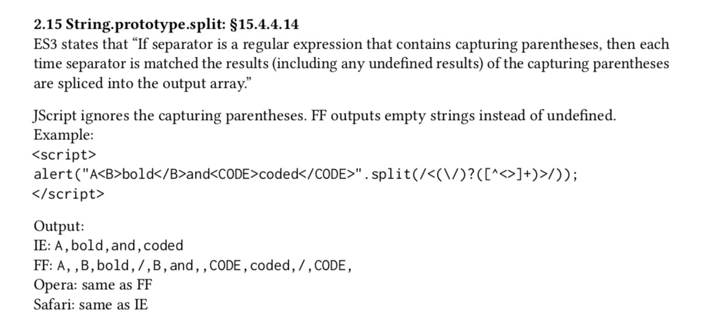
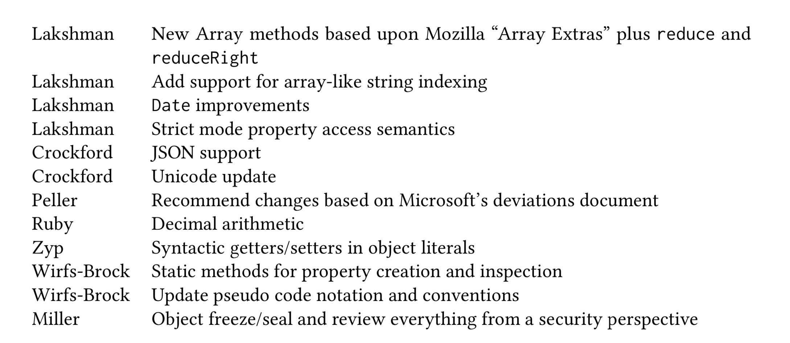
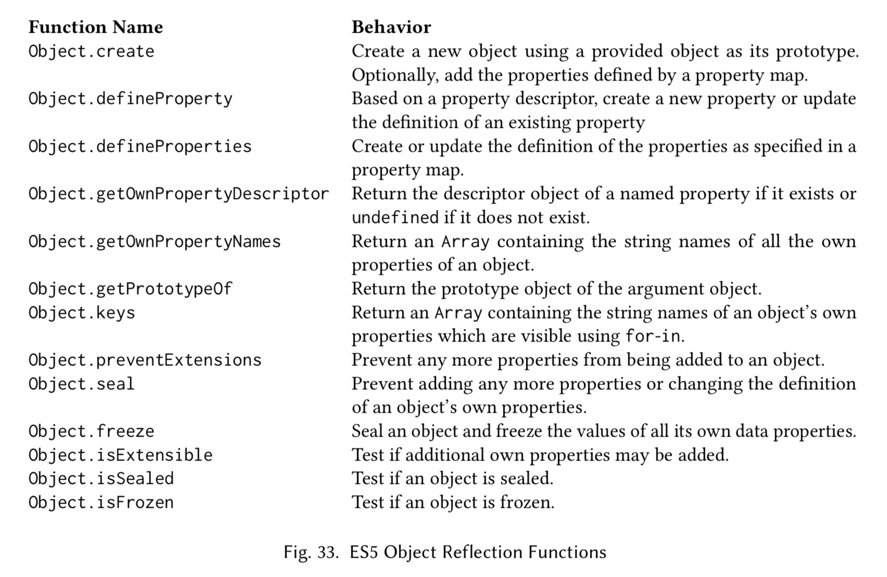
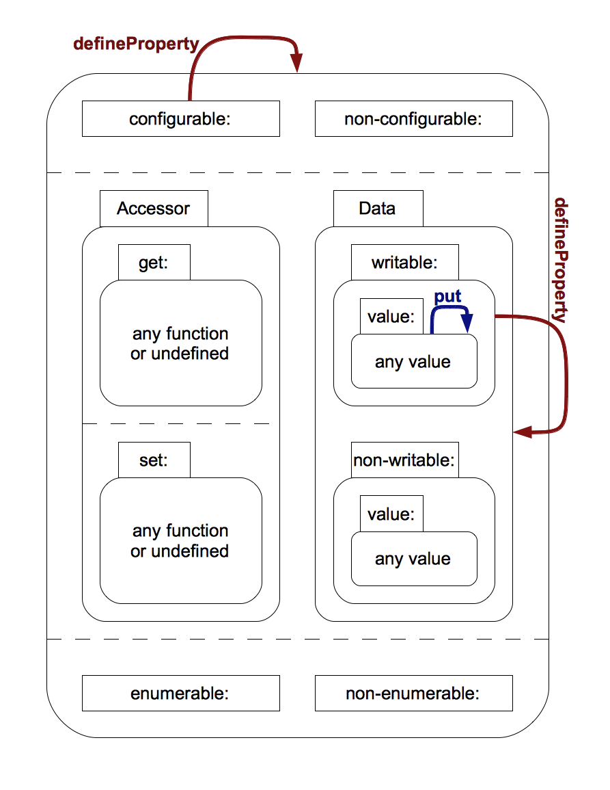
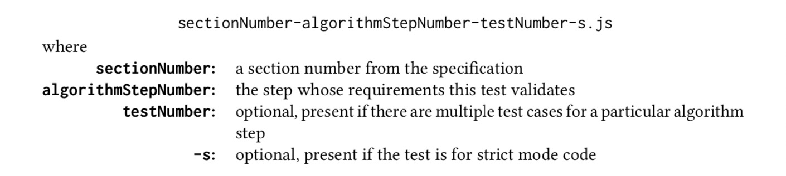
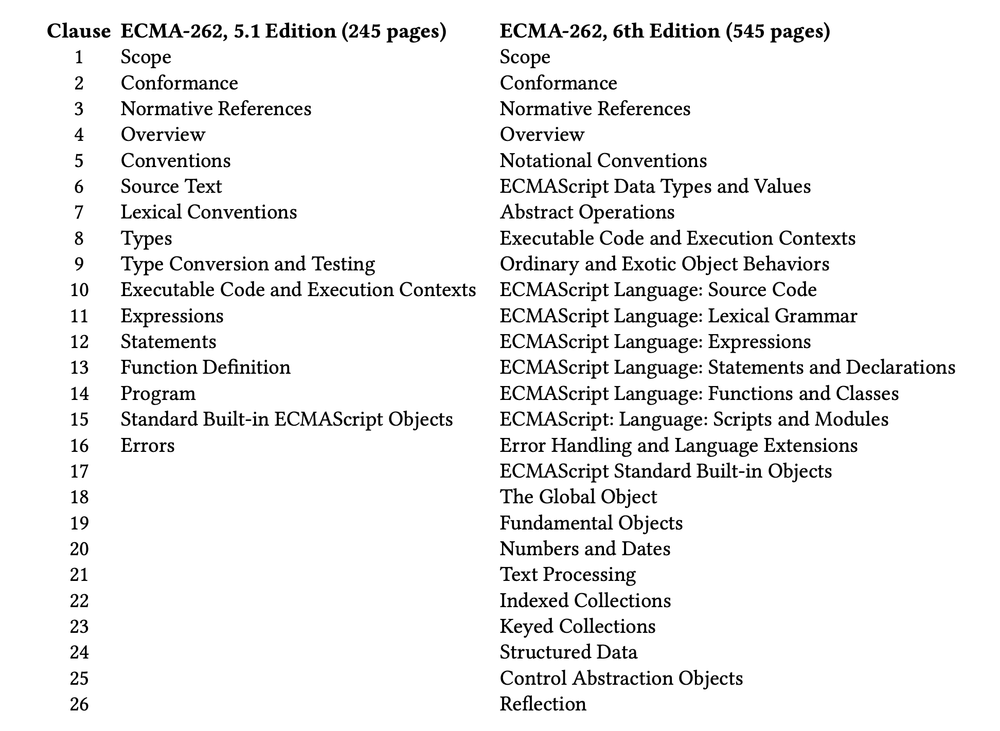

## 开发 ES3.1 / ES5
在 2007 年的大多数时间里，新版 ES4 工作组都认为对 ES3.1 的投入不过是企图阻挠新版 ES4 的竞争，其中并没有实质性的技术。但是，Douglas Crockford、Pratap Lakshman 和 Allen Wirfs-Brock 仍然致力于对 ES3 规范进行增量修改，从而保证规范与时俱进，并修复各种导致互操作性问题的隐患。在发布 ES3.1 的初始目标和设计原则，并提出语言特性级的改动后，他们走出了工作的第一步，即全面了解当时 Web 浏览器中 JavaScript 的现状，以及真实的 Web 与 ES3 规范之间有何不同之处。

ES3.1 工作组有一个直接的关注点，那就是微软为 Internet Explorer 实现的 JScript 以不符合 Web 标准而闻名。为了验证这些 ECMAScript 相关问题的有效性与影响范围，Allen Wirfs-Brock 请 Pratap Lakshman 进行分析，以确定 IE 的 JScript 与 ES3 规范之间一共有哪些出入。这次分析于 2007 年 9 月完成，其成果是一份长达 87 页的报告，名为《JScript 到 ES3 的偏差》。这份报告分为三个主要部分。在第一部分里，报告逐个确定了「当时的 JScript 实现」与「ES3 规范的明确要求」之间存在偏差的具体位置。对每个偏差，报告都提供了 ES3 中相应被违反之处的描述、用于观察偏差的测试用例，以及在当时最新版的 IE、Mozilla Firefox、Opera 和苹果 Safari 上执行测试的结果。这些浏览器是当时公认的「前四大」浏览器。如图 29 中的示例，就展示了一个被确定出的此类偏差。其中有些偏差为 IE 所特有，有些偏差在所有受测浏览器中均存在，还有些偏差在 IE 和其他若干浏览器中存在。



图 29. 一个记录在 JScript 偏差报告中的 ES3 偏差。

偏差报告的第二个主要部分，确定了所有在 ES3 规范中被明确定义为「行为依赖于实现」或定义不够充分之处。这部分也提供了测试用例，以及在四个主流浏览器上执行测试的结果。报告的最后一部分则描述了 IE 中实现的各类属于 ES3 规范扩展的特性。Wirfs-Brock 还准备了一份列表，记录了 Firefox 中实现的 ES3 扩展。在 2007 年 8 月 16 日的会议上，Douglas Crockford 和 Allen Wirfs-Brock 讨论了这些文档的草案，相应产物是一系列 ES3.1 规范中的试验性变更。

ES3.1 的开发在 2008 年 1 月的 TC39 会议上正式启动。这次会议上探讨了规范的目标，其中另有几位 TC39 成员对参与开发工作也表示出了兴趣。2 月 11 日，Lakshman 向 TC39 的内部邮件列表发送了一条消息，呼吁对 ES3.1 行动的参与。这封邮件提醒人们注意去年夏天准备的偏差与互操作性文档，并请求对这些文档提供更多反馈。在 2 月 21 日举行的电话会议上，每周两次电话会议的工作时间表得以确定。与以前的 ES3.1 讨论相比，参与这些电话会议的人数明显更多。图 30 中列出了相应的经常性参与者。起初，人们通过直发邮件来交换和讨论提案，也有一些讨论在 `es4-discuss` 邮件论坛进行。然而，由于与新版 ES4 主题相关的流量很大，因此很难挑选出其中与 ES3.1 相关的主题。为此在 4 月，一个单独的 `es3.1-discuss` 邮件论坛得以成立。之后大多数在会议前后对 ES3.1 设计的讨论，都移到了这个论坛来进行。

```
Douglas Crockford - 雅虎
Pratap Lakshman - 微软
Mark S. Miller - 谷歌
Adam Peller - IBM
Sam Ruby - IBM
Allen Wirfs-Brock - 微软
Kris Zyp - Dojo 基金会
```

图 30. 2008 年 ES3.1 WG 会议的经常性参与者。

在最早的讨论主题里，其中有一个是评估 ES3.1 的总体目标，以及在解决问题和添加新特性时所应遵循的设计准则。对此，微软 Live 团队开发者和其他一些 Web 框架开发者所主张的早期立场，是避免使用任何可能导致脚本「无法在现有或旧版浏览器上解析」的新语法扩展。但这种「不允许新语法」的规则带来了过多的限制，忽视了多种浏览器已经具备某些语法扩展的事实。这个讨论的成果，是基于四种最知名的浏览器（IE、Firefox、Opera 和 Safari）而得出的「四人三票」（3 out of 4）规则，这些浏览器在微软的 JScript 偏差文档中都已经被分析过了。当四种浏览器中有三种在某特性上达成了一致或具备共通行为时，ES3.1 规范就应该以此为准。这条规则引发了关于「ES3.1 应如何处理浏览器互操作性问题」的广泛讨论。

人们一致认为，ES3.1 的首要原则是「不要破坏 Web」，亦即确定出有哪些语言变更会改变现有「已与主流浏览器相兼容的」网页的行为。但是现存的网页已有数以亿计，它们实际上依赖了 ECMAScript 规范中的哪些部分呢？对规范的哪些改动会破坏 Web 呢？有一则来自浏览器实现者的趣闻，认为由于现有网页的庞大基数，任何兼容的浏览器特性（不论用法多晦涩或令人难以置信）都可能被某些现存的页面使用。基于这种观点，在所有四种主流浏览器中共通的特性不应被更改，而四种浏览器中有三种支持的特性则很有望被标准化。但对于那些四种浏览器中只有两种支持，或在所有浏览器中都不同的特性和行为，又该怎么办呢？显然，这类特性和行为对于现有的可交互 Web 并非必需，并且还可能会在标准化过程中被进一步修改。

工作组还发现，基本上所有 ECMAScript 规范中允许实现存在的可变性，都不利于创建可兼容的网页。传统的语言规范中可能会允许「特定于实现」的差异，以便为语言实现者提供灵活性，或者适应在不同实现中已知的差异。但这种场景和万维网「通过多种独立创建的 Web 浏览器，访问全球互通的 Web」的理念，在根本上就是不匹配的。ECMAScript 规范需要比传统语言规范更规范化、更详细，并且还需要尽可能消除现有实现上的差异。经过 2 月的初步讨论，Douglas Crockford 在 TC39 Wiki 上发布了修订后的 ES3.1 目标（图 31）。

```
1. 对浏览器实现的统一：考虑采纳 4 种浏览器品牌中已有 3 种实现的特性，或 4 种用户计算机中已有 3 种部署的特性，减少跨浏览器的不兼容性。
2. ES3.1 应通过减少易混淆或麻烦的结构来改进语言，使业余开发者受益。
3. ES3.1 应通过减少易混淆或麻烦的结构来改进语言，使主要网站受益。
4. ES4 应成为 ES3.1 的超集。
5. ES3.1 应为语言的安全子集提供良好基础。
6. ES3.1 应尝试纠正 ES3 中的错误。
7. ES3.1 新特性应需要具体演示。
8. ES3.1 可能会废弃（或选择性删除）影响性能、安全性和可靠性的特性。
9. ES3.1 应提供可虚拟化性，允许对宿主对象的模拟。
```

图 31. 2008 年 2 月 ES3.1 修订后的目标。

在 2008 年 3 月的面对面会议上，工作组一致认为应该立即开始编写实际的 ES3.1 规范文档。Patrap Lakshman 在会议上提供了一份经过纠正的 ES3 规范，其改动来源于 Mozilla 维护的勘误表。工作组同意将其用作 ES3.1 基础文档，并请 Lakshman 担任编辑。跟以前的版本一样，规范文档将使用微软 Word 编写。通过相对于第三版的修订追踪（change tracking）功能，可以跟踪规范的演变情况，从而进行评审，并确保这些改动能被重新集成到新版 ES4 中。工作组成员被分配到了对具体新特性的规范文本开发上（图 32）。工作完成后，Lakshman 会将它们合并到 master 草案中。



图 32. 截至 2008 年 3 月 28 日的 ES3.1 工作组任务分配。

2008 年 5 月 29 日，Pratap Lakshman 在 TC39 Wiki 上发布了 ES3.1 规范的初稿。更新后的草案通常每周发布一次，而「评审草案」则在每次 TC39 会议之前两到三周发布。在 2008 年 5 月 29 日到 2009 年 3 月 2 日之间，共有 26 个中间草案发布。

长期以来，IBM 一直主张 JavaScript 需要支持小数运算。从 1998 年 11 月 19 日的 TC39 工作组会议起，Mike Cowlishaw 就希望将这一特性包含在 ES3 和初版 ES4 中。当 IBM 重新参与 TC39，开始贡献新版 ES4 和 ES3.1 时，他们再次强烈建议引入对小数的支持。来自 IBM 的成员向 TC39 明确了一点，即 IBM 的政策是「反对所有不支持小数运算的新语言标准」。TC39 中的许多人都对这一目标的可行性表示怀疑，但是 Brendan Eich 支持 IBM，他指出 Firefox 最常报告的的错误来自于那些不了解二进制浮点运算语义的 JavaScript 开发者。Eich 帮助了 Sam Ruby 开始开发原型。他们使用 Mozilla 的 SpiderMonkey 引擎，将 IEEE 754-2008 浮点小数实现为了新的原始数据类型，使其可以在混合模式（mixed-mode）表达式中与 Number 类型结合使用。在 2008 年 9 月和 2008 年 11 月的 ES3.1 草案中，已经纳入了相当完整的小数特性规范。但在 2008 年 11 月 19 日至 20 日的 TC39 会议上，需要就 ES3.1 草案中所应保留或删除的新特性做出最终决定。会议的第一项议题便是小数运算支持。委员会的结论是，小数设计仍然太不成熟，并存在剩余的设计问题，这些问题在不延迟 ES3.1 的情况下是不太可能解决的。会议纪要中记录了这些担忧，并总结如下：

> 由于存在这些问题，因此决定将对小数的支持推迟到 ECMAScript 的 Harmony 修订版。与会者承认，当前在 ECMAScript 小数提案的开发上已经有非常显著的进展，并要感谢 IBM 的 Sam Ruby 对开发所投入的努力。与会者鼓励 Sam 和其他 TC39 成员继续开发该提案，并对「完全集成且通用的」小数运算提案版本成为 Harmony 修订版的组成部分感到乐观。

在 2009 年 1 月发布的下一个评审草案中，没有关于小数运算的资料。

由于微软将 JavaScript 的开发职责转移给了位于雷德蒙德的新小组，并且 Pratap Lakshman 拒绝了调迁的机会，因此他在 2009 年 3 月 25 日至 26 日的会议上宣布辞去 ECMA-262 编辑的职务。委员会任命 Allen Wirfs-Brock 接任他的编辑职位。

Wirfs-Brock 回忆说，在 TC39 会议期间的某个休息时间，他找到了 Brendan Eich，建议将 ES3.1 重命名为整数级的版本。关于新名称的说法是，ES3.1 已经成长为 ECMA-262 的全面修订，与之前的三个版本一样重要。而新版 ES4 虽然已经终止，但其相关作品已经广为宣传。因此如果将 ES3.1 指定为第 4 版，会对 JavaScript 开发者社区和 Web 搜索引擎造成混乱。作为替代，Wirfs-Brock 建议 Ecma 永久停用 ECMA-262 第 4 版，并发布 ES3.1 作为第 5 版。对此 Eich 表示同意。在会议恢复后，他们向委员会提出了这个想法，并获得了接受。在认可了对版本号的更新后，会上委员会还同意接受以当时最新的草案作为最终草案。2009 年 4 月 7 日，「最终草案」以第 5 版的名称发布。该草案发布后，还有五个发行候选（release-candidate）草案发布，其中包含了一些较小的技术和编辑更改。在 2009 年 8 月苹果发现，使 `arguments` 对象继承自 `Array.prototype` 的决定，会与 Prototype 框架产生意外的交互，从而破坏多个苹果网站和 NASA 网站。于是这一改动从最终规范中删除。

2009 年 9 月 23 日，TC39 投票确认了 ES5 的完成，并将其提交给 Ecma GA 大会供批准。Ecma GA 大会审核通过的最终草案于 2009 年 10 月 28 日发布。在第 3 版获得批准十年后，《ECMA-262 第 5 版》于 2009 年 12 月 3 日由 GA 大会通过。GA 大会投票收到 19 票赞成和 2 票反对。IBM 之所以投反对票，是因为标准未包含对小数运算的支持。Intel 则表示他们投反对票，只是因为他们缺乏足够的时间对规范进行完整的知识产权审查。

《ECMA-262 第 5 版》是 ISO/IEC ECMAScript 标准的快速通道修订版，它经历了 ISO 国家机构的审核过程。Allen Wirfs-Brock 根据审核过程中的反馈，将许多编辑上的修订纳入了规范。这份修订版于 2011 年 6 月作为《ECMA-262 第 5.1 版》和《ISO/IEC 16262 第 3 版》发布。

### ES5 技术设计
尽管 ES3.1 最初的目标非常保守，ES5 仍包含多项技术创新。

*严格模式*（Strict Mode）。ES5 严格模式直接源于 Douglas Crockford 在 JavaScript 的设计中「纠正错误和不便」的目标。其中的一些不便在当时会造成语法错误，它们在 ES5 中可以在不影响现有代码的前提下被修正。例如保留字（reserved words）既无法作为对象字面量的属性键，也无法在点号后使用。但是，仍有许多 JavaScript 的错误特性并不能被无条件修复，因为它们可能会改变现有代码的运行时行为，从而「破坏 Web」。严格模式的设想，则是使 JavaScript 开发者有机会在新代码或更新后的代码中，明确是否选择性使用（opt-in）包含了此类修复的语言方言。为此，浏览器将必须同时支持严格模式和原有非严格模式的代码。并且在理想情况下，严格模式应该能在各个独立函数的层面上选择性切换，以便现有脚本能逐步转换为使用严格模式。人们希望随着时间的流逝，严格模式能成为编写新代码的主要方言。但它该如何获得最初的采用，仍然是一个问题。有人认为要等到所有主流浏览器都实现 ES5 严格模式，可能会有相当大的延迟。而浏览器博弈论预测，如果严格模式会使脚本在某些流行的浏览器上无法使用，那么开发者将不会使用它。使严格模式符合减法原则（subtractive）可以规避这个问题。严格模式并没有向 ECMAScript 添加新特性；相反地，它删除了有问题的特性。在不支持严格模式的浏览器上运行时，无错误的严格模式代码也应该能继续按开发者的预期工作。

严格模式的一个早期问题，是该如何选择性地启用它。严格模式所具备的细粒度选择性，需要一种易于嵌入到脚本中的机制来实现，而不能利用类似 `<script>` 元素属性的外部手段。ES4 中考虑过提供可放置在 ECMAScript 代码内的 `use` 指令，以此来选择各种模式。但这样的指令会违反 ES3.1「不允许新语法」的设计准则。还有一种可能性是使用特殊形式的注释作为指令。但是 ES3.1 工作组也不愿意为任何形式的注释赋予语法上的意义，因为 JavaScript 压缩工具（minimizer）会删除注释。但 Allen Wirfs-Brock 发现，ECMAScript 中的 *ExpressionStatement* 语法可以将任何表达式转换成有效的语句。只要某个表达式是显式或隐式地（通过 ASI）后跟分号，那么它就可以转换成有效的语句，对仅含字符串字面量常量的表达式而言也是如此。这意味着那些诸如 `"use-strict";` 的声明，在语法上也是有效的 ES3 代码。因为这行代码只是一个常量值，所以在 ES3 中对其求值也没有副作用。同时这也是一个*空操作*（no-op）。选择使用这样的语句作为严格模式看起来相当安全，因为任何现有的 JavaScript 代码似乎都不太可能已经利用了这样的语句形式，并且在 ES3 的实现中加载 ES5 代码时，旧版实现也都会忽略这行代码的存在。工作组采纳了这个想法，决定只要使用 `"use-strict";` 形式的声明作为脚本或函数主体的第一条语句，就表示整个脚本或函数应使用严格模式下的语义来处理。

严格模式的主要目标之一，是显式捕获那些容易产生但在运行时并不明显的编码错误。严格模式中添加了如下的新运行时错误：

* 给未声明的标识符赋值。在旧版 JavaScript 中，对输错的变量名称进行赋值，会导致在全局对象上创建属性。
* 给只读的自有或继承属性赋值。在旧版 JavaScript 中，这种操作会静默地不生效。
* 尝试在不可扩展的对象上创建属性。这样的对象在 ES5 之前并不存在，但为了保持一致性，在 ES5 中的严格模式之外执行此操作时，也将会静默地不生效。
* 将 `delete` 运算符应用于不可删除的属性。在旧版 JavaScript 中，这时的 `delete` 会返回 `false`。
* 将 `delete` 运算符应用于变量引用会产生语法错误。在旧版 JavaScript 中，对于显式声明的变量，`delete` 会返回 `false`。如果变量引用来自与 `with` 语句相配合的对象，或者属于全局对象的属性，那么它在旧版 JavaScript 中将被删除。

严格模式还会移除或修改那些可能使程序更混乱、更难优化或更不安全的特性：

* 禁用 `with` 语句。`with` 语句提供了一种变量引用的动态作用域形式，这种形式可能会造成困扰，并且不利于各实现中的优化。
* `eval` 函数不能动态添加新绑定到当前作用域。
* `eval` 和 `arguments` 不能用作变量名或参数名。
* 函数的 `arguments` 对象不与其形参相关联。作为替代，严格模式下的 `arguments` 对象是一个数组式（array-like）的对象，其元素是传递给函数的参数值的快照。修改其元素不会修改相应形参的值，反之亦然。
* 严格模式下，函数的 `arguments` 对象没有 `callee` 属性。将这样的 `arguments` 对象传递给其他代码时，不会再隐式转移出调用它上面函数的能力。
* 严格模式下，不允许实现在函数的 `arguments` 对象上提供 `caller` 属性。 `caller` 属性是 ES3 的一个非标准但已广泛实现的扩展，它允许遍历函数的调用堆栈，获取到所有的调用者函数。
* 严格模式下，调用函数时如果没有提供 `this` 值，全局对象对其就不可见。

在 Douglas Crockford 列出的错误和不便清单上，还有许多关于严格模式的特性，但它们都没有纳入 ES5 中。对于这些特性，要么是 TC39 无法就其是否不受欢迎达成一致，要么是发现该改动不符合减法原则。例如，尽管 Crockford 和其他许多人都不喜欢 JavaScript 的自动分号插入，但许多开发者都更喜欢在没有显式分号的情况下编码。再比如，将 `typeof null` 更改为返回非 `"object"` 的其他值，也不符合减法原则。

*Getter，Setter 和对象元操作*（Getters, Setters, Object Meta Operations）。从最早的 JavaScript 实现开始，内置对象和宿主对象中的某些属性就已具备一些特殊性质。而通过 JavaScript 代码所创建的对象，是无法应用它们的。例如某些属性具有只读的值，或无法使用 `delete` 运算符删除；内置对象和宿主对象的方法属性在由 `for-in` 语句枚举时会被跳过。在 ES1 中这些特殊语义的确定，是通过将 ReadOnly，DontDelete 和 DontEnum 这些标记（attribute）与规范中的对象模型相关联的方式来实现的。这些标记会通过伪代码来测试，伪代码中定义了它们所涉及的语言标记的语义。这些标记没有被具体化（reified）——在 JavaScript 中，并不存在能为「新创建或已有的」属性设置这些标记的语言特性。ES3 中添加了一个 `Object.prototype.propertyIsEnumerable` 方法，用于测试 DontEnum 标记是否存在。但规范中仍然没有对 ReadOnly 或 DontDelete 标记执行非破坏性测试的相应方法。类似地，有许多由浏览器 DOM 提供的宿主对象也暴露了一些属性，它们通常叫做「getter / setter 属性」。在 ES5 中，这些属性被命名为访问器属性（accessor properties），会在存取属性值时执行计算。由于缺少对这些特性的标准化支持，JavaScript 程序员既无法定义「遵守与内置或宿主对象相同约定」的库，也无法实现 polyfill 来可靠地模拟这类对象。

对这些问题的统一解决方案，构成了新版 ES5 特性中最大的一部分。这部分特性没有正式名称，它们被非正式地称为「静态对象函数」（Static Object Functions）或「对象反射函数」（Object Reflection Functions）。Allen Wirfs-Brock 为这个功能集编写了设计原理文档，其中包含了用例与以下设计准则：

* 干净地将元层（meta）和应用层分开。
* 尽量降低 API 的复杂度，例如方法的数量和方法参数的复杂度。
* 专注于命名和参数设计上的易用性。
* 尝试复用设计中的基本元素。
* 尽可能使程序员或语言实现能静态优化对该 API 的使用。

第一条准则不鼓励在 `Object.prototype` 中添加形如 `propertyIsEnumerable` 的新方法，这会进一步模糊元层和应用层的分离。作为替代，ES5 工作组决定把这些特性作为命名空间对象的属性，从而将它们与应用层对象分离。他们考虑添加一个名为 `Reflect` 的新内置全局对象作为命名空间对象，但又担心这会与现有代码的名称冲突。最终，他们决定将新函数作为 `Object` 构造函数的属性，而不是 `Object.prototype` 的属性。将对象构造函数作为命名空间是一个不错的选择，因为它是一个已经存在的全局变量，并且在当前的语言实现和以前的标准版本中，都没有在其上定义任何属性。同时，它的名称也与重新考虑对象定义的想法相契合。

下一个问题是确定 API 的形式。基于第二条准则，ES5 设计者希望避免给每个「属性标记」与「访问器属性」分别设置单独的查询与赋值函数。设计者考虑了许多方法来将这一特性合并到少量函数中。一些可能性包括使用具有 Boolean 标记（如「read-only」）的位编码的单个函数，或者具有大量位置参数（positional parameters）的单个函数。但是这两种方法的易用性都不够好。使用可选的关键字参数（keyword arguments）或许可以解决这些易用性问题，但 ES5 中缺少关键字参数。

Allen Wirfs-Brock 建议使用描述符对象（descriptor object），这种对象的属性将与各种属性标记相对应。这种描述符可以用来定义和检查属性。Wirfs-Brock 的第一份草案展示了一种可能的 API 示例，用于向名为 `obj` 的对象添加属性：

``` js
Object.addProperty(obj, { name:"pi", value:3.14159, writable:false });
```

在示例中，描述符被编码为对象的字面量。对于描述符上没有，但又与其他属性标记相对应的属性，则会使用这里提供的默认值。还有一个设想中的 `defineProperty` 函数也会接受类似的描述符，可以用来更改已有属性的标记值。`defineProperty` 不会修改不存在于描述符属性上的标记。最后，还可以通过调用 `getProperty` 来获取对象上任何已有属性的完整描述符。

Mark Miller 提出了改进意见，建议让这个 `defineProperty` 能支持「添加新属性」和「修改现有属性」的使用场景。Miller 还建议从属性描述符中删除 name 属性，将描述符包装在一个对象中，该对象的属性名就是目标对象中受影响的属性名。这样的「属性映射表」（property map）将允许通过单次调用定义出多个属性。例如，以下操作就定义出了名为 `x` 和 `y` 的属性：

``` js
Object.defineProperties(obj, {
    x: { value: 0, writable: true },
    y: { value: 0, writable: true }
});
```

Miller 建议移除 `defineProperty`，只保留 `defineProperties` 的形式，因为后者也很容易用于定义单个属性。但是，这种表达方式很难定义出具有计算名称（computed name）的属性。在 ES3.1 中并没有语法能将计算值放置在「对象字面量的属性名称」位置处。最后，ES3.1 既提供了能通过「将名称独立地传递为参数」来定义单个属性的 `defineProperty`，也提供了能通过属性映射表定义多个属性的 `defineProperties`。ES5 定义的整套对象反射函数如图 33 所示。



图 33. ES5 对象反射函数。

访问器属性也能通过可选的属性描述符来支持。除了 `value` 属性外，还可以使用具有 `get` 和（或）`set` 属性的描述符来定义访问器属性。例如一个用于「拦截对数据属性存取操作」的访问器属性，就可以定义为如下：

``` js
Object.defineProperties(obj, {
    x: {
        set: function(value) { this.privateX = value }, // 公有访问器属性
        get: function() { return this.privateX }
    },
    privateX: {
        value: 0,
        writable: true
    } // 「私有」数据属性
});
```

除了这种基于反射的接口外，ES3.1 还在语法上支持了用对象字面量来定义访问器属性。四种浏览器中有三种都已经实现了这种语法，因此它符合加入新语法的标准。在对象字面量中，可以通过函数来定义访问器属性，其中函数关键字 `function` 被 `get` 或 `set` 所替换，例如：

``` js
var obj = {
    privateX: 0, // 一个普通的属性
    set x(value) { this.privateX = value }, // 访问器属性 x 的 setter
    get x() { return this.privateX }, // 访问器属性 x 的 getter
    get negX() { return -this.privateX } // 只有 getter 的访问器
};
```

要支持这些新功能，需要扩展语言内部（最早在 ES1 中定义的）对象模型，通过对象反射 API 来部分开放它。这也为重新考虑对象模型的术语提供了契机。ES1 通过一个值和一组标记的方式来描述属性，这些标记包括 ReadOnly，DontEnum 和 DontDelete。ES1 中的标记是无状态的，它们是关联到属性的记号，以自身的存在与否来表达其含义。ES3.1 设计者则希望将这些标记作为属性描述符对象的属性。为此他们更改了内部模型，将 ES1 标记建模为与每个对象属性相关联的 Boolean 状态变量，并将属性值重新建模为另一个状态变量。而内部标记的命名约定，也更改成了与内部方法一致的双括号模式。为了支持访问器属性，内部对象模型上新添加了 `[[Get]]` 和 `[[Set]]` 标记，这些标记的值分别是在值被引用时调用的 getter 函数，以及在赋值时调用的 setter 函数（或者是表示默认函数的 `undefined`）。根据某个属性是否既具有 `[[Value]]` 标记又没有 `[[Get]]` 与 `[[Set]]` 标记，可以区分出数据属性和访问器属性。

为了支持访问器属性，需要更新 ES1 中 `[[Get]]`、`[[Put]]` 和 `[[CanPut]]` 内部方法的规范。为了支持对象反射 API 使用的属性描述符，还需要添加 `[[DefineOwnProperty]]`、`[[GetOwnProperty]]` 和 `[[GetProperty]]` 内部方法。但光有这个反射 API 还是不够。在 ES3.1 中，`for-in` 语句对属性键的枚举、`Object.getOwnPropertyNames` 方法，以及 `Object.keys` 函数，都仍然使用非形式化的叙述来定义语义。

设计对象反射 API 的最后一步，是为这些属性描述符对象中表示属性标记的词汇，确定出一致且可用的命名约定。尤其像 DontEnum 和 ReadOnly 之类的名称就缺乏内部一致性，这引来了对其易用性问题的关注，当它们被用作布尔值标志时更是如此。例如若将属性设为可枚举，就需要表达双重否定（将 DontEnum 设置为 `false`）。在 2008 年初，Neil Mix 在与新版 ES4 有关的主题帖上建议，将 「enumerable」、「writable」和「removable」（对应 DontDelete）作为标记名会更好。Mark Miller 对这些名称表示赞赏，并提出了一条设计准则：标记名应说明它「允许什么」而非「拒绝什么」。他还建议遵循「默认拒绝」的最佳实践来保证安全性。当定义属性时，全部所需的标记都要显式地启用。

对象反射 API 提供了 ECMAScript 早期版本中没有的新能力。它允许程序更改现有属性的标记，包括在数据属性和访问器属性之间切换。这里的一个考量在于，是否需要额外的标记来禁用此类更改。对此可能的命名包括「dynamic」、「flexible」和「fixed」。但人们担心添加这样一个额外的 Boolean 属性标记后，对现有实现可能产生的影响。如果一个语言实现没有可用的额外比特位来表示该标记，要怎么办呢？最后 ES3.1 工作组意识到，对属性标记的更改，等效于先对属性的当前标记做原子查询，再删除该属性，最后重新创建具有相同名称但标记值已修改的属性。鉴于这种等效性，可以使用单个标记来表达是否启用删除和修改。于是 DontDelete 和 removable 标记被重命名为「configurable」来代表这一含义。Mark Miller 绘制了 ES5 属性标记的状态图（图 34），并发布到了 ECMAScript Wiki 上。注意当 configurable 标记为 `false` 时，仍然可以将属性的 writable 标记从 `true` 更改为 `false`。这个反常之处的存在，是为了让安全*沙箱*（sandbox）能更改某些内置属性，使其从「不可配置但可写」变为「不可配置且不可写」。



图 34. ES5 中属性的标记状态图。

作为在 JavaScript 应用中使用「基于原型风格的面向对象编程」范式的倡导者，Douglas Crockford 提倡使用名为 `beget` 的函数，来基于「显式提供的原型」创建对象。ES5 中的 `Object.create` 函数，实质上就是将属性映射表添加为第二个可选参数的 `beget` 函数，例如：

``` js
var point1 = beget(protoPoint); // 用 Crockford 风格创建一个 point
point1.x = 0;
point1.y = 0;
var point2 = Object.create(protoPoint, { // 使用 ES5 声明式风格
    x: {value: 0},
    y: {value: 0}
});
```

ES3 中 Crockford 的 `beget` 函数与 ES5 的对比。

Allen Wirfs-Brock 曾希望 JavaScript 程序员采用声明式风格，这样语言实现就可以识别出该模式，并据此优化对象的创建。然而在实践中，有个易用性问题妨碍了这种 ES5 模式的广泛应用。这个问题出在对默认属性标记的选择上。在 JavaScript 1.0 中，通过隐式赋值创建的属性具有与此等效的属性标记：`{writable：true，enumerable：true，configurable：true}`。但 ES5 属性描述符所遵循的「默认拒绝」策略，意味着在使用声明式风格的 `Object.create` 时，所有这些标记的默认值均为 `false`。例子如下所示：

``` js
// 以 Crockford 风格使用 Object.create
var point1 = Object.create(protoPoint);
point1.x = 0;
point1.y = 0;
// point1.x 的标记为
// writable: true, enumerable: true, configurable: true
// point1.y 的标记为
// writable: true, enumerable: true, configurable: true

// 以声明式风格使用 Object.create
var point2 = Object.create(protoPoint, {
    x: {value: 0},
    y: {value: 0}
});
// point2.x 的标记为
// writable: false, enumerable: false, configurable: false
// point2.y 的标记为
// writable: false, enumerable: false, configurable: false
```

要与 `beget` 示例的效果完全一致，使用 ES5 风格的 JavaScript 程序员就必须编写：

``` js
// 通过 ES5 与例行的标记值来创建 point 实例
var point2 = Object.create(protoPoint, {
    x: {value: 0, writable: true, enumerable: true, configurable: true },
    y: {value: 0, writable: true, enumerable: true, configurable: true }
});
```

对于大多数希望使用 JavaScript（传统意义上更为宽松的）默认值的程序员而言，这种表达方式过于繁琐。在实践中，人们通常使用 `Object.create` 的单参数形式来创建新对象，使用 `Object.defineProperties` 来定义和操作对象创建后的属性，很少使用 `Object.create` 的双参数形式来定义新对象的属性。

*对象的完整性与安全性特性*。Netscape 3 所引入的 HTML `<script>` 元素 `src` 属性，使网页可以从多个 Web 服务器加载 JavaScript 代码。按最常见的说法，脚本会被加载到单个 JavaScript 执行环境中，在此它们共享同一个全局命名空间。跨站脚本也可以直接与此交互，这使得人们有条件创建 mashup 应用。跨站脚本的加载能力得到了广泛使用，并对支持基于广告的 Web 商业模式起了关键作用。但是跨站脚本既可能相互篡改与干扰，也可能如此影响原站点页面中的脚本。最后 Web 开发者们意识到，第三方脚本可能引发一些风险，比如窃取密码等用户机密数据，或者修改页面行为以欺骗用户。到 2007 年，人们发现 Web 广告代理商开始在暗中分发恶意广告。浏览器厂商开发了各种 HTML 和 HTTP 级别的特性来解决这一问题，例如内容安全策略（CSP）。但这种级别的特性并不能直接解决许多低层面的 JavaScript 漏洞。

当 Douglas Crockford 和 Mark Miller 参加 ES3.1 工作组时，他们都在积极开发用于支持 JavaScript 执行沙箱的技术，这些沙箱可用于安全地托管执行不受信任的第三方 JavaScript 代码。尽管 ES3.1 强势的向后兼容性需求意味着已无法消除许多已知的第三方脚本漏洞，但 Crockford 和 Miller 都力求消除那些可以在兼容前提下修补的漏洞，并继续添加新特性，以助于创建安全沙箱。在这之中，Mark Miller 对基于对象能力构建沙箱所需的特性尤其感兴趣。

这里最大的问题是 JavaScript 对象的可变性（mutability）。默认情况下，包括标准库对象在内的所有 JavaScript 对象，对于任意获取到了对其引用的代码而言，都是完全可变的。对象的属性和方法都可以被更改、赋值或删除。对于被直接引用的对象以及（从根级对象起）被间接引用的对象来说，情况都是这样的。尽管 ES3 中并没有方法能直接修改某个对象「到其原型对象」的引用，但是除 IE 之外的所有主流浏览器都已经实现了非标准属性 `__proto__`。通过该属性，可以修改对象的原型继承链。对于这种普遍存在的可变性，仅有的例外是 ES3 中带有 ReadOnly 或 DontDelete 标记的少数内置属性。

Mark Miller 和 Douglas Crockford 希望添加新能力，从而在将对象传递给不受信任的代码前，能锁定该对象的属性。这种能力可以用于保护需要暴露给沙箱的内置库对象，并让托管在沙箱内的代码能保护任何「需要被传递给不受信任的代码」的对象。通过将 DontDelete 标记重新设定为 Configurable 标记，并利用 `Object.defineProperty` 来使属性不可被修改与删除，语言提供了保护单个属性的基本能力。但这仍不足以防止不受信任的代码将新属性附加到传入其中的对象上。这种添加新属性的能力，使得不受信任的代码可以覆盖掉继承的行为，并有可能构建出用于泄漏私人数据的隐蔽通信渠道。在 ES5 中，这个问题是通过为每个对象关联一个名为 `[[Extensible]]` 的内部新状态来解决的。创建对象时，`[[Extensible]]` 默认被设置为 `true`。但如果将它设置为 `false`，那么新属性就无法添加到该对象上，此时语言实现也不允许提供任何用于修改对象 `[[Prototype]]` 的扩展。最后，一旦 `[[Extensible]]` 被设置为 `false`，就无法将其重置为 `true`。

`Object.isExtensible` 函数提供了一个用于查询对象 `[[Extensible]]` 状态的 API。`Object.preventExtensions` 函数能强制将 `[[Extensible]]` 设置为 `false`。而 `Object.freeze` 函数能很方便地将 `[[Extensible]]` 连同所有属性的 `[[Configurable]]` 与 `[[Writable]]` 标记都设置为 `false`，使对象的直接状态完全不可变。`Object.seal` 函数则类似于 `Object.freeze`，只是它没有将 `[[Writable]]` 设置为 `false`。它能固定住对象的原型和属性集合，但仍然允许修改数据属性的值。

另一个被重点关注的问题，则是对全局对象的环境式访问（ambient access）。ECMAScript 将全局对象定义为了一个「属性位于全局作用域上」的对象，所有具名的标准库对象都作为全局对象的属性存在。并且大多数 JavaScript 的宿主环境，都会向全局对象添加特定于环境的对象与 API 函数。例如浏览器中的全局对象就和 `window` 对象相同，提供了对当前页面 DOM 对象与其他浏览器 API 的完全访问权限。一般而言，沙箱会限制对某些或所有全局对象属性的访问，或替代掉部分全局对象的属性。理论上，应该可以在所有沙箱代码外强制放置一个额外的词法作用域，通过设置这个作用域来实现这种效果。这种手段可以为某些全局对象属性提供替代性的绑定，或者通过提供值为 `undefined` 的遮盖式绑定，从而隔离这些属性。但是自 JavaScript 1.0 以来，始终有一种方法能访问到词法作用域隐藏不了的全局对象：

``` js
function getGlobalObject() {
    // 直接调用时，this 的值是全局对象
    return this;
}
getGlobalObject().document.write("pwned");
```

直到 ES5 前，直接调用函数（而非限定了对象的方法调用）的行为都会传入 `null` 作为隐式 `this` 参数，并且所有函数在被调用时，都会把值为 `null` 的 `this` 替换成全局对象。为了保证后向兼容性，现有代码中的这一行为是不能更改的。但 ES5 的严格模式则为新代码提供了「选择性使用新行为」的机会。在 ES5 中，严格模式下的函数永远不会用全局对象替换实际的 `this` 参数。沙箱可以只允许在其中运行严格模式的 JavaScript 代码，从而杜绝对全局对象的环境式访问。

在 ES5 的开发过程中，Web 上开始实际出现了如图 35 中示例的恶意攻击。ES3 规定使用对象字面量创建的对象继承自 `Object.prototype`，并且该对象字面量会使用 `[[Put]]` 内部方法，以设置新对象字面量中列出的属性。但是当使用 `[[Put]]` 将值分配给对象的属性时，需要查找原型继承链，来检查是否可以找到具有相同名称的属性。如果找到具有这一名称的 setter 属性，相应的 setter 函数就会执行。而如果在 `Object.prototype` 上设置这种 setter，那么只要尝试使用对象字面量形式创建一个与 setter 同名的属性，就都会调用到相应的 setter 函数，并为其传递该属性值。

``` js
// 假设我们已经发现某页面使用对象字面量
// 将一些有价值的信息存在 secret 属性中
function setupToStealSecret() {
    // 使用 ES5 前非标准的 getter / setter API
    // 在原型上定义一对 getter / setter
    Object.prototype.__defineSetter__("secret", function(val) {
        this.__harmlessSoundingName__ = val; // 将值存储在其他属性上
        exploitTheSecret(val, this)
    });
    Object.prototype.__defineGetter__({"secret", function() {
        // 从另一个位置获取值，不会破坏原有代码逻辑
        return this.__harmlessSoundingName__;
    });
}

// 当代码使用具有 secret 属性的对象字面量定义对象时，秘密就会泄漏
var objectWithSecret = {
    secret: "password"; // 这会触发继承的 setter
    // 可能还定义了其他属性
};
```

图 35. 使用 JavaScript 1.5 的 `__defineSetter__` 扩展的安全漏洞。通过在 `Object.prototype` 上定义 setter 属性，攻击者可以劫持使用对象字面量定义的特定属性的值。

对这个漏洞的修复，会产生对象字面量语义上的破坏性变更，但浏览器厂商愿意为修复这样的安全漏洞而做出改动。实际的规范更改很简单：不再使用 `[[Put]]` 语义来创建新对象的属性。ES5 使用了新的 `[[DefineOwnProperty]]` 内部方法，这个方法会始终忽略继承的属性，直接在对象上创建新的属性。

ES5 只能使 JavaScript 在安全方面前进一小步。当 ES5 的工作正在进行时，Douglas Crockford 建议在 TC39 内成立一个安全 ECMAScript（SES）工作组，目的是探索开发一种新 ECMAScript 安全方言的可能性，这种方言不受后向兼容性的约束。SES 工作组在 2008 到 2009 年举行了四次会议，并评估了一些现有的 JavaScript 解决方案，以实现对不可信代码的安全求值。最后，TC39 放弃了对单独的新方言做标准化的想法，但诸如对象能力模型（object-capability model）一类的 SES 概念则极大地影响了 Harmony 的研发。Ankur Taly 等人基于形式化手段，展示了严格模式和其他 ES5 特性是如何支持「对 mashup 友好的安全 ECMAScript 子集」的。

*活跃对象的移除*（Elimination of Activation Objects）。在 ES5 之前，ECMAScript 规范已经明确要求使用 ECMAScript 对象来定义 ECMAScript 语言的作用域语义。每个*作用域轮廓*（scope contour）都由一个活跃对象（AO）表示。活跃对象也是普通的 ECMAScript 对象，其属性提供了变量和函数绑定，这些绑定是由与当前轮廓相对应的代码创建的。嵌套作用域被定义为一份活跃对象的列表，可在其中依次搜索对某个引用的绑定。语言特点在于，引用绑定在访问「活跃对象」和访问「用户程序定义出的对象属性」时，都会使用相同的属性访问语义运算符。ES1 及其后续规范指出，活跃对象的概念仅用于纯粹的语言规范化，对 ECMAScript 程序而言是透明的。然而如果引擎完全符合规范，这种属性访问语义会导致出现一些边界情况下意料之外的行为。对于这些边界情况下的语义，实际实现则各有不同。

例如有一种意外情况，就是活跃对象可能继承自 `Object.prototype`，而这是新创建对象的默认原型。这意味着 `Object.prototype` 的属性会被所有活跃对象继承，并将作为每个活跃对象的本地绑定。这会导致外部作用域中所有名称相同的绑定都被遮盖住。

对绑定的解析是动态发生的，其中会使用活跃对象进行属性查找。因此只要在调用函数前，预先加入相应名称在 `Object.prototype` 上的绑定，任何在被调用函数中的自由引用都可以被拦截，例如：

``` js
var originalArray = Array;
function AltArray() {
    // 用于替代内置的 Array 构造器
    // ...
}
// 调用一个函数, 强制它使用 AltArray
Object.prototype.Array = AltArray;
somethingThatFreelyReferencesArray();
delete Object.prototype.Array; // 移除可选的 Array 绑定
```

ES1–ES3

另一种意外情况，是 ES3 中对 `try` 语句的 `catch` 子句形参的处理。此时的形参会在新作用域中作为「使用本地词法作用域」的绑定，而这个新作用域包含了 `catch` 子句的语句体。使用 ECMAScript 对象来表示作用域轮廓的手段，也给这一语义带来了问题。ES5 规范对该问题的描述如下：

> 12.4：在第 3 版中，会以类似 `new Object()` 的形式创建出一个对象，作为解析「传递给 `try` 语句 `catch` 子句的异常形参」名称的作用域。如果实际的异常对象是一个函数，并且它在 `catch` 子句中被调用，那么作用域对象将被作为函数调用的 `this` 值传递。而后，函数体可以在 `this` 值上定义新属性。并且在函数返回后，这些属性名称将成为 `catch` 子句作用域内可见的标识符绑定。在第 5 版中，当将异常参数作为函数调用时，将把 `undefined` 作为 `this` 的值来传递。

在 2008 年的大部分时间里，工作组打算在新版本中引入 `const` 声明，因为尽管语义不同，这个特性在四种浏览器中也有三种支持。计划的目的是使 `const` 词法作用域缩小到块级，这有望进一步对早期规范版本中遗留的作用域模型施加压力。

为了解决这些问题，Allen Wirfs-Brock 在规范层面上开发了一种新的作用域与绑定模型。这个模型并不使用 ECMAScript 对象语义来定义标识符解析机制，并且引入了环境记录（environment record）的概念。环境记录包含单个作用域轮廓中的绑定，以及一些环境（environment），每个环境都是环境记录的有序列表。环境记录为在 ECMAScript 程序中某个位置做标识符解析提供了上下文。环境记录有不同的种类，它们可用于表示全局作用域、函数作用域、块级作用域，以及 `with` 语句的作用域。而所有环境都开放了一个规范级的通用协议，用于对单个绑定做定义、查找和值修改。规范中对于与「声明或访问变量」和「其他种类的绑定」相关的语言特性，都需要使用通用的环境记录协议。

不过，`const` 声明最终推迟到了未来的 harmony 规范版本中，因为工作组意识到过早纳入 `const` 可能会引入一些有问题的语义，从而妨碍将来更全面的块级作用域设计。新的作用域模型仍然在 ES5 中得以应用，以解决与作用域相关的已知遗留问题，并为 ES6 中一组更全面的声明语句奠定了基础。

*其他 ES5 特性*。除了图 33 中列出的对象反射函数外，ES5 还添加了以下的标准内置函数、方法和属性：

* `JSON.parse` 和 `JSON.stringify`，它们可以在对象与其 JSON 格式字符串之间做相互转换。
* 9 个新的 `Array.prototype` 方法：`indexOf`、`lastIndexOf`、`every`、`some`、`forEach`、`map`、`filter`、`reduce` 和 `reduceRight`。
* 1 个新的 `String.prototype` 方法：`trim`。
* `Date`：`Date.prototype.now` 方法与新扩展，用于解析和产生 ISO 8601 日期格式下的数据字符串。
* 新的 `Function.prototype` 方法 `bind`，以及函数实例上的 `name` 属性。

其他各类更改和增强包括：

* 修复 `with` 语句和 `catch` 子句形参作用域的语义。
* 使用 `[]` 语法对字符串做数组式的索引。
* 对正则表达式语法进行小幅修正。
* 每次求值正则表达式字面量时，都需要创建一个新的 `RegExp` 对象。
* 对错误的正则表达式字面量做早期错误报告。
* 全局对象中的 `undefined`、`NaN` 和 `Infinity` 属性具有只读的值。
* 要求对于所有规范中的算法，都用 `Object`、`Array` 等的内置初始值来替代当前值。
* 规范附录 D 和 E 中列出的各种非规范性语义修订。

### 实现与测试
在 2008 年 7 月于奥斯陆举行的 Ecma TC39 会议上，委员会同意在发行 ES3.1 之前，先获得两种互相兼容的实现。提出「两种互相兼容的实现」需求的主要原因，是确保委员会不去对那些尚未被证明「技术上可行且与现有 Web 内容兼容」的内容进行标准化。Mozilla 承诺提供其中一种实现。由于微软的市场地位及其历来低频的浏览器更新，TC39 内部有一种强烈的情绪，认为微软应该公开浏览器宿主内的语言原型实现，以此作为 ES3.1 验证过程的一部分，展示它对 ES3.1 所应承担的责任。当时 TC39 计划在 2009 年 6 月的 Ecma GA 大会上准备好发布 ES3.1。这需要在 2009 年 3 月的 TC39 会议上，根据在 2 月到 3 月期限内所进行的互通性测试的结果，来决定出是否继续。当时还没有针对 ECMA-262 的官方一致性测试套件，自然也没有针对 ES3.1 新特性的测试用例，各种语言实现都具有自己的专项测试（ad hoc test）套件。除了微软外，所有语言实现都使用了 Mozilla 的 JavaScript 测试套件。微软对 Mozilla 测试套件所使用的 Mozilla 公共许可证有所顾虑，因此不会使用或贡献它。微软的首选测试套件应该使用 MIT 或 BSD 风格许可证，经由 Ecma 来提供。

在 2008 年 10 月，Pratap Lakshman 开始同时开发以 IE 为宿主的 ES3.1 实现，以及为其配套的测试套件。

已被实现出的测试用例将被贡献回社区。而整个测试套件的目标则是实现最大的代码覆盖率，这里的「代码」指的是规范中的伪代码。每个测试用例都以它在最新规范草案中的章节和算法步骤编号来命名，并放置在单独的 `.js` 源文件中。图 36 说明了测试文件所使用的命名约定。



图 36. 用于 esconform 测试用例文件的命名约定。每个文件包含一个测试，并以其在规范中所测试的伪代码步骤作为文件名。

Lakshman 实现了 900 多个测试用例，以及一个用于运行和报告各用例的简单测试工具。图 37 是其中一个测试用例的示例。

``` js
// Test Subclause 10.4.2 Alorithm 3 Step 1 Strict mode}
var testName =
"Eval code in strict mode-cannot instantiate variable in calling context";

function testcase() {
    eval("'use strict ';var __10_4_2_3_1_s = 1");
    try{
        __10_4_2_3_1_s;
    } catch(e) {
        if (e instanceof ReferenceError)
        return true;
    }
}
```

图 37. 一个 ES5conform 测试。这个测试用例位于微软为 TC39 提供的初始 zip 文件中的 `10.4.2-3-1-s.js` 中。

在 2009 年 1 月的 TC39 会议上，Pratap Lakshman 演示了 ES3.1 的原型。它将实验版 `JSCRIPT.dll` 集成到了刚发布的微软 IE 8 Release Candidate 1 版本中 。这次演示的内容包含了新语言特性与一致性测试套件。人们对这项工作大加赞赏，Waldemar Horwat 在会议记录中提到：「开发者们欣喜若狂」。

微软向 Ecma 贡献了这些测试，并在其开源项目门户 `codeplex.com` 上以「ES5conform」的名义发布了它们。大致在同一时间，谷歌宣布将发布他们在开发 Chrome 的 V8 JavaScript 引擎过程中创建的开源 ES3 测试套件。这个测试套件被命名为「Sputnik」，包含了 5000 多个测试。

2010 年，ES5conform 和 Sputnik 成为了名为「Test262」的通用测试套件的核心，这一套件由 Ecma TC39 管理。像这样由 Ecma 技术委员会来维护和分发软件包，是一种根本性的改变。为了实现这一目标，必须要解决许多政策与许可证问题。Test262 开发过程中，最早的 ES5 阶段由 David Fugate 领导，到 ES6 阶段这一职责交给了 Brian Terlson。在 ES6 阶段后，Test262 由 Leo Balter 组织。现在，Test262 已经成为了 TC39 开发过程中不可或缺的一部分，每个 ECMAScript 新特性必须在测试后才能纳入 ECMAScript 标准。截至 2018 年 8 月 21 日，Test262 包含了 61877 个测试。Test262 的成功使得 TC39 相信，现在的规范已经不再需要配套的可执行文件了。

## 从 Harmony 到 ECMAScript 2015
新版 ES4 的流产，使 TC39 自 1999 年以来终于能以相对干净的状态，来规划 JavaScript 未来的演进之路。TC39 不再考虑从头开始创造一种更好的语言，开始了一条走向成功的道路。只要花 7 年时间，就能抵达这条路的终点。

### 开始投入 Harmony
TC39 的 Harmony 项目没有受限于 ES4 开发期间所做的决策，但仍然可以从中参考借鉴。虽然 TC39 仍然会被部分 ES5 项目中的决策所限制，但这项工作现在总体上与 Harmony 的预期方向一致。事实上，在 2008 年下半年和 2009 年的大部分时间里，TC39 在大部分会议时间里关注的都是 ES5。这也为整个委员会提供了一个机会，使他们能以 ES5 规范为起点，熟悉并投入 Harmony 上的工作。

*稻草人（Strawman）与目标*。在 2008 年 8 月，ECMAScript Wiki 上出现了名为「Harmony 稻草人」的页面，`es4-discuss` 邮件列表也更名为 `es-discuss`。在 Harmony 项目提出后，`es-discuss` 上爆发了关于其潜在特性的新讨论。根据当时的工作流程，新的想法会在 `es-discuss` 或 TC39 会议上提出。如果 TC39 的成员认为某个想法有价值，他们会写出一份初步的设计或特性描述，并将其发布到稻草人 Wiki 页面上。随后这个「稻草人」将在 TC39 会议上进行展示。根据委员会的反应，该想法要么被放弃，要么被反复修改以继续完善。到 2008 年 11 月 21 日，稻草人 Wiki 页面中共列出了以下条目：

* class
* const
* lambda
* 词法作用域
* 命名
* 返回标签（return to label）
* 类型

除了这里的 class 还是个占位符之外，所有条目都指向了一份由 Dave Herman 简要撰写的稻草人提案。

对于 Harmony 中可能的特性，人们进行了广泛的讨论。到 2009 年夏天，委员会决定进一步促进这项工作形成体系。在 2009 年 7 月的会议上，TC39 成员决定是时候定义出 Harmony 的目标了。他们认为 ES3.1 的目标在此仍然适用，主要只是在其基础上做一些补充和改进。Brendan Eich 发布了这些目标的新版本。其最终产物是如图 38 所示的「Harmony 目标说明」。

```
需求
1. 新特性需要具体的示例。
2. 保持语言对业余开发者的愉悦性。
3. 保留语言易于「从小规模开始迭代原型」的性质。

目标
1. 成为如下场景下更好的语言：
  一、开发复杂的应用时。
  二、开发这些应用所依赖的库（可能包括 DOM）时。
  三、开发面向新版的代码生成器时。
2. 切换到可测试的规范，理想情况下这对应于一个主要以 ES5 为宿主的定义解释器。
3. 改善互操作性，尽可能采用事实上的标准。
4. 尽可能保持版本号的简单和线性。
5. 支持在对象层面上可静态验证的安全子集。

手段
1. 尽量减少 ES5 之外所需的额外语义状态。
2. 为以下维度提供语法上的便利：
  一、良好的抽象模式。
  二、高完整性的模式。
  三、经过净化后所定义出的核心语义。
3. 通过可选的版本机制或前置杂注（pragma），去除易混淆或麻烦的结构：
  一、考虑使 Harmony 基于 ES5 严格模式。
4. 支持可虚拟化，允许对宿主对象的模拟。
```

图 38. 2009 年 7 月的 Harmony 目标说明。

*倡导者模型*（Champions Model）。Dave Herman 向委员会建议，认为委员会应该采用一种名为「倡导者模型」的开发方式。基于这种模型，应由一位或一小组成员共同对一项单独的特性负责。倡导者（champion）需要写出最初的稻草人提案，并持续对其进行改进，直到提案可以被整合到实际规范中为止。从提出最早的稻草人提案起，倡导者还需要随提案发展向整个委员会做报告，并接受来自委员会和其他评审者的反馈。这些反馈意见也由倡导者消化，并据此决定是否对提案进行更新。基于倡导者模型，委员会就应该不会在倡导者报告过程中陷入「委员会设计」的行为了。不过最后仍然需要委员会全体达成一致，以决定将最终提案纳入规范。

委员会接受了 Herman 对倡导者模型的提案，并总体上有效地使用了这一模型。但这种机制也有崩溃的时候。这一时期的核心会员群体相对较小，技术能力也很强。他们有时根本抵挡不住「由委员会做一些设计」的诱惑，有时这其实是在提案上取得进展的最有效方式。有时会出现多位倡导者，他们会对某一特定特性或设计问题提出不同的解法和提案。在这种情况下，如果相互竞争的倡导者们不能就一份共同的提案达成一致，委员会就必须选择一个提案，或在某些情况下拒绝所有相互竞争的提案。

*选择特性集*。在 2009 年、2010 年和 2011 年上半年的大部分时间里，TC39 的倡导者们都在致力于开发稻草人提案。他们与委员会一起审查这些提案，并试图获得必要的共识，以便将其推进到获得接受的状态。到 2009 年 8 月，稻草人页面上的提案数量已从最初的 7 个发展到了 21 个。到 2010 年初，Harmony 特性集的大致形态开始出现。Brendan Eich 将它们组织成了一系列主题（见图 39），并添加到了介绍 Harmony 目标的页面。到 2010 年 12 月，稻草人页面上的提案已经增加到了 66 个，另有 17 个提案已确认被推迟或放弃。到 2011 年 5 月初，稻草人页面有超过 100 个条目，而「已通过提案」的页面有 17 个条目。

```
主题
1. 模块化，换句话说即如何划分源码单元，以对外部用户隐藏内部细节
2. 隔离性，即阻止副作用传播，或仅允许特定引用来传播副作用
  * 零授权的制造者式模块（maker-style modules）
  * 其他涉及模块的「基础设施 / 上下文 / 内置特性」等的组合
  * 浏览器中缺乏隔离：多个互相连接的全局对象
3. 虚拟化，用于分层的客体代码托管，并连接不同的对象系统，特别是模拟宿主对象
  * 代理（Proxy）
  * 弱引用或 Ephemeron（类似 WeakMap 的数据结构，译者注）
4. 控制副作用，以便于较简单的迭代和状态机代码
  * 有限的 continuation 机制
  * 生成器与迭代器
5. 为库与工具赋能，这样 TC39 委员会就不会妨碍库的演进
  * Object.hashcode
  * 某种字节数组
  * 值类型（用于小数运算等）
6. 语言改革，需要「更好的胡萝卜」来引导用户远离不好的形式
  * 块级作用域中的 let、const 和函数
  * 默认参数、剩余参数（rest parameter）和展开运算符（spread operator）
  * 解构（destructuring）
7. 版本化，因为新语法是 Harmony 的一部分
  * 本主题意在尽量减少选择性使用的版本特性，从而简化迁移，并为未来的下一版做准备
```

图 39. 2010 年的 Harmony 特性主题。

2009 年，Brendan Eich 建议 TC39 将 2012 年 6 月作为Ecma GA 通过「ES.next」的目标日期，并将功能冻结的目标日期定为 2011 年 5 月。随着 5 月目标日期的临近，规范明显还无法在 2012 年 6 月完成。但起草一份规范所承诺的特性列表以便专注于其开发，仍然有其意义所在。5 月会议的大部分时间用于对稻草人列表进行分类，并就哪些剩余的稻草人提案将推进到「Harmony 提案」状态达成了共识。每份稻草人提案都先经过讨论，然后再去衡量是否有共识来推进它。在经过最低限度的审查后，一些提案获得推进，另一些则被拒绝。对于其他代表重要特性的提案，虽然委员会对当时相应的稻草人不够满意，但它们也得到了推进。这些提案被当作占位符，等待后续开发改进后的提案。如模块和类即均以此方式处理。最终的 Harmony 功能集并未在会议上被严格冻结。随着 ES.next 开发的继续，也有一些提案被加入和放弃。但此次会议所列出的提案清单，已经确立了后来 ES2015 的大致形态。图 40 列出了 5 月会议的参会者，附录 O 则展示了会后的 Harmony 提案页面。

```
Avner Aharon - Microsoft
Douglas Crockford - Yahoo! (Phone)
Brendan Eich - Mozilla
Cormac Flanagan - UCSC
David Fugate - Microsoft
Dave Herman - Mozilla
Luke Hoban - MicrosoftBill Frants - Periwinkle (guest)
Waldemar Horwat - Google
Mark Miller - GoogleJohn Neumann - Ecma
Alex Russell - Google
Mike Samuel - GoogleIstván Sebestyén - EcmaSam Tobin-Hochstadt - Northeastern University
Allen Wirfs-Brock - Mozilla
```

图 40. 2011 年 5 月 TC39 特性筛选会的参会者。

*开始编写*。Allen Wirfs-Brock 作为项目编辑，全面负责根据 TC39 倡导者开发的 Harmony 提案，创建 ES.next 规范文档。在微软，他的职责被分散在 TC39 相关工作与其他项目之间。2010 年 12 月，他离开微软加入 Mozilla，专注于 ES Harmony。

ES4 和 ES5 的经验使 Wirfs-Brook 明白，持续不断地对具体规范文档的开发，是完成新版标准的关键。2011 年 6 月 22 日，他怀着坚定的决心打开了最近完成的 ES5.1 规范的源文件，将封面页改为「第 6 版草案」，并将其保存为基准 ES6 规范草案。然后，他立即开始根据 5 月份的功能分类与委员会两年来做出的其他决定，在草案中编辑新材料。7 月 12 日，他发布了「ES.next 规范的第一份工作草案」。图 41 是该草案的变更摘要。这是委员会发布的 38 份草案中的第一份，最后一份草案于 2015 年 4 月 14 日发布到了 wiki 上。

* `5.1.4` 引入补充语法的概念。
* `5.3` 引入静态语义规则的概念。
* `8.6.2` 等处取消了 `[[Class]]` 内部属性，增加了各种内部特征属性作为替代。
* `10.1.2` 定义了「扩展代码」的概念，即指可能使用新版 ES.next 语法的代码。一并重新定义的还有「严格代码」，即 ES5 严格模式代码或扩展代码。
* `11.1.4` 增加了在数组字面量中使用展开运算符的语法和语义。
* `11.1.5` 增加了属性值简写的语法和语义，以及多种辅助抽象操作的语义。
* `11.2, 11.2.4` 增加了参数列表中展开运算符的语法和语义。
* `11.13` 增加了解构赋值操作符的语法和语义。
* `12.2` 增加了 BindingPattern 语法和部分语义，以支持在声明与形参列表中的解构。
* `13` 增加了对形参列表中剩余参数、参数默认值和模式解构的语法支持，并为它们提供了静态语义。但这种参数的实例化还未完成。对这类增强后的形参列表，也定义了实参列表的「长度」。
* `15` 说明了此条目的函数规范，实际上是 `[[Call]]` 内部方法的定义。
* `15.2.4.2` 重新规定 toString 不使用 `[[Class]]`。注意未来仍然需要增加一种明确的扩展机制。
* `Annex B` 改名为面向 Web 浏览器 ES 实现的规范化可选特性。

图 41. 首份 ES6 草案的变更日志。

*One JavaScript*。从 Harmony 项目启动起，TC39 就假定需要某种显式的「选择性使用」（opt-in）机制，来使用很多（甚至可能是所有）的新 Harmony 特性。这是从 ES4 时代延续下来的。在 ES4 时代，很多提案都包含了会使一些现有 JavaScript 程序失效的破坏性变更。Harmony 的进程对于纳入破坏性变更而言比较保守，但还是有所考虑的。在 Harmony 开发的前三年，具体的选择机制还没有确定，但也经常受到讨论。第一份 ES6 草案引入了「扩展代码」的概念，它是 ES5 严格代码的超集，但还没有包含对具体选择机制的描述。一些可供考虑的替代方案包括：使用 HTML `<script>` 元素属性从外部进行选择；使用新的 `use mode` 杂注语句；使用某种分隔的语法形式；添加一种类似于 `"use strict"` 的新指令等。有人担心这样下去将来会有多少种模式，难道标准的每个大版本里都需要选择性地使用一种新模式吗？这似乎对语言用户和实现者而言都是个重大的复杂性负担。

Dave Herman 在题为「ES6 不需要 opt-in」的 `es-discuss` 消息中认为，破坏性变更应该非常有限，并且仅限于在封装为 ES6 模块的代码内。绝大多数特性应该是非破坏性的，这样无论它们是否出现在模块中，都应该表现得完全一致。在某些情况下，这可能需要重新设计一些特性。在少数情况下，设想中的特性可能不得不为此而放弃。在对这条 `es-discuss` 消息的 150 多条回复中，这些想法逐渐得到了完善。在接下来的 TC39 会议上，Herman 做了一次名为「One JavaScript」的演讲，其中介绍了对这些想法的提炼。这里的关键在于，未来的程序员与 ECMAScript Harmony 的实现者们，应该能够用一种统一的 JavaScript 语言来思考，而不用考虑模式、版本或方言。TC39 有责任使 ES.next 的设计与此观点保持一致。会议的大部分时间都在讨论这条命题，以及它对各种 Harmony 特性的影响。大家的共识是尽量让「1JS」适用于 Harmony。在下一份规范草案中，扩展代码的概念被删除了。同时人们也做了各种其他的修改，以消除潜在的破坏性变更。

*Brendan 的梦想*。2011 年 1 月，在 Harmony 上投入了两年多的工作后，Brendan Eich 发表了一篇名为《我的 Harmony 梦想》的博客文章，其中提出了一些关于语言进化和标准委员会的观点。文中核心则给出了他希望中「Harmony JavaScript 应该是什么样子」的示例。

> ……我想提出一个全新的 JavaScript Harmony 愿景。当然，这里的概念性尝试还（暂时）不够标准，但也不是一些随意而糟糕的衍生品。这些东西确实可能成为现实。如果有你们的帮助，它们会更有可能实现，并且能实现得更好（关于如何参与，可参见本文末尾）。
> 
> 我正在模糊 Ecma TC39 目前的共识与我的想法之间的界限。这里的共识包括 Harmony 项目，以及 TC39 上一些人赞成的 Harmony 稻草人提案。我这么做是故意的，因为我认为 JS 需要一些新的概念上的完整性。它不需要安全的委员会设计，不管是那种「让我们把所有提案联合起来」的方法（这在 TC39 上是行不通的），还是盲目地「让我们求出提案间的交集，如果结果还是空集，那就这样算了吧」的方法（这也是行不通的，但这是更可能的坏结果），都是不可行的。

他介绍了各种场景下如何使用 ES5 特性进行编码的示例，以及如何在他梦想的 Harmony 中表达同等内容的替代性示例。这些设想中的例子，展示了 Harmony 提案的中间阶段，以及它们是如何演变成实际 ES2015 特性的。他提出的一些内容并未纳入 ES2015 中，大多数特性最后在某些方面发生了变化。另外也有必要做出其他的改动，因为 1JS 理念消除了对现有特性的语法和语义进行选择性修改的可能性。

为了解这些特性的演化，这里将比较 Brendan Eich 在 2011 年的「梦想」和最终成为现实的 ES2015。

**梦想：绑定与作用域**。块级作用域的声明和自由变量引用，属于早期（解析时）错误：

``` js
let block_scoped = "yay!"
const REALLY = "srsly"
function later(f, t, type) {
  setTimeout(f, t, typo) // EARLY ERROR
}
```

**ES2015 现实**：支持块级作用域的 `let` 和 `const` 声明，但 1JS 令自由变量引用不属于早期错误。

**梦想：函数声明的改进**。消除 `function` 关键字，隐式 `return` 最后的表达式，即可为不存在自由变量的函数消除冗余闭包：

``` js
const #add(a, b) { a + b }
#(x) { x * x }
```

**ES2015 现实**：箭头函数取代了 `#` 符号，仅对带有表达式体的箭头函数采用隐式 `return`。对象字面量和类语句体中使用了简洁的方法。不可观察的闭包优化交由实现决定：

``` js
const add = (a, b) => a + b // 表达式体隐式返回
x => x * x
x => {console.log(x); return x * x} // 语句体需要显式返回
// 对象字面量与类中的方法定义
class {
  add(a, b) {return a + b} // 不支持表达式体
}
```

**梦想：使用词法作用域的 this**。在 `#` 号函数中，`this` 基于词法作用域绑定：

``` js
function writeNodes() {
  this.nodes.forEach(#(node) {
    this.write(node)
  })
}
```

**ES2015 现实**：对于 `this` 和其他函数级作用域的隐式绑定，都会在箭头函数中使用词法绑定：

``` js
function writeNodes() {
  this.nodes.forEach(node => this.write(node))
}
```

**梦想：记录（record）与元组（tuple）**。支持不可变的数据结构，并支持内容层面的等价性：

``` js
const point = #{x: 10, y: 20}
point === #{x: 10, y: 20} // true
```

**ES2015 现实**：未支持。这一特性过于接近「可扩展的值类型」的概念，这在 Harmony 中并未获得充分开发。

**梦想：剩余参数、展开与解构**。支持可变长度参数列表的语法，可将数组展开到参数列表与数组字面量，并从数组和对象中提取组件。

``` js
function printf(format, ...args) {
  /* 将 args 作为真实数组使用 */
}
function construct(f, a) {
  return new f(...a)
}
let [first, second] = sequence
const {name, address, ...misc} = person
```

**ES2015 现实**：除了 ES2015 中不支持 `...` 操作符的对象解构外，与设想完全相同。对象解构特性在后续版本中已经加入。

**梦想：模块**。一种简单的模块化设计，支持在浏览器中异步加载。

``` js
module M {
  module N = "http://N.com/N.js"
  export const K = N.K // N.K 的值
  exported export #add(x, y) { x + y }
}
```

**ES2015 现实**：每个文件一个模块，没有明确的模块定义定界符。支持更多的 `import` 和 `export` 形式。基于绑定而非模块间共享的值。

``` js
// http://M.com/M.js 的内容
export {K} from "http://N.com/N.js" // N.K 所 export 的绑定
export const add = (x, y) => x + y
```

**梦想：迭代**。对无括号的 `for-in` 语句进行扩展，使其能与「基于 proxy 的标准库」或「用户定义的生成器函数」所提供的迭代器一起工作。

``` js
module Iter = {"@std:Iteration"}
import Iter.{keys,values,items,range}
for k in keys(o) { append(o[k]) }
for v in values(o) { append(v) }
for [k,v] in items(o) { append(k, v) }
for x in o { append(x) }
#sqgen(n) { for i in range(n) yield i*i }
return [i * i for i in range(n)] // 数组推导
return (i * i for i in range(n)) // 生成器推导
```

**ES2015 现实**：1JS 鼓励使用 `for-of` 语句，以取代通过依赖模块和 proxy 来重载 `for-in` 的行为。内置的集合类也定义出了标准的 key / value / entries 协议。出于对未来前景的考量，推导式在 Harmony 开发的后期被放弃了。

``` js
for (k of o.keys()) append(o[k])
for (v of o.values()) append(v)
for ([k,v] of o.entries()) append(k, v)
for (x of o) append(x) // o 提供了其默认迭代器
function *sqgen(n) {for (let i of Array(n).keys) yield i*i } // 一个生成器
```

**梦想：无括号的语句**。这是更为现代的语法，在复合语句中取消了原先必需的小括号：

``` js
if x > y { alert("paren-free") }
if x > z return "brace -free"
if x > y { f() else if x > z { g() }
```

**ES2015 现实**：未纳入，由于被认为过于激进而被 TC39 拒绝。1JS 要求继续承认旧的语法形式，新旧形式的混合导致了设计和使用上额外的复杂性。

### 重新打造规范
使用可执行、可测试的规范来表达 ECMAScript 语义的愿望，从新版 ES4 的工作中延续了下来。但使用 ML 作为规范语言的尝试已经被放弃了。在 Harmony 工作的早期，Allen Wirfs-Brook 提出了通过「以 ES5 JavaScript 编写的定义解释器」来确定 Harmony 的想法。这个想法甚至被列入了 Harmony 目标声明中（图 38）。但到 2010 年春天，在这个概念上仍然没有取得什么进展，TC39 成员对此方法也感到了更多的不确定性。而为 ES5（附录 P）所做的伪代码改进，已经消除了早期版本中伪代码存在的大部分可用性问题。并且 Test262 的进展也表明，一套全面的测试套件对于验证规范和实现同样有用。在 5 月的 TC39 会议上，人们再次讨论了规范的形式。当前现状对会议上的许多人来说仍然很有吸引力。苹果公司的 Oliver Hunt 发现，作为规范实现者，ES5 中的伪代码比他见过的任何可执行规范代码都更好用。于是会议一致决定继续使用伪代码来定义 Harmony。

对于项目编辑来说，创建规范并不仅仅是一件简单的集成任务。从理论上来说，提案应当由倡导者开发到「可以轻松集成到规范中」的程度。但在实践中，这种情况很少发生。一些倡导者对规范的结构或形式不够熟悉，无法创建可集成的伪代码。另外一些人则没有必要的时间或专业知识来创建详细的语义规范。对于许多提案，Allen Wirfs-Brock 不得不设法将它们集成到规范中。这需要制定语义细节，并编写或重写提案在规范中的算法。

倡导者们往往会较为狭隘地关注自己的提案所定义的特性。好的提案会考虑到该特性如何与语言的现有特性交互。然而即使是最熟练的倡导者，也很难考虑他们的特性和「其他倡导者同时开发的其他提案」之间所有的潜在交互。所有特性都必须通过编辑，才能成为实际规范的一部分。所以 Wirfs-Brock 对于原有语言和所有 Harmony 提案如何结合在一起形成 ES6，有着最完整的看法。他特别关注跨越多个特性提案的交叉问题，并确保提案之间在语法和语义上的一致性。当他整合已批准的提案时，他会试图将它们转化为一组可组合的正交特性。有时，这需要改变提案的语法或语义细节，甚至增加或删除重要功能。然后这些改变必须提交给倡导者，而且往往还要提交给整个委员会批准。

*重新组织规范*。从 1997 年的第一版初稿（图 13）到 ES5.1 为止，ECMAScript 规范的组织结构基本没有变化。在编写 ES5 规范时，Allen Wirfs-Brook 发现规范中材料的基本排序令人困惑。他逐渐认识到规范实际上定义了三个独立的部分：

* 一个 ECMAScript 虚拟机，包括各种运行时实体及其语义。
* ECMAScript 语言的语法、语义，及其与虚拟机之间的映射。
* 所有 ECMAScript 程序都可以使用的各种标准库对象。

原始规范及其修订版将三部分交织在一起，掩盖了这一基本结构。Allen Wirfs-Brock 认为，将规范明确地组织成三部分结构将使其更容易理解，还能更清楚地介绍大量新的 ES6 材料。委员会对此表示同意。图 42 显示了 ES2015 规范的新组织结构与 ES5 规范之间的比较。



图 42. 第五版和第六版的组织。在 ES6 规范中，第 6-9 条定义了虚拟机语义。第 10-15 条定义了语言，第 17-26 条定义了标准库。
